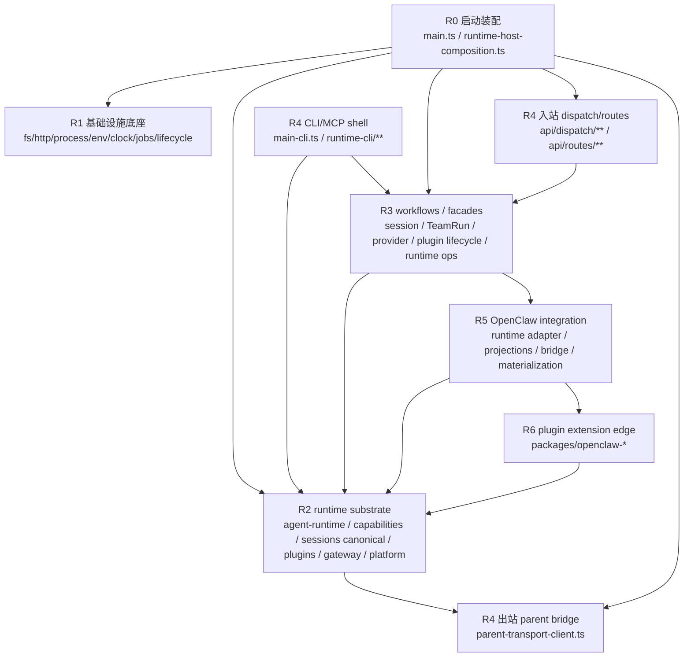
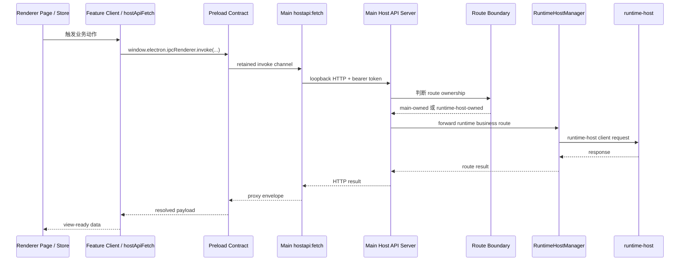
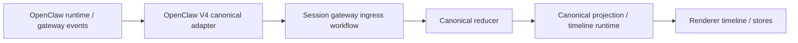
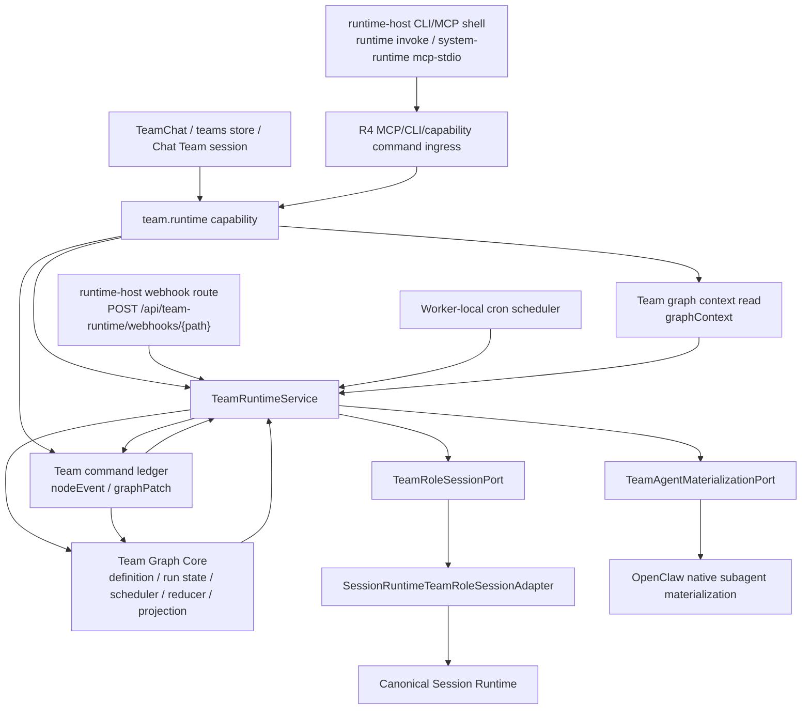
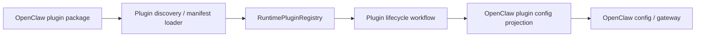

# MatchaClaw 实际代码分层架构

本文描述的是 MatchaClaw 当前代码**真实实现出来的分层**，不是抽象的四类分层模型，也不是传统后端的 controller / service / repository 分层。

产品命名以 [CONTEXT.md](../../CONTEXT.md) 为准：

- **MatchaClaw** — 本仓库中的桌面应用与产品。
- **OpenClaw** — MatchaClaw 集成并适配的 agent runtime substrate。
- **runtime-host** — 由 MatchaClaw 拥有的本地常驻 runtime process。
- **OpenClaw plugins** — 通过 OpenClaw plugin interface 接入的 plugin packages。

## 1. 总体结论

当前代码真实落地的是一条从桌面 UI 到本地 runtime，再到 OpenClaw / plugin extension 的分层链：

```text
Renderer 产品入口与 UI 投影
→ Renderer/Main 安全 transport seam
→ Electron main host boundary / desktop shell
→ runtime-host process bootstrap / composition root
→ runtime-host runtime substrate modules
→ runtime-host application workflows / facades
→ OpenClaw adapters / projections / bridge
→ OpenClaw plugin packages / extension seam
```

这条链不是“前端 → 后端 controller → service → repository”。更准确地说：

- Renderer 层负责产品入口、UI 状态和 view projection。
- Electron main 层负责桌面壳、安全 IPC、host API boundary 和 runtime-host 进程管理。
- runtime-host composition 层负责把宿主进程、container、system modules、application modules、routes 接起来。
- runtime-host substrate 层提供 capability、agent runtime、session runtime、plugin runtime、gateway bridge、platform runtime 等稳定 runtime 能力。
- application workflows / facades 层推进具体流程，例如 session run、TeamRun、provider sync、plugin lifecycle、runtime operations。
- OpenClaw adapter/projection 层把 runtime-host 的稳定 interface 投影到 OpenClaw config、gateway、workspace、provider 与 native subagent materialization；不拥有 TeamRun 事实源。
- OpenClaw plugins 层是最终 extension seam，提供非 TeamRun 的 tools、hooks、provider implementation 等扩展能力。

## 2. 完整分层 module map

> 可缩放版本：[layered-module-map.svg](./layered-module-map.svg)

```mermaid
flowchart TB
  subgraph L1 ["第 1 层：Renderer 产品入口与 UI 投影"]
    Pages["产品页面\nsrc/pages/**"]
    Stores["UI stores / view state\nsrc/stores/**"]
    FeatureClients["Feature clients\nsrc/services/openclaw/**"]
    SessionClient["Session client\nsrc/services/runtime/session-runtime.ts"]
  end

  subgraph L2 ["第 2 层：Renderer/Main 安全 transport seam"]
    HostApi["hostApiFetch / invokeIpc\nsrc/lib/host-api.ts\nsrc/lib/api-client.ts"]
    HostEvents["host events\nsrc/lib/host-events.ts"]
    Preload["Preload contract\nelectron/preload/**"]
  end

  subgraph L3 ["第 3 层：Electron main host boundary / desktop shell"]
    MainBootstrap["App bootstrap\nelectron/main/app-bootstrap.ts"]
    IpcHandlers["IPC handlers\nelectron/main/ipc/**"]
    HostApiProxy["hostapi IPC proxy\nelectron/main/ipc/hostapi-proxy-ipc.ts"]
    MainApiServer["Main host API server\nelectron/api/server.ts"]
    RouteBoundary["Route ownership seam\nelectron/api/route-boundary.ts\nelectron/api/main-api-boundary.json"]
    MainRoutes["Main-owned routes\nelectron/api/routes/**"]
    RuntimeHostManager["RuntimeHostManager\nelectron/main/runtime-host-manager.ts"]
    RuntimeHostProcess["runtime-host process/client adapters\nelectron/main/runtime-host-process-manager.ts\nelectron/main/runtime-host-client.ts"]
    EventBridge["Host event bridge\nelectron/main/host-event-bridge.ts"]
  end

  subgraph L4 ["第 4 层：runtime-host process bootstrap / composition root"]
    RuntimeMain["runtime-host entries\nruntime-host/main.ts\nruntime-host/main-cli.ts"]
    RuntimeComposition["Process composition\nruntime-host/composition/runtime-host-composition.ts"]
    Container["Container / lifecycle / jobs\nruntime-host/composition/**"]
    SystemRegistry["System module registry\nruntime-host/composition/runtime-host-runtime-module-registry.ts"]
    ApplicationRegistry["Application module registry\nexternal-connectors / openclaw / operations / sessions\nruntime-host/composition/runtime-host-module-registry.ts"]
    RouteComposition["Route composition\nruntime-host/composition/runtime-route-composition.ts\nruntime-host/composition/route-registry.ts"]
    RuntimeHostRoutes["runtime-host HTTP routes\nruntime-host/api/routes/**"]
    RuntimeCliMcp["runtime-host CLI / MCP shells\nruntime-host/main-cli.ts\nruntime-host/application/runtime-cli/**"]
    ParentTransport["Parent transport bridge\nruntime-host/composition/parent-transport-client.ts"]
  end

  subgraph L5 ["第 5 层：runtime-host runtime substrate modules"]
    RuntimeAddress["Runtime address / scope / target\nruntime-host/application/agent-runtime/contracts/runtime-address.ts"]
    CapabilityPlatform["Capability platform\nCapabilityRegistry / CapabilityRouter"]
    AgentRuntime["Agent runtime registry\nruntime adapters / protocol connectors"]
    SessionRuntime["Canonical session runtime\ncanonical events / reducer / projection / timeline"]
    PluginRuntime["Plugin runtime\ncatalog / enabled ids / runtime registry"]
    PluginEngine["Plugin discovery substrate\nruntime-host/plugin-engine/**"]
    GatewayBridge["Gateway bridge substrate\nreadiness / endpoint control / events"]
    PlatformRuntime["Platform runtime\ntool registry / policy / ledger / audit"]
    ExternalConnectorPlatform["External connector platform\nconnector registry / MCP program catalog / protocol specs / validation"]
    JobRuntime["Job / lifecycle runtime\nbackground jobs / long tasks"]
  end

  subgraph L6 ["第 6 层：runtime-host application workflows / facades"]
    SessionWorkflows["Session workflows\nsession-run / ingress / hydration / approval / command"]
    TeamRuntime["TeamRun runtime\nTeamRuntimeService / graph core / command ledger / local cron / worker"]
    ProviderWorkflows["Provider/config workflows\naccounts / models / routing / auth"]
    PluginLifecycle["Plugin lifecycle workflows\nenable / refresh / install / reconcile"]
    RuntimeOperations["Runtime operations\nbootstrap / diagnostics / gateway launch / jobs"]
    ExternalConnectorWorkflows["External connector workflows\nregistry facade / downstream sync ports"]
    WorkbenchSkills["Workbench / skills / ClawHub workflows"]
    ApplicationFacades["Application facades\napplication/*/service.ts"]
  end

  subgraph L7 ["第 7 层：OpenClaw adapters / projections / bridge"]
    OpenClawRuntimeAdapter["OpenClaw runtime adapter\nopenclaw-runtime-adapter.ts"]
    V4CanonicalAdapter["OpenClaw V4 canonical adapter\nopenclaw-v4-canonical-adapter.ts"]
    OpenClawProjections["OpenClaw projections\nprovider / plugin / workspace / auth / channel"]
    OpenClawMcpProjection["OpenClaw MCP projection\nexternal connector MCP config projection"]
    OpenClawGateway["OpenClaw gateway bridge\nruntime-host/openclaw-bridge/**"]
    ManagedPlugins["Managed plugin install/config\nopenclaw-managed-plugin-*.ts"]
    OpenClawWorkflowFacades["OpenClaw-specific workflow facades\napplication/adapters/openclaw/workflows/**"]
    SubagentMaterialization["Native subagent materialization\nopenclaw-team-agent-materialization-adapter.ts"]
  end

  subgraph L8 ["第 8 层：OpenClaw plugin packages / extension seam"]
    PluginManifests["Plugin manifests\npackages/*/openclaw.plugin.json"]
    PluginEntries["Plugin SDK entries\npackages/*/src/index.ts"]
    TaskPlugin["Task manager plugin\ntools / prompt hook"]
    BrowserPlugin["Browser relay plugin"]
    SecurityPlugin["Security plugin"]
    MediaPlugin["MatchaClaw media plugin"]
    MemoryPlugin["Memory LanceDB plugin"]
    Hooks["Hook extension seam\napi.on(...) / tools"]
  end

  Pages --> Stores
  Stores --> FeatureClients
  Stores --> SessionClient
  FeatureClients --> HostApi
  SessionClient --> HostApi
  HostEvents --> Stores

  HostApi --> Preload
  Preload --> HostApiProxy
  EventBridge --> HostEvents

  MainBootstrap --> IpcHandlers
  IpcHandlers --> HostApiProxy
  HostApiProxy --> MainApiServer
  MainApiServer --> RouteBoundary
  RouteBoundary --> MainRoutes
  RouteBoundary --> RuntimeHostManager
  RuntimeHostManager --> RuntimeHostProcess
  RuntimeHostManager --> EventBridge

  RuntimeHostProcess --> RuntimeMain
  RuntimeMain --> RuntimeComposition
  RuntimeComposition --> Container
  Container --> SystemRegistry
  Container --> ApplicationRegistry
  ApplicationRegistry --> RouteComposition
  RouteComposition --> RuntimeHostRoutes
  RuntimeHostRoutes --> ApplicationFacades
  RuntimeCliMcp --> CapabilityPlatform
  RuntimeCliMcp --> ApplicationFacades

  SystemRegistry --> ParentTransport
  SystemRegistry --> CapabilityPlatform
  SystemRegistry --> AgentRuntime
  SystemRegistry --> SessionRuntime
  SystemRegistry --> PluginRuntime
  SystemRegistry --> PluginEngine
  SystemRegistry --> GatewayBridge
  SystemRegistry --> PlatformRuntime
  SystemRegistry --> ExternalConnectorPlatform
  SystemRegistry --> JobRuntime
  CapabilityPlatform --> RuntimeAddress
  AgentRuntime --> RuntimeAddress
  ExternalConnectorPlatform --> CapabilityPlatform
  SessionRuntime --> RuntimeAddress

  ApplicationRegistry --> SessionWorkflows
  ApplicationRegistry --> TeamRuntime
  ApplicationRegistry --> ProviderWorkflows
  ApplicationRegistry --> PluginLifecycle
  ApplicationRegistry --> RuntimeOperations
  ApplicationRegistry --> WorkbenchSkills
  ApplicationRegistry --> ApplicationFacades
  SessionWorkflows --> SessionRuntime
  TeamRuntime --> SessionRuntime
  TeamRuntime --> CapabilityPlatform
  ProviderWorkflows --> CapabilityPlatform
  PluginLifecycle --> PluginRuntime
  RuntimeOperations --> GatewayBridge
  ExternalConnectorWorkflows --> ExternalConnectorPlatform

  OpenClawRuntimeAdapter --> AgentRuntime
  V4CanonicalAdapter --> SessionRuntime
  OpenClawProjections --> ProviderWorkflows
  OpenClawProjections --> PluginLifecycle
  OpenClawMcpProjection --> ExternalConnectorWorkflows
  OpenClawGateway --> GatewayBridge
  ManagedPlugins --> PluginEngine
  OpenClawWorkflowFacades --> ProviderWorkflows
  SubagentMaterialization --> TeamRuntime
  PluginEngine --> PluginRuntime
  ParentTransport --> RuntimeOperations

  PluginManifests --> PluginEngine
  PluginEntries --> TaskPlugin
  PluginEntries --> BrowserPlugin
  PluginEntries --> SecurityPlugin
  PluginEntries --> MediaPlugin
  PluginEntries --> MemoryPlugin
  TaskPlugin --> Hooks
  BrowserPlugin --> Hooks
  SecurityPlugin --> Hooks
  MediaPlugin --> Hooks
  MemoryPlugin --> Hooks

  classDef ui fill:#fff7ed,stroke:#ea580c,color:#0f172a;
  classDef transport fill:#eff6ff,stroke:#2563eb,color:#0f172a;
  classDef main fill:#f8fafc,stroke:#64748b,color:#0f172a;
  classDef composition fill:#ecfdf5,stroke:#16a34a,color:#0f172a;
  classDef substrate fill:#f0fdfa,stroke:#0d9488,color:#0f172a;
  classDef workflow fill:#fef3c7,stroke:#d97706,color:#0f172a;
  classDef adapter fill:#faf5ff,stroke:#9333ea,color:#0f172a;
  classDef plugin fill:#fdf2f8,stroke:#db2777,color:#0f172a;
  class Pages,Stores,FeatureClients,SessionClient ui;
  class HostApi,HostEvents,Preload transport;
  class MainBootstrap,IpcHandlers,HostApiProxy,MainApiServer,RouteBoundary,MainRoutes,RuntimeHostManager,RuntimeHostProcess,EventBridge main;
  class RuntimeMain,RuntimeComposition,Container,SystemRegistry,ApplicationRegistry,RouteComposition,RuntimeHostRoutes,ParentTransport composition;
  class RuntimeAddress,CapabilityPlatform,AgentRuntime,SessionRuntime,PluginRuntime,PluginEngine,GatewayBridge,PlatformRuntime,ExternalConnectorPlatform,JobRuntime substrate;
  class SessionWorkflows,TeamRuntime,ProviderWorkflows,PluginLifecycle,RuntimeOperations,ExternalConnectorWorkflows,WorkbenchSkills,ApplicationFacades workflow;
  class OpenClawRuntimeAdapter,V4CanonicalAdapter,OpenClawProjections,OpenClawMcpProjection,OpenClawGateway,ManagedPlugins,OpenClawWorkflowFacades,SubagentMaterialization adapter;
  class PluginManifests,PluginEntries,TaskPlugin,BrowserPlugin,SecurityPlugin,MediaPlugin,MemoryPlugin,Hooks plugin;
```



## 3. 各层说明

### 第 1 层：Renderer 产品入口与 UI 投影

这一层是真实产品入口：页面、stores、feature clients、session client。它负责接收用户动作、维护 UI 投影、调用 host API 或 runtime capabilities。

| Module group | 职责 | 关键文件 |
|---|---|---|
| 产品页面 | 渲染用户工作流，触发 store/client actions | `src/pages/**` |
| UI stores | 保存 UI state、runtime snapshot、view projection、in-flight 状态 | `src/stores/**` |
| OpenClaw feature clients | 将页面/store 动作转成 host API 或 capability 调用 | `src/services/openclaw/**` |
| Session client | 提供 renderer 侧 session list/prompt/timeline/delete 等入口 | `src/services/runtime/session-runtime.ts` |

说明：pages 更偏展示与入口；stores 和 feature clients 承担 renderer 侧应用编排与 projection 承接。

### 第 2 层：Renderer/Main 安全 transport seam

这一层是真实的 renderer-main 通信 seam。它不承载业务，只提供受控 transport、事件订阅、安全 IPC contract。

| Module group | 职责 | 关键文件 |
|---|---|---|
| Renderer host API client | 封装 `hostapi:fetch`、abort、token、错误 envelope | `src/lib/host-api.ts`, `src/lib/api-client.ts` |
| Renderer host event client | 订阅 `host:event`，提供 renderer 侧事件入口 | `src/lib/host-events.ts` |
| Preload bridge / IPC contract | 通过 retained channel 暴露受限 `window.electron` | `electron/preload/index.ts`, `electron/preload/ipc-contract.ts` |

### 第 3 层：Electron main host boundary / desktop shell

这一层是桌面壳。它拥有 Electron 特权能力、本地 host API server、route ownership policy、runtime-host 进程管理、host event bridge。

| Module group | 职责 | 关键文件 |
|---|---|---|
| App bootstrap | 启动 runtime-host、注册 IPC、启动 main host API、连接 event bridge | `electron/main/app-bootstrap.ts` |
| IPC handlers | 注册 renderer 可调用的 main IPC adapters | `electron/main/ipc-handlers.ts`, `electron/main/ipc/**` |
| Host API IPC proxy | 将 renderer `hostapi:fetch` 转成 authenticated loopback HTTP | `electron/main/ipc/hostapi-proxy-ipc.ts` |
| Main host API server | 处理 main-owned routes，并将 runtime-host business routes 转发给 runtime-host manager | `electron/api/server.ts` |
| Route ownership seam | 明确 main-owned route、runtime-host business route、renderer 可访问 route | `electron/api/route-boundary.ts`, `electron/api/main-api-boundary.json` |
| RuntimeHostManager | 管理 runtime-host lifecycle、health、request、events、privileged shell actions | `electron/main/runtime-host-manager.ts` |
| Process / HTTP adapters | spawn/supervise runtime-host child process，并向 runtime-host 发 HTTP request | `electron/main/runtime-host-process-manager.ts`, `electron/main/runtime-host-client.ts` |
| Host event bridge | 将 runtime/gateway/oauth/team events 转成 renderer `host:event` | `electron/main/host-event-bridge.ts` |

### 第 4 层：runtime-host process bootstrap / composition root

这一层是真正 runtime-host 进程的启动与装配层。它负责 container、基础设施注册、system modules、application modules、route registry、lifecycle/jobs wiring。

| Module group | 职责 | 关键文件 |
|---|---|---|
| runtime-host entry | runtime-host 进程入口 | `runtime-host/main.ts` |
| Process composition | 创建 runtime-host process、server、runner、container | `runtime-host/composition/runtime-host-composition.ts` |
| Runtime server / runner | 提供 HTTP dispatch server 与 lifecycle runner | `runtime-host/composition/runtime-host-server.ts`, `runtime-host/composition/runtime-host-runner.ts` |
| Infrastructure module | 注册 fs/http/process/env/clock/timer/scheduler/tcp 等基础 adapters | `runtime-host/composition/modules/runtime-infrastructure-module.ts`, `runtime-host/composition/runtime-host-infrastructure-adapters.ts` |
| System module registry | 装配 platform/plugin/agent/session/gateway 等 substrate modules | `runtime-host/composition/runtime-host-runtime-module-registry.ts` |
| Application module registry | 装配 external-connectors、openclaw、runtime、operations、sessions、license/workbench 等 application modules；External Connector 是独立 Matcha-owned module，不挂在 operations/OpenClaw 下 | `runtime-host/composition/runtime-host-module-registry.ts`, `runtime-host/composition/modules/external-connectors-application-module.ts` |
| Route composition | 将 route modules 汇入 runtime-host dispatch route | `runtime-host/composition/runtime-route-composition.ts`, `runtime-host/composition/route-registry.ts` |

### 第 5 层：runtime-host runtime substrate modules

这一层是 runtime-host 的运行时中台。它提供稳定 runtime vocabulary、registries、routers、state stores、timeline/projection、plugin runtime、gateway bridge、platform runtime 等能力。

| Module group | 职责 | 关键文件 |
|---|---|---|
| Runtime address model | 定义 endpoint、scope、target、session identity、capability target | `runtime-host/application/agent-runtime/contracts/runtime-address.ts`, `runtime-host/shared/runtime-address.ts` |
| Capability platform | 以 capability descriptor / scope / target / operation 表达可执行能力 | `runtime-host/application/capabilities/contracts/capability-registry.ts`, `runtime-host/application/capabilities/contracts/capability-router.ts` |
| Agent runtime registry | 注册 runtime adapters 与 protocol connectors，维护 runtime topology | `runtime-host/application/agent-runtime/**`, `runtime-host/composition/modules/agent-runtime-module.ts` |
| Canonical session runtime | 统一 session events、canonical reducer、projection、timeline、snapshot、execution graph | `runtime-host/application/sessions/canonical/**`, `runtime-host/application/sessions/session-timeline-runtime.ts`, `runtime-host/composition/modules/session-runtime-module.ts` |
| Plugin runtime | 管理 plugin catalog、enabled ids、runtime snapshot、refresh jobs | `runtime-host/application/plugins/runtime-plugin-registry.ts`, `runtime-host/application/plugins/plugin-runtime-service.ts`, `runtime-host/composition/modules/plugin-runtime-module.ts` |
| Gateway bridge substrate | 维护 gateway readiness、connection state、endpoint control、events | `runtime-host/application/gateway/**`, `runtime-host/composition/modules/gateway-bridge-module.ts` |
| Platform runtime | 管理 tool registry、policy engine、ledger、audit、tool reconciliation、execution facade | `runtime-host/application/platform-runtime/**`, `runtime-host/composition/modules/platform-runtime-module.ts` |
| External connector platform | 管理 Matcha-owned 外部能力 connector spec、registry、MCP server 程序清单、system-runtime MCP program、显式 runtime probe、downstream adapter/session status port、secret-ref 安全校验与协议形态声明；持久化挂在中性的 `runtimeHost.runtimeDataRoot`，不依赖 OpenClaw config object graph | `runtime-host/application/external-connectors/**`, `runtime-host/composition/modules/external-connectors-application-module.ts` |
| Job / lifecycle runtime | 承载后台任务、长任务、状态快照、生命周期 hooks | `runtime-host/application/**/**jobs**`, `runtime-host/composition/**` |

### 第 6 层：runtime-host application workflows / facades

这一层是真正推进业务流程的地方。它使用 substrate modules 和 adapters，不直接成为 transport 或 OpenClaw config 实现。

| Module group | 职责 | 关键文件 |
|---|---|---|
| Session workflows | 编排 create/prompt/run/ingress/hydration/approval/abort/window/timeline | `runtime-host/application/workflows/session-*`, `runtime-host/application/sessions/session-command-service.ts`, `runtime-host/application/sessions/session-gateway-ingress-service.ts` |
| TeamRun runtime | 编排 Team graph template、TeamRun graph instance / run state / scheduler / projection；新 Run 从 Team template 实例化拓扑/提示词/rules，但 role sessions 与执行态按 run 隔离；StartNode trigger 语义属于 graph/runtime，cron 由 worker-local scheduler 触发，webhook 由 runtime-host HTTP boundary 鉴权后调用 `team.triggerFire`；Renderer 的 Team role 会话发送入口提交长期 role session message，不 claim WorkNode、不启动 node attempt | `runtime-host/application/team-runtime/**`, `runtime-host/application/team-runtime/graph/**`, `runtime-host/application/capabilities/team/team-runtime-capability.ts` |
| Provider/config workflows | 编排 provider accounts、models、routing、auth profile、restart signal、projection sync | `runtime-host/application/workflows/provider-projection-sync/**`, `runtime-host/application/adapters/openclaw/workflows/openclaw-provider/**` |
| Plugin lifecycle workflows | 编排 plugin enable/disable/install/refresh/reconcile 与 gateway restart | `runtime-host/application/workflows/plugin-lifecycle/**`, `runtime-host/application/workflows/plugin-runtime/**` |
| Runtime operations | 编排 bootstrap settings、gateway launch/recovery、diagnostics、runtime jobs、maintenance | `runtime-host/application/runtime-host/**`, `runtime-host/application/workflows/runtime-host/**`, `runtime-host/application/workflows/runtime-bootstrap/**` |
| External connector workflows | 编排 connector registry facade、MCP server 程序 catalog snapshot、Matcha system-runtime connector source、显式 runtime probe、downstream sync port 与 session-aware downstream status port；core 只暴露 Matcha-owned connector source/status contract，不直接依赖 OpenClaw projection，也不自动执行外部 stdio command | `runtime-host/application/external-connectors/external-connector-service.ts`, `runtime-host/application/external-connectors/external-connector-store.ts`, `runtime-host/application/external-connectors/external-mcp-server-program-catalog.ts`, `runtime-host/application/external-connectors/external-connector-connection-status.ts`, `runtime-host/application/external-connectors/external-connector-downstream-status.ts`, `runtime-host/composition/modules/external-connectors-application-module.ts` |
| Workbench / skills / ClawHub | 编排 workbench、skill import/install、ClawHub inventory/install | `runtime-host/application/workbench/**`, `runtime-host/application/skills/**`, `runtime-host/application/workflows/skill-install/**` |
| SubAgent management facade | 暴露 Matcha-owned SubAgent list/create/update/delete、display config、description/model/skills/files 等语义 operation；Renderer 不直接读写 OpenClaw raw config / hash / baseHash | `runtime-host/application/subagents/service.ts`, `runtime-host/application/subagents/subagent-config-contracts.ts`, `runtime-host/application/capabilities/agent/subagent-management-capability.ts` |
| Application facades | 对 routes/capabilities 暴露较薄的 service/facade interface | `runtime-host/application/*/service.ts`, `runtime-host/composition/application-services.ts` |

说明：`application/**` 不是单一“业务层”。这里同时有 substrate、workflow、adapter-facing projection。看职责，不看目录名。

### 第 7 层：OpenClaw adapters / projections / bridge

这一层将 runtime-host 的稳定 interface 接到 OpenClaw 的具体 runtime、config、gateway、workspace、plugin、subagent、provider 结构。

| Module group | 职责 | 关键文件 |
|---|---|---|
| OpenClaw runtime adapter | 将 OpenClaw 注册成 agent runtime adapter | `runtime-host/application/adapters/openclaw/runtime/openclaw-runtime-adapter.ts` |
| OpenClaw V4 canonical adapter | 将 OpenClaw V4 live/replay events 转换成 canonical session events | `runtime-host/application/adapters/openclaw/runtime/openclaw-v4-canonical-adapter.ts` |
| OpenClaw projections | 将 provider/plugin/workspace/auth/channel 状态投影到 OpenClaw config/workspace/gateway | `runtime-host/application/adapters/openclaw/projections/**`, `runtime-host/application/adapters/openclaw/workflows/**` |
| SubAgent OpenClaw config projection | 作为 R5 adapter 承担 OpenClaw `agents` config shape、revision/hash 与实际读写；向 R3/R4 只暴露 SubAgent display/description/model/skills 与 skill/tool config projection 所需的端口 | `runtime-host/application/adapters/openclaw/projections/openclaw-subagent-config-projection.ts`, `runtime-host/application/adapters/openclaw/projections/openclaw-agent-skill-config-projection.ts`, `runtime-host/application/adapters/openclaw/projections/openclaw-agent-tool-config-projection.ts` |
| OpenClaw MCP projection/status adapter | 作为 R5 downstream adapter 由 OpenClaw application module 在 connect 阶段接入 External Connector source/status ports；只将可投影的 MCP connector 写入 OpenClaw `mcp.servers`，并把 OpenClaw 会话级 MCP 状态映射为统一 downstream status；会话级 MCP status 查询的异步刷新走 runtime-host Runtime Job，完成事件由 renderer 侧复拉状态，CLI/SDK/HTTP connector 保持 Matcha-owned | `runtime-host/application/adapters/openclaw/projections/external-connector-openclaw-mcp-projection.ts`, `runtime-host/application/adapters/openclaw/projections/external-connector-openclaw-mcp-status.ts`, `runtime-host/composition/modules/openclaw-application-module.ts` |
| OpenClaw gateway bridge | 接入 OpenClaw gateway 协议、auth、heartbeat、reconnect、event bridge | `runtime-host/openclaw-bridge/**`, `runtime-host/application/adapters/openclaw/gateway/**` |
| Native subagent materialization | 将 Team role / managed agent 投影为 OpenClaw native subagent | `runtime-host/application/team-runtime/adapters/openclaw/openclaw-team-agent-materialization-adapter.ts` |
| Plugin discovery / manifest loader | 从 filesystem roots 发现 plugin，读取 manifest，归一化 catalog 输入 | `runtime-host/plugin-engine/plugin-discovery.ts`, `runtime-host/plugin-engine/plugin-manifest-loader.ts`, `runtime-host/plugin-engine/plugin-location-rules.ts` |
| runtime-host HTTP routes | 将 HTTP/dispatch 请求解析并转发到 service/capability/workflow | `runtime-host/api/routes/**` |
| Parent transport | runtime-host 与 Electron main 内部 API 通信 | `runtime-host/composition/parent-transport-client.ts`, `runtime-host/shared/parent-transport-contracts.ts` |

### 第 8 层：OpenClaw plugin packages / extension seam

这一层是通过 OpenClaw plugin interface 接入的扩展包。它们不是 runtime-host core；也不再承载 TeamRun plugin tools/outbox 入口。它们通过 tools、hooks、manifests、provider contracts 等形式接入非 TeamRun 扩展能力。

| Module group | 职责 | 关键文件 |
|---|---|---|
| Plugin manifests | 声明 plugin id、contracts、tools、config schema、metadata | `packages/*/openclaw.plugin.json` |
| Plugin SDK entries | 通过 plugin SDK 注册 tools/hooks/runtime behaviour | `packages/*/src/index.ts`, `packages/*/index.ts` |
| Task manager plugin | 提供 task/todo tools 与 prompt hooks | `packages/openclaw-task-manager-plugin/**` |
| Browser relay plugin | 提供 browser tool/runtime extension | `packages/openclaw-browser-relay-plugin/**` |
| Security plugin | 提供 security hooks/runtime guard extension | `packages/openclaw-security-plugin/**` |
| MatchaClaw media plugin | 提供 image/media provider implementations | `packages/openclaw-matchaclaw-media-plugin/**` |
| Memory LanceDB plugin | 提供 memory tools 和 storage-backed memory operations | `packages/memory-lancedb-pro/**` |
| Hook extension seam | 插件通过 `api.on(...)` 与 tools 接入非 TeamRun extension 行为 | `docs/hook-extension-points.md`, `packages/**` |

## 4. runtime-host 核心进程内部真实分层

`runtime-host` 是当前架构的核心进程。它现在**不是**已经完整落成一套纯净的 L0-L7 物理分层；更准确地说，它已经长出了 L0-L7 目标里的大部分职责层，但这些职责仍按历史目录混放，尤其集中在 `runtime-host/application/**` 与 `runtime-host/composition/**` 中。

当前应按**职责层**理解 runtime-host，而不是按目录名或计划里的层号机械归类。

```text
R0 Process bootstrap / composition root
→ R1 Infrastructure base / process services
→ R2 Runtime substrate / kernel / platform
→ R3 Application workflows / facades / orchestration runtimes
→ R4 Inbound dispatch / outbound parent bridge boundaries
→ R5 OpenClaw integration surface
→ R6 OpenClaw plugin extension edge
```

> runtime-host 内部可缩放版本：[runtime-host-layered-module-map.svg](./runtime-host-layered-module-map.svg)

### 4.1 当前 runtime-host 真实内部分层

| 当前职责层 | 真实职责 | 关键模块 | 与 L0-L7 目标的关系 |
|---|---|---|---|
| R0 Process bootstrap / composition root | 创建 container，读取环境，创建 parent transport，装配 system/application modules，组合 routes，启动 HTTP server / runner，并提供 runtime-host CLI/MCP 进程入口 | `runtime-host/main.ts`, `runtime-host/main-cli.ts`, `runtime-host/composition/runtime-host-composition.ts`, `runtime-host/composition/runtime-host-runner.ts`, `runtime-host/composition/runtime-host-server.ts` | 接近目标 Composition Root，但现在它在代码启动链里更靠底，不是“业务最外层”的 L7；它是进程装配根 |
| R1 Infrastructure base / process services | 注册 fs/http/process/env/clock/timer/scheduler/tcp/logger/lifecycle/jobs 等底层端口和 adapters | `runtime-host/composition/modules/runtime-infrastructure-module.ts`, `runtime-host/composition/runtime-host-infrastructure-adapters.ts`, `runtime-host/composition/container.ts` | 接近 Shared Kernel / Host Infrastructure；但 shared vocabulary 与 infra adapters 还没有完全物理分层 |
| R2 Runtime substrate / kernel / platform | 提供 runtime address、agent runtime registry、capability platform、canonical session runtime、plugin runtime、gateway bridge、platform runtime | `runtime-host/application/agent-runtime/**`, `runtime-host/application/capabilities/contracts/**`, `runtime-host/application/sessions/canonical/**`, `runtime-host/application/plugins/**`, `runtime-host/application/gateway/**`, `runtime-host/application/platform-runtime/**`, `runtime-host/plugin-engine/**` | 已明显接近 Agent Runtime Kernel / Capability Platform；最大偏差是这些 substrate 仍放在 `application/**` 中 |
| R3 Application workflows / facades / orchestration runtimes | 推进 session、TeamRun graph、Team agent command ledger、provider/config、plugin lifecycle、runtime operations、workbench/skills 等流程 | `runtime-host/application/workflows/**`, `runtime-host/application/*/service.ts`, `runtime-host/application/team-runtime/**`, `runtime-host/application/team-runtime/graph/**`, `runtime-host/application/team-runtime/domain/team-command-ledger.ts`, `runtime-host/application/team-runtime/ports/team-command-ledger-port.ts`, `runtime-host/composition/application-services.ts` | 对应 Workflow / Orchestration；但 `service.ts` 语义不统一，TeamRun 是长生命周期 graph orchestration runtime，不是薄 facade |
| R4 Inbound dispatch / outbound parent bridge boundaries | 入站 dispatch 解析、route matching、route adapter、provider-neutral CLI/MCP command shell；出站调用 Electron main parent API | `runtime-host/api/dispatch/**`, `runtime-host/api/routes/**`, `runtime-host/application/runtime-cli/**`, `runtime-host/composition/route-registry.ts`, `runtime-host/composition/runtime-route-composition.ts`, `runtime-host/composition/parent-transport-client.ts`, `runtime-host/shared/parent-transport-contracts.ts` | 对应 API Boundary / transport seam；但 inbound routes、CLI/MCP shell 与 outbound parent bridge 是不同方向的 adapter，不应承载业务规则 |
| R5 OpenClaw integration surface | 把 runtime-host substrate/workflows 接到 OpenClaw runtime、gateway、config、workspace、managed plugins、provider/channel/security projections | `runtime-host/application/adapters/openclaw/**`, `runtime-host/openclaw-bridge/**`, `runtime-host/application/team-runtime/adapters/openclaw/**` | 对应 Adapter / Projection，但当前不是薄层；里面混有 bridge substrate、projection、workflow facade、managed plugin install/config |
| R6 OpenClaw plugin extension edge | 通过 plugin manifests、tools、hooks、provider implementation 扩展非 TeamRun runtime 行为；不再有 team-runtime plugin tools/outbox 作为 TeamRun ingress | `packages/openclaw-*`, `packages/memory-lancedb-pro/**` | 对应 plugin extension seam；它不是 runtime-host core，但 runtime-host 会通过 plugin-engine / managed plugin config 主导发现、安装、启用和配置 |

### 4.2 哪些已经接近 L0-L7，哪些仍有偏差

| 目标职责 | 当前实际状态 | 判断 |
|---|---|---|
| Shared Kernel | 有 `runtime-host/shared/**`、runtime address / scope / identity、contracts，但还没有形成完全独立的纯 shared kernel 层 | 部分形成 |
| Host Infrastructure | `runtime-infrastructure-module.ts`、process/server/runner/container/lifecycle/jobs 已经清楚 | 基本形成 |
| Agent Runtime Kernel | `agent-runtime/**`、runtime address、runtime adapter / connector registry、canonical session runtime 已经是稳定 kernel/substrate | 基本形成 |
| Capability Platform | `CapabilityRegistry` / `CapabilityRouter` / descriptor / target / scope / operation 已经成型 | 基本形成 |
| Workflow / Orchestration | `application/workflows/**` 已有大量流程；TeamRun 也已在 runtime-host 内形成长生命周期 orchestration runtime | 已形成，但组织形态不统一 |
| Adapter / Projection | OpenClaw runtime adapter、V4 canonical adapter、config projections、gateway bridge、materialization 已经集中 | 已形成，但仍偏厚 |
| API Boundary | dispatch/routes/parent transport 已经分离 transport 与业务 | 基本形成，但 inbound/outbound boundary 方向不同 |
| Composition Root | composition root、module registry、route/job/lifecycle wiring 已经存在 | 基本形成，但还不是 manifest/imports/exports 完全纯化的最终形态 |

### 4.3 当前最重要的偏差

1. **`application/**` 不是单一 application layer。** 里面同时有 Agent Runtime Kernel、Capability Platform、Canonical Session Runtime、Plugin Runtime、Gateway Bridge、Platform Runtime、External Connector Platform、workflows、facades、OpenClaw projections。读代码时必须按职责判断。
2. **`composition/**` 也不是纯 DI。** 它同时包含 process composition、infrastructure registration、system module registry、application module registry、route composition、runner/server。
3. **`service.ts` 命名不等于同一层。** 有些是薄 facade，例如 runtime-host / platform / session command services；TeamRun 的 `TeamRuntimeService` 则是实际 orchestration core。
4. **TeamRun 不是普通 request/response workflow。** 它现在是 `R4 capability/CLI/MCP command ingress -> R3 TeamRuntimeService/router/graph state/graph scheduler/command ledger -> session runtime / R5 OpenClaw native subagent materialization` 的长生命周期 graph 编排 runtime。
5. **OpenClaw integration 不是单一薄 adapter。** `application/adapters/openclaw/**` 内部混有 bridge、config projection、workflow facade、repository、managed plugin install/config；其中 channel login、managed plugin installer、OAuth plugin registration、runtime config service 都偏厚。
6. **`plugin-engine/**` 更像通用 plugin substrate。** 它负责 discovery / manifest loading / filesystem rules，被 OpenClaw integration 消费，但本身不应被理解成 OpenClaw projection。
7. **runtime-host CLI/MCP 是通用入站 shell，不是业务事实源。** `runtime-host/main-cli.ts` 与 `runtime-host/application/runtime-cli/**` 负责 CLI/MCP 协议、JSON/target 解析和 dispatch transport seam；Matcha 自己的 MCP stdio server 由 External Connector Platform 作为 `system-runtime` MCP program 管理，CLI 只提供 program entrypoint，业务校验、状态推进和持久化仍必须落到 capability/service。
8. **API routes 和 parent transport 都是 boundary，但方向相反。** `api/routes/**` 是入站 dispatch adapter；`parent-transport-client.ts` 是 runtime-host 到 Electron main 的出站 bridge adapter。

### 4.4 runtime-host 内部依赖方向



这张图的重点是：runtime-host 内部不是传统后端的 controller/service/repository，也不是已经按计划文件物理拆好的 L0-L7；它现在是一个**职责层已经形成、物理目录仍混层**的本地 runtime process。

## 5. 关键流程

### 5.1 Renderer 到 runtime-host 的请求链



### 5.2 Canonical session flow



说明：canonical session/message runtime 是实际代码中的 runtime substrate；`session-* workflows` 是该 substrate 之上的应用编排。

### 5.3 TeamRun flow



说明：TeamRun Graph Core 与 TeamRuntimeService 同属 runtime-host application/team-runtime 的 R3 worker 编排核心，是 Team graph template、TeamRun graph instance/run state/command ledger 的事实源；TeamInstance 的创建来源由 R3 记录为 TeamSkill package 或 manual selected existing agents：TeamSkill source 以 package 为 leader/roles/workflow/dependencies 事实源，manual source 以用户选择的 existing agents/role/leader 为事实源；R5 OpenClaw materialization 只据此写入对应 AGENTS.md/TOOLS.md 和 config projection，不反向成为 source；Graph definition 保存拓扑和 edge event rules，edge 使用 `action: activate | rework | gate | finish` 与 `payload.includeUpstreamResult`，不再用 legacy `required` fan-in。`team.graphSave` / `team.graphImportYaml` 保存 active run graph，同时更新 TeamInstance 的 graph template；后续 `team.runCreate` 从该 template 实例化新的 TeamRun graph instance，只复制拓扑、提示词、executor/config/rules/layout metadata，并重写 runId，执行态、artifacts、deliveries、messages 与 role sessions 不复制。Node 执行状态由 Attempt / NodeResult / inputContexts 派生：`team.nodeEvent complete/reject` 提交 NodeResult，reducer 按 edge action 激活、返工、聚合 gate 或结束，下游 prompt 只在 edge payload 允许时拼接上游 NodeResult；`team.graphPatch` 只修改 graph topology/config/template（例如稳定 `node.config.prompt`），不是一次性分派结果通道。StartNode trigger contract 属于 graph definition/runtime，只由 cron/webhook 触发。Renderer 的 Team role 会话发送入口提交 active run 的 `team.roleMessageSubmit`；普通 Agent 会话仍走 session chat send，不携带 TeamRun 触发语义。Team role message 默认只进入长期 role workspace session，并追加 workspace context（teamId/runId/roleId/flat runtime endpoint），不追加当前 node 位置信息。唯一例外是当前 role 存在 entry WorkNode 的 READY initial attempt、未 started、没有 active delivery 且当前 role 没有 running/waiting prompt 时，这条 Team role message 会升级为该 entry WorkNode 的 attempt user message，并由 TeamRuntimeService 派发 node prompt；非 entry Team role chat 不 claim WorkNode。WorkNode / ReviewNode 等 attempt prompt 由 graph scheduler、entry role message trigger、StartNode trigger、rework 或 control effects 投递；attempt 结果只通过 `team.nodeEvent` 回写。`team.nodeEvent` / `team.graphPatch` 是 runtime-host-owned command path；`team.graphContext` 是 runtime-host-owned compact read path，只返回关键 graph/node 状态摘要，不返回完整 config/prompt snapshot：R4 capability/CLI/MCP 入口只做 transport/target/input 校验，R3 TeamRuntimeService 校验 run/nodeExecution/role 语义，写命令时进入 Team command ledger 并推进 graph reducer/projection。cron 入口是 worker-local scheduler → `team.triggerFire` → graph reducer；webhook 入口是 runtime-host R4 HTTP route 鉴权、有上限地读取 body 摘要后调用 `team.triggerFire`，不经过 OpenClaw plugin hooks/session/agent。Team webhook token 由 runtime-host 生成并持久化到本机 settings，`MATCHACLAW_TEAM_WEBHOOK_TOKEN` 仅作为高级覆盖；Renderer 只读取 token 投影用于展示调用方式，不拥有鉴权规则。OpenClaw native subagent materialization 只消费 R3 TeamRun 状态做 R5 config projection，不拥有 command ledger 或 graph 调度规则；R6 不再有 team-runtime plugin tools/outbox。

### 5.4 Plugin lifecycle / config projection flow



## 6. 容易误读的目录名

| 目录 / 命名 | 容易误读成 | 实际应理解为 |
|---|---|---|
| `runtime-host/application/**` | 单一业务层 | 混合了 runtime substrate、application workflows、facades、adapter-facing projections |
| `*Service` | 传统 service 层 | 很多只是 facade；复杂流程通常在 workflows 或 runtime substrate 中 |
| `runtime-host/api/routes/**` | controller 层 | HTTP/dispatch adapter，负责解析和转发，不应承载业务规则 |
| `runtime-host/composition/**` | 纯 DI 配置 | runtime-host process bootstrap、system module registry、application module registry、route composition |
| `runtime-host/plugin-engine/**` | plugin 业务核心 | filesystem discovery / manifest loading / catalog input adapter |
| `runtime-host/openclaw-bridge/**` | SDK 工具包 | OpenClaw gateway 协议、auth、heartbeat、reconnect、event bridge 适配边界 |
| `packages/openclaw-*` | MatchaClaw core packages | OpenClaw plugin extension packages，不是 runtime-host core |

## 7. 依赖规则

1. Renderer 页面只做产品入口和展示；复杂状态推进进入 stores、feature clients 或 runtime-host workflows。
2. Renderer feature clients 只能通过 `hostApiFetch` / preload contract / host API seam 进入 main，不直接绕过 Electron 安全边界。
3. Electron main 的 route ownership seam 决定 main-owned route 与 runtime-host-owned route，不在 renderer 侧判断。
4. runtime-host composition 可以看见所有模块，但只做注册和连接，不沉淀业务规则。
5. runtime-host substrate modules 提供稳定 interface；workflows/facades 使用这些 interface 推进流程。
6. HTTP routes 是 adapter；routes 不应复制 session/provider/plugin lifecycle 规则。
7. OpenClaw adapters/projections 可以很厚，但不应把 OpenClaw config object graph 倒灌进 runtime-host substrate。
8. TeamRun 是 runtime-host application workflow，不是 OpenClaw plugin adapter。
9. OpenClaw plugins 是 extension seam，不是 MatchaClaw core。
10. Hook 具体语义由 `docs/hook-extension-points.md` 维护；本文只记录其在代码架构中的位置。

## 8. 维护规则

- 新增稳定 module group 或 seam 时，按实际代码职责归入本文，不按目录名机械归档。
- 不要把本文变成文件树索引；只记录有架构意义的 module group。
- 产品词汇放在 [CONTEXT.md](../../CONTEXT.md)，不要在本文发明另一套说法。
- hard-to-reverse decisions 放在 `docs/adr/`，不要混进本文。
