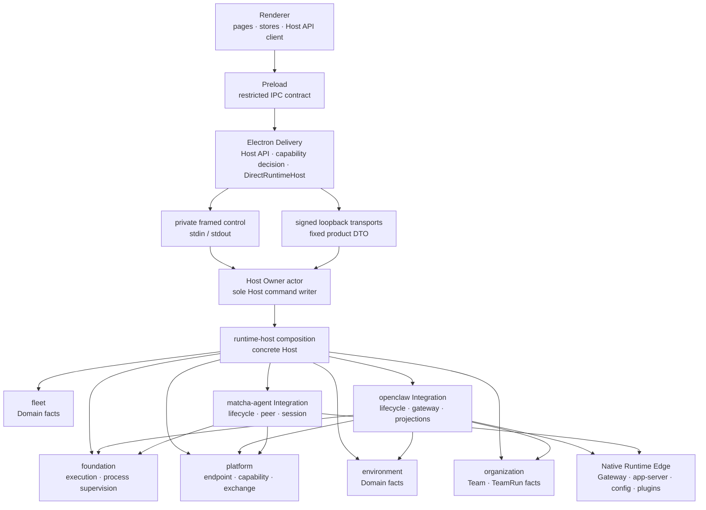
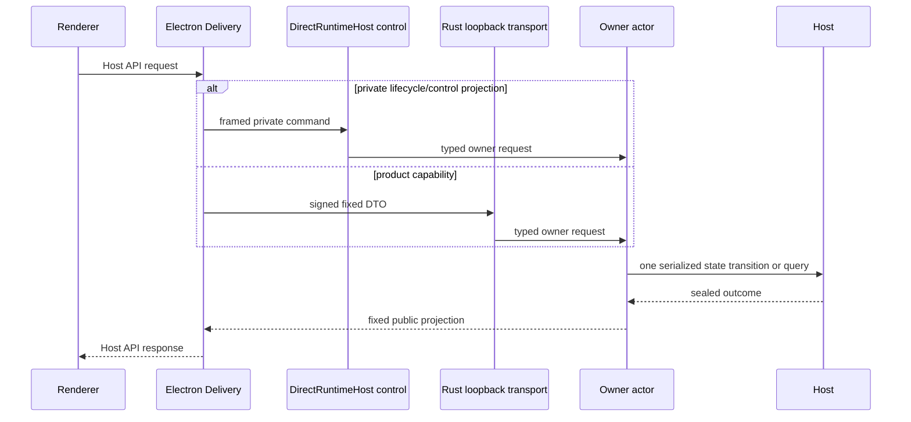
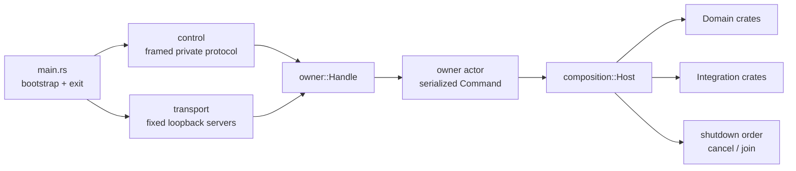
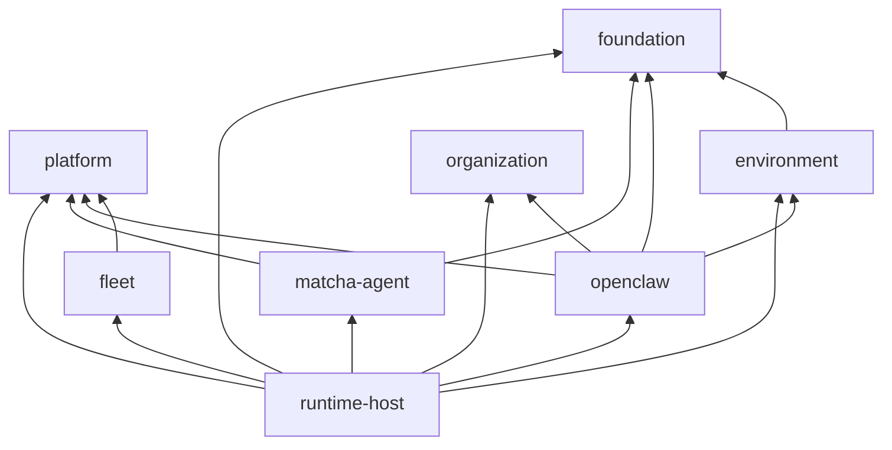
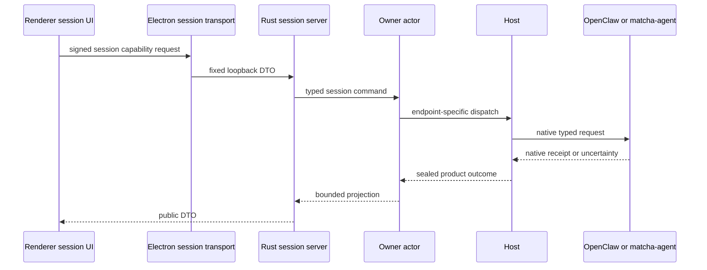
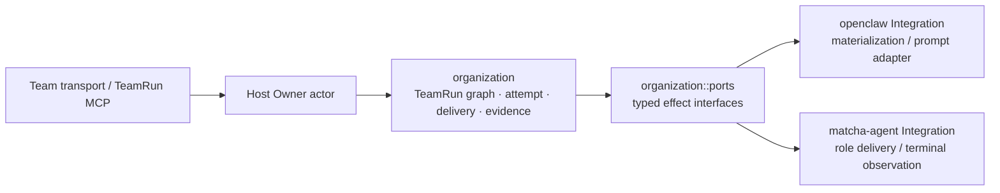

# MatchaClaw 当前分层架构

本文描述当前 **active** 的 MatchaClaw 架构：Electron Desktop Delivery 与 Rust `runtime-host` workspace 如何协作、各 crate 的事实 owner、transport seam 与编译依赖方向。

它不是 TypeScript runtime-host 的目录迁移图，不是旧 owner 审计，也不是迁移完成度账本。旧 TypeScript 路径、历史 `process-runtime` 主链和已删除的 Node runtime-host 仅可作为迁移语义证据，不能被本文表述为当前实现。

产品术语以 [CONTEXT.md](../../CONTEXT.md) 为准；迁移状态唯一以 [runtime-host-ts-rust-migration-progress.md](./runtime-host-ts-rust-migration-progress.md) 为准；Rust 终态地址空间与依赖规则以 [runtime-host-rust-target-architecture.md](./runtime-host-rust-target-architecture.md) 为准。

## 1. 当前结论

```text
Renderer
→ Electron Delivery
→ Rust runtime-host
→ Domain facts / Platform contracts / Runtime Integrations / Foundation mechanisms
→ Native Runtime Edge
```

- **Electron** 是桌面 Delivery：它拥有窗口、preload、OS integration、Host API proxy、受限 capability decision、Rust binary 启动及 Renderer event projection。
- **`runtime-host` binary** 是本地 runtime process，也是 Rust workspace 的唯一 concrete composition root；它不是 OpenClaw、matcha-agent 之外的第三个 peer Runtime。
- **Host Owner actor** 是 Host composition 的串行入口和 Host mutable state 单写边界。control 和 loopback transport 都只能经 `owner::Handle` 请求 Host 行为；它不拥有各 Domain/Integration 的 durable facts，也不直接修改 Supervisor 或 peer state。
- **Foundation** 只提供 runtime-agnostic execution 与受管进程 authority/supervision mechanism。
- **Platform** 只提供跨 owner 的中性契约，例如 Endpoint、Capability、Invocation/Immediate Receipt、listener identity 与 pinned TLS；它不保存跨 Domain 的业务事实。
- **Domain crates** 独占自己的 durable facts、状态转换、恢复与 reconciliation policy。
- **Integration crates** 独占 peer-specific lifecycle、native wire、private projection、native session/workspace semantics；它们不把 peer-private DTO 倒灌为 Domain 事实。
- **Native Runtime Edge** 是 OpenClaw Gateway、matcha-agent app-server、OpenClaw config/plugin/workspace 等真实 native owner。Rust 不复制 Native Session transcript 或 LLM execution history。

## 2. 系统结构与调用方向


```mermaid
flowchart TB
  Renderer["Renderer\npages · stores · Host API client"]
  Preload["Preload\nrestricted IPC contract"]
  Electron["Electron Delivery\nHost API · capability decision · DirectRuntimeHost"]
  Control["private framed control\nstdin / stdout"]
  PublicTransport["signed loopback transports\nfixed product DTO"]
  Owner["Host Owner actor\nsole Host command writer"]
  Host["runtime-host composition\nconcrete Host"]

  Foundation["foundation\nexecution · process supervision"]
  Platform["platform\nendpoint · capability · exchange"]
  Environment["environment\nDomain facts"]
  Fleet["fleet\nDomain facts"]
  Organization["organization\nTeam · TeamRun facts"]
  OpenClaw["openclaw Integration\nlifecycle · gateway · projections"]
  Matcha["matcha-agent Integration\nlifecycle · peer · session"]
  Native["Native Runtime Edge\nGateway · app-server · config · plugins"]

  Renderer --> Preload --> Electron
  Electron --> Control --> Owner
  Electron --> PublicTransport --> Owner
  Owner --> Host
  Host --> Foundation
  Host --> Platform
  Host --> Environment
  Host --> Fleet
  Host --> Organization
  Host --> OpenClaw
  Host --> Matcha
  OpenClaw --> Foundation
  OpenClaw --> Platform
  OpenClaw --> Environment
  OpenClaw --> Organization
  Matcha --> Foundation
  Matcha --> Platform
  OpenClaw --> Native
  Matcha --> Native
```

箭头表示当前调用或编译依赖允许的方向，不表示所有 crate 都互相依赖。`runtime-host` 仅在 composition 处同时看见具体 Domain 与 Integration；其他 crate 不通过反向依赖、全局 registry 或 generic runtime map 获得对 Host 的控制权。

## 3. Delivery：Renderer、Electron 与 Rust 的三个 contract

Renderer public capability、Electron transport 与 Rust internal control 是三个不同的 contract。一个 Rust command 存在，不会自动成为 Renderer 能力。

### 3.1 Renderer 到 Electron

Renderer 通过 `hostApiFetch` 和 preload 暴露的受限 IPC 调用 Electron Host API。Renderer 只消费公开 DTO 和 Renderer event projection，不读取 Rust bootstrap、peer token、native path、child stderr、private state directory 或 peer-private protocol data。

| Module | Interface | 实现位置 |
|---|---|---|
| Renderer product entry | 页面、store、view projection 与 Host API client | `src/pages/**`, `src/stores/**`, `src/lib/host-api.ts` |
| Preload seam | retained IPC channel 与严格 IPC contract | `electron/preload/**` |
| Main Host API | route ownership、capability decision、公开错误 envelope | `electron/api/**`, `electron/main/ipc/hostapi-proxy-ipc.ts` |

### 3.2 Electron 到 Rust

Electron 使用 `DirectRuntimeHost` 启动一个 Rust binary，写入一次 bootstrap frame，并保留两个不同的调用 seam：

1. **private framed control**：Electron Main 通过 stdin/stdout 长度帧发出 private control command，读取 health、lifecycle、safe event 或少量固定 Host command。
2. **signed loopback transport**：Electron 在已授权的公开产品操作上签发固定 capability decision，并调用 Rust loopback server 的固定 DTO transport。


```mermaid
sequenceDiagram
  participant R as Renderer
  participant E as Electron Delivery
  participant C as DirectRuntimeHost control
  participant T as Rust loopback transport
  participant O as Owner actor
  participant H as Host

  R->>E: Host API request
  alt private lifecycle/control projection
    E->>C: framed private command
    C->>O: typed owner request
  else product capability
    E->>T: signed fixed DTO
    T->>O: typed owner request
  end
  O->>H: one serialized state transition or query
  H-->>O: sealed outcome
  O-->>E: fixed public projection
  E-->>R: Host API response
```

`DirectRuntimeHost` 位于 `electron/main/runtime-host-delivery/direct-host.ts`。它是 Electron 的 Rust child process adapter，不是旧 TypeScript `RuntimeHostManager`、`runtime-host-client` 或 `electron/main/process-runtime/**` 的兼容替代。

### 3.3 Rust 到 Renderer 的事件方向

Host/Owner 只产生受限 `SafeEvent`。Electron `host-event-bridge` 将其投影为 Renderer event；Renderer event 不反向成为 Host state 的写入通道。没有 public consumer 的 native event、raw message、tool payload、thinking、approval detail、workspace root、token 或 raw child stderr 不得跨此 seam。

## 4. Rust workspace：物理 owner 与职责

当前 workspace 位于 `runtime-host/`：

```text
runtime-host/
├── foundation/                 # foundation
├── platform/                   # platform
├── domains/
│   ├── environment/            # environment
│   ├── fleet/                  # fleet
│   └── organization/           # organization
├── integrations/
│   ├── openclaw/               # openclaw
│   └── matcha-agent/           # matcha-agent / matcha_agent
└── host/                       # runtime-host / runtime_host
```

`integrations/acp/` 不是当前 workspace member：当前没有 source-backed supported Delivery consumer，因此不以空 crate、fake transport 或 unavailable production implementation 占位。

| Crate | 事实 owner 与 interface | 不负责的事 |
|---|---|---|
| `foundation` | `execution` 与 `process` mechanism；受管进程 authority、observation、termination、supervision | 产品 Domain、peer wire、route、Renderer DTO |
| `platform` | Endpoint、Capability、Invocation/Immediate Receipt、listener identity、pinned TLS 的中性语言 | Session transcript、global approval、global job store、Domain reconciliation state |
| `environment` | Environment desired facts、authorization、reconciliation、provider/connector ports | OpenClaw private config/auth projection、public credential exposure |
| `fleet` | target/topology、lease、command/outbox、unknown/replay、audit、selector/reconcile durable facts | 未证明的 remote executor、artifact producer、public remote Delivery |
| `organization` | Team、TeamRun graph、attempt、delivery、approval、evidence、trigger 与 durable Organization facts | OpenClaw config shape、peer terminal receipt 的猜测 |
| `openclaw` | Gateway lifecycle/wire/auth、native session/workspace、OpenClaw projections、Cron/skill/task/channel operations | Host composition、Organization command ledger、Renderer public policy |
| `matcha-agent` | app-server lifecycle、peer/session protocol、native run/session receipt translation | Electron process lifecycle、Renderer channel、Matcha transcript shadow store |
| `runtime-host` | 具体 composition、Owner actor、control/loopback transport、diagnostic projection、delivery-facing Host policy | 把自己变成第三个 peer Runtime 或 generic job/runtime registry |

### 4.1 Durable state roots

Electron bootstrap 只传递 owner-specific state root，不做跨 owner fallback：

| Root | Owner | 内容 |
|---|---|---|
| `%APPDATA%/MatchaClaw/runtime-host` | MatchaClaw Host / Rust `runtime-host` | `organization-facts.log`、Team webhook token、`fleet-facts.log`、`fleet-private/` |
| `%APPDATA%/MatchaClaw/openclaw` | OpenClaw Integration / native OpenClaw | `openclaw.json`、Gateway token、private OpenClaw projection |
| `%APPDATA%/MatchaClaw/matcha-agent/app-server` | matcha-agent app-server | app-server native session/run/event/snapshot state |

## 5. `runtime-host` 内部结构

`runtime-host/host` 不是传统 controller/service/repository 栈。其 deep module 是 `Host`：调用者通过小而 typed 的 Owner interface 请求行为，composition、peer lifecycle、Domain store、shutdown order 和 transport policy 被集中在实现一侧。


```mermaid
flowchart LR
  Main["main.rs\nbootstrap + exit"] --> Control["control\nframed private protocol"]
  Main --> Transport["transport\nfixed loopback servers"]
  Control --> Handle["owner::Handle"]
  Transport --> Handle
  Handle --> Actor["owner actor\nserialized Command"]
  Actor --> Host["composition::Host"]
  Host --> Domain["Domain crates"]
  Host --> Integration["Integration crates"]
  Host --> Shutdown["shutdown order\ncancel / join"]
```

| Host module group | Interface / role | 关键路径 |
|---|---|---|
| bootstrap | 解码 private bootstrap material，构造 typed Host input | `host/src/bootstrap/**`, `host/src/main.rs` |
| composition | 创建具体 `Host`、Integration input、Domain store、event sink、shutdown order | `host/src/composition/**` |
| owner | 串行化命令并保证 Host state 的单写；Handle 是 transport 的唯一 request seam | `host/src/owner.rs`, `host/src/owner/**` |
| runtime surface | fixed OpenClaw/Matcha peer identity、RuntimeDriver ops surface、Capability Directory 与 Runtime Endpoint Directory public projection | `host/src/runtime_driver.rs`, `host/src/capability_directory.rs`, `host/src/peer_directory.rs` |
| control | private framed stdin/stdout command、ready signal 与 SafeEvent | `host/src/control/**` |
| transport | 固定 loopback server、authorization decision 验证、sealed request/response DTO | `host/src/transport/**` |
| product owners | session、cron、workspace、provider、channel、security、diagnostics、Task、TeamRun、Fleet、Environment 等 Host-facing semantic owner | `host/src/session_*.rs`, `host/src/cron.rs`, `host/src/task_manager.rs`, `host/src/team_*.rs`, `host/src/fleet/**` 等 |

### 5.1 Owner actor 的不变量

- Host mutable state 只能由 Owner actor 请求路径推进。
- transport 只解析、验证其输入 contract 并投影固定 outcome；不复制 Domain 或 Integration policy。
- 长操作必须保留 cancellation 与 shutdown/join 语义；例如 Host 拥有的 `foundation::execution::OperationHandle<T>` 由具体 semantic owner 管理和收束。
- `Host` 可以调用 peer Integration，但不直接把 Gateway/app-server/private config/state 作为公开 DTO 返回。
- `main.rs` 只负责 bootstrap、入口和退出码，不承载业务状态机。

## 6. Domain、Platform 与 Integration 的关系

### 6.1 Platform 是语言，不是第二状态库

`platform` 为跨 crate 调用提供 Endpoint、Capability、scope、Invocation outcome、listener identity 与 pinned TLS 的 typed grammar。

**Invocation outcome / Immediate Receipt** 只表达调用边界能知道的事实：明确拒绝、同步完成、取消，或 effect 可能已到达目标但终局未知。它不等同最终 execution success。需要恢复的 command、attempt、delivery 和 terminal outcome 仍由真正的 Domain 或 Native Runtime owner 保存；无法判定的 effect 使用 `Unknown`，不自动重试。

### 6.2 Domain 独占业务事实

- `environment` 负责自己的 desired/applied/observed comparison、authorization 与 reconcile policy。
- `fleet` 只保留当前能证明的本地 durable facts；历史 RemoteFleet control plane 删除不构成新的 executor 依据。
- `organization` 负责 Team 与 TeamRun 的 graph、attempt、approval、delivery、evidence、trigger 和恢复。OpenClaw materialization 是 Integration effect，不拥有 TeamRun command ledger。

没有横切的 `session`、`approval`、`reconciliation`、`job`、`storage` 或 `facts` crate。共同字段形状不证明共同 owner。

### 6.3 Integration 独占 peer-specific private semantics

| Integration | 当前职责 | Native Runtime Edge |
|---|---|---|
| OpenClaw | Gateway auth/wire、single backend WS dispatcher、request/response/event demux、peer lifecycle、native session/window/workspace、config/channel/agent/team projection、native operation readback；session/task/team prompt 复用 `GatewayClient` control exchange，`sessions.subscribe` 不参与 Host session 主链路 | OpenClaw Gateway、OpenClaw config、plugins、Agent Workspace、native session state |
| matcha-agent | app-server lifecycle、peer/session protocol、run/terminal receipt、approval/session translation | app-server、worker、QueryEngine、native session/run state |

Integration 可以消费 Domain 的 typed port 或 intent，但不能将 OpenClaw config object graph、Gateway raw error、app-server token、native workspace root、transcript 或 raw event 变成 Platform/Domain 事实。

## 7. Process lifecycle ownership

受管 runtime lifecycle 的职责固定如下：

```text
Foundation
→ runtime-agnostic process authority / observation / termination / supervision mechanism

Runtime Integration
→ peer-specific launch / readiness / graceful stop / recovery / logs / restart policy

Host
→ concrete composition, cross-instance start dependency, shutdown / join order

Electron Delivery
→ launch and connect Rust runtime-host; desktop shell and safe transport
```

每个受管 process instance 的 process handle、provenance、authority scope 和 lifecycle state 只由其 Foundation Supervisor 单写。Host 和 Integration 通过 typed command/request 操作；未知 port occupant 未证明是 Matcha-owned 时不得被终止。

Electron 不拥有 OpenClaw 或 matcha-agent 的 semantic lifecycle policy。Electron 启动并连接 Rust `runtime-host`；Rust Host 组合具体 peer Integration、决定 runtime dependency 与 shutdown order。

### 7.1 当前 crate 依赖 DAG

下表是 `runtime-host/Cargo.toml` 与各 crate `Cargo.toml` 的当前 workspace 编译依赖，不是逻辑调用图。它用于判断新增 import 是否破坏 owner 方向。


```mermaid
flowchart BT
  Foundation[foundation]
  Platform[platform]
  Environment[environment]
  Fleet[fleet]
  Organization[organization]
  OpenClaw[openclaw]
  Matcha[matcha-agent]
  Host[runtime-host]

  Environment --> Foundation
  Fleet --> Platform
  OpenClaw --> Foundation
  OpenClaw --> Platform
  OpenClaw --> Environment
  OpenClaw --> Organization
  Matcha --> Foundation
  Matcha --> Platform
  Host --> Foundation
  Host --> Platform
  Host --> Environment
  Host --> Fleet
  Host --> Organization
  Host --> OpenClaw
  Host --> Matcha
```

| Crate | 当前可依赖的 workspace crate | 架构含义 |
|---|---|---|
| `foundation` | 无 | 最低层 mechanism，不能看见产品或 peer |
| `platform` | 无 | 中性 contract，不引入 Domain 或 Integration policy |
| `environment` | `foundation` | Environment 的 durable owner 只使用必要 mechanism |
| `fleet` | `platform` | Fleet durable facts 使用 endpoint/exchange language，不依赖 Host |
| `organization` | 无 | Team/TeamRun 领域模型与 store 可独立验证 |
| `openclaw` | `foundation`, `platform`, `environment`, `organization` | 将 Environment/Organization intent 投影为 OpenClaw native effect |
| `matcha-agent` | `foundation`, `platform` | 只翻译 app-server lifecycle/session peer semantics |
| `runtime-host` | 所有当前 workspace crate | 唯一 concrete composition 与 Delivery-facing owner |

该 DAG 也解释了为什么 `organization` 不能直接 import OpenClaw：TeamRun 通过 `organization::ports` 定义的 materialization、role-session、prompt-delivery 等 typed interface 表达所需 effect，具体 OpenClaw adapter 只能在 Host composition 处注入。

## 8. 启动、transport 与 shutdown 的真实结构

### 8.1 Bootstrap 与启动

Electron `bootstrapMainApplication()` 创建 `DirectRuntimeHost`，将一次性 bootstrap bytes 写入 Rust stdin。Rust `host/src/main.rs` 只完成三件事：读取 bootstrap、拆出 typed input/ports/verifier、调用 `run_delivery_transports()`。

`run_delivery_transports()` 的顺序是：

```text
bootstrap typed inputs
→ Host::new(input)
→ Host::start()
→ owner::Owner::spawn(host)
→ 打开 delivery-private owners（例如 Security desired/effect owner）
→ bind fixed loopback transport servers
→ run private framed control with the same Owner handle
```

每个 loopback server 都持有相同 `owner.handle()`；private control 也只通过同一个 Owner handle 执行固定命令。`host.capabilities.list/describe` 来自 Rust Capability Directory，Runtime Endpoint Directory 只投影 fixed local OpenClaw/Matcha peer 与 readiness，不暴露 PID、token、path 或 raw peer state。因此 HTTP/control 请求不能绕过 Owner actor 直接访问 `Host`，也不会为每条 route 创建第二个 Host 或第二份 peer lifecycle state。对应实现为 `runtime-host/host/src/main.rs`、`runtime-host/host/src/control/**`、`runtime-host/host/src/owner.rs`、`runtime-host/host/src/runtime_driver.rs`、`runtime-host/host/src/capability_directory.rs`、`runtime-host/host/src/peer_directory.rs` 与 `runtime-host/host/src/transport/**`。

### 8.2 Transport family 与职责

`transport/**` 按产品语义拆分 server，而不是按 HTTP resource 机械聚合。它们共享的 interface 是：严格解码固定 DTO、验证 capability decision、调用 `owner::Handle`、投影封闭成功/拒绝/unknown outcome。

| Transport family | Host semantic owner | 典型路径 |
|---|---|---|
| Session | native endpoint session list/create/delete/rename/send/abort/model/approval/timeline/history | `transport/sessions/**`, `transport/session_*.rs`, `session_*.rs` |
| Workspace | OpenClaw native workspace text/binary/directory/media/write projection | `transport/workspace_*.rs`, `workspace_*.rs` |
| Organization / TeamRun | public graph、role session、approval、decision、trigger、lifecycle、manual team、TeamSkill | `transport/team_*.rs`, `composition/team_run_mcp.rs` |
| Environment-facing products | provider accounts/models/routing、settings desired、security policy/emergency, channel control/status/pairing | `transport/provider_accounts/**`, `transport/provider_models.rs`, `transport/settings_desired/**`, `transport/security_*.rs`, `transport/channel_*.rs` |
| OpenClaw products | Cron、agents、task manager、usage、skill bundle/install；session/task/team prompt effect 经 OpenClaw `GatewayClient` control exchange 投递 | `transport/cron.rs`, `transport/agents/**`, `transport/task_manager*`, `transport/usage/**` |
| diagnostics | constrained Host archive receipt | `transport/diagnostics/**`, `diagnostics*.rs` |

这个划分不是把每个 transport 变成一个新的事实 owner：例如 Cron native job facts仍由 OpenClaw，TeamRun graph facts 仍由 Organization，security desired/effect facts 仍由其 dedicated owner。transport 只是其入站 adapter。Host health/status 读取 Host admission、peer supervisor projection、Gateway health/control readiness 时保持独立字段；`Host Ready` 只表示 admission open，不等同 Gateway connected、Matcha Running 或 OpenClaw control ready。

### 8.3 Shutdown 是显式顺序，不依赖 drop 偶然收束

Host shutdown 由 `composition/host/shutdown.rs` 定义并在 Owner shutdown path 中执行：

```text
begin Host shutdown admission
→ cancel and join Host-owned Cron operations
→ close OpenClaw session actor and close OpenClaw event sink
→ confirm and join OpenClaw Supervisor
→ cancel Matcha Renderer subscriptions and close Matcha event sink
→ confirm and join Matcha peer
→ only when all slots settle, publish HostPhase::ShutDown
```

每一步都会保留 `ShutdownOutcome` 或 typed failure；未 resolved/join 的 peer 使 Host shutdown 保持失败，而不是假报成功。由此产生两个维护规则：

1. 新增长操作时，owner 必须定义它在 peer/session shutdown 前的 cancellation 与 join 位置。
2. 新增 peer 时，不能仅在 `Host::new()` 构造；必须同时明确 start dependency、event sink、shutdown order 与 failure report。

## 9. 代表性业务调用链

### 9.1 Session：公开 DTO 不成为 transcript owner


```mermaid
sequenceDiagram
  participant UI as Renderer session UI
  participant Main as Electron session transport
  participant Server as Rust session server
  participant Owner as Owner actor
  participant Host as Host
  participant Peer as OpenClaw or matcha-agent

  UI->>Main: signed session capability request
  Main->>Server: fixed loopback DTO
  Server->>Owner: typed session command
  Owner->>Host: endpoint-specific dispatch
  Host->>Peer: native typed request
  Peer-->>Host: native receipt or uncertainty
  Host-->>Owner: sealed product outcome
  Owner-->>Server: bounded projection
  Server-->>UI: public DTO
```

Session identity is an endpoint-bound address; it is not a transcript identifier, local filesystem path or permanent product identity. The peer Runtime remains the Native Session history owner. Rust may project a bounded catalog/window/receipt but does not create a second session store or rehydrate private transcript state into the Host.

### 9.2 TeamRun：Organization 事实与 OpenClaw effect 分离


```mermaid
flowchart LR
  Delivery["Team transport / TeamRun MCP"]
  Owner["Host Owner actor"]
  Organization["organization\nTeamRun graph · attempt · delivery · evidence"]
  Ports["organization::ports\ntyped effect interfaces"]
  OpenClaw["openclaw Integration\nmaterialization / prompt adapter"]
  Matcha["matcha-agent Integration\nrole delivery / terminal observation"]

  Delivery --> Owner --> Organization --> Ports
  Ports --> OpenClaw
  Ports --> Matcha
```

`organization` owns graph reduction, attempt fences, approval, delivery ledger, evidence and trigger facts. `openclaw` and `matcha-agent` are concrete adapters for typed ports; a native success, timeout or connection close is interpreted as the adapter's typed receipt/outcome, not as an Integration-owned TeamRun state transition. `runtime-host-mcp` is a separate delivery shell composed in `composition::run_team_run_mcp()`; it opens the Organization store and verifies its request contract, but it does not introduce a second TeamRun owner.

### 9.3 Cron：immediate admission 与 native terminal fact 不混同

Cron CRUD/read-model uses the fixed Electron Cron transport and Rust OpenClaw integration. A manual trigger, where implemented, has two distinct facts:

```text
Electron capability request
→ Host control admission
→ OpenClaw native cron.run immediate receipt (accepted / skipped / outcome unknown)
→ Host-owned bounded background operation when terminal observation is required
→ OpenClaw native cron event or readback terminal fact
```

An accepted immediate receipt does not mean agent execution succeeded. A Host owner may retain a `foundation::execution::OperationHandle<T>` only for the concrete operation it owns, and shutdown must cancel/join that operation before closing the OpenClaw session. This does not create a generic Host-wide job queue or convert native Cron history into a second Domain store. The owner ledger remains the authority for whether this flow is settled.

### 9.4 Security：Delivery decision 与 desired/effect owner 分离

Security policy and emergency transports verify an Electron-issued decision, then call a dedicated Rust desired/effect owner. Electron bearer access, Rust private control, Gateway scope and a public capability decision are not interchangeable authority. Public results stay sealed; native config, token, raw evidence, peer error and filesystem detail do not leave the private implementation.

## 10. 当前 active path 与迁移状态的分离

本文记录的是稳定 architecture fact，不以“有 crate”“有 private seam”或“某个局部测试通过”宣称迁移完成。

- 具体 owner 是否已结算，必须同时满足 Rust active path、旧 owner 删除/不可达、定向 oracle 与 residual scan，并以 [runtime-host-ts-rust-migration-progress.md](./runtime-host-ts-rust-migration-progress.md) 为准。
- 固定 profile E2E、支持 target、unpacked/signed package、真实账号或 release evidence 只在对应 owner 的账本记录中结算；它们不能由源码存在、unit test 或单一 Windows smoke 替代。
- 未结算的 Environment、Organization/TeamRun、部分 Session/Integration、Foundation 跨平台及 package proof 继续保持各自真实状态；本文不把它们降级成 historical no-go，也不伪称已经完成。
- 已删除的 TS runtime-host 和无 consumer 的 candidate 不作为 active module 重新列入本文。未来只有与真实 consumer、final owner、Delivery、oracle 和精确删除范围同一 atomic group 的实现，才能扩展本文。

## 11. 依赖与修改规则

1. Renderer 只能经 Host API/preload seam 进入 Electron，不直连 Rust loopback、Gateway 或 app-server。
2. Electron public transport、Rust private control、Rust loopback product transport 是独立 contract；不得以 private control 充当公开产品 interface。
3. `runtime-host` 是唯一 concrete composition root。仅 Host 依赖具体 Domain 与 Integration；其他 workspace crate 不反向依赖 Host。
4. Foundation 不依赖 Platform、Domain、Integration 或 Delivery。
5. Platform 不拥有业务 store、peer private state、generic runtime map 或跨 Domain execution database。
6. Domain 只保存自己的 facts、policy、recovery 与 receipt；它通过 typed port 请求 external effect。
7. Integration 封装 peer-specific protocol、private material 和 native projection；不得复活 TypeScript fallback、bridge、dual write 或 shadow state。
8. `transport/**` 与 `control/**` 是 adapter：它们不承载 Domain/Integration policy，也不回显 private error/detail。
9. `composition/**` 只组装真实 owner、依赖和 shutdown order；不成为新的 generic registry 或业务事实 source。
10. 任何新 public interface 必须有当前真实 consumer、明确 owner 与可执行 oracle；一个 hypothetical adapter 不足以证明需要新 seam。

## 12. 历史资料的角色

旧 TypeScript 实现、旧 audit、历史 artifact、过时目录与 Git history 是语义、失败模式和删除范围的证据，不是当前 active architecture。它们用于恢复 `caller → workflow → adapter → effect → persistence → recovery → receipt → consumer`，但不得被恢复为 runtime fallback 或本文件中的当前 module map。

当当前 active code、迁移账本与历史说明冲突时：当前 active code 说明现状；实时账本说明 owner 结算状态；历史记录只说明过去的语义证据。
