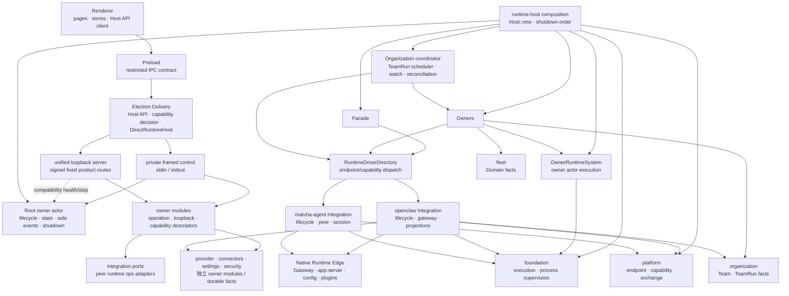
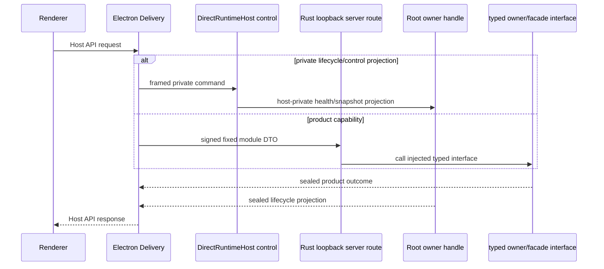
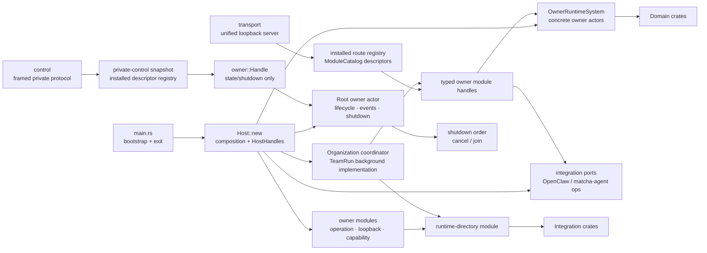
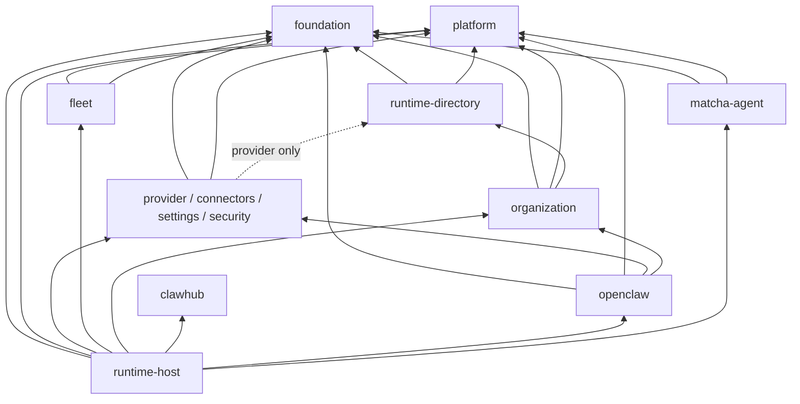
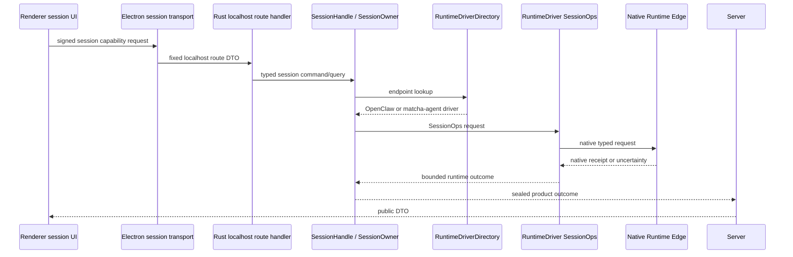
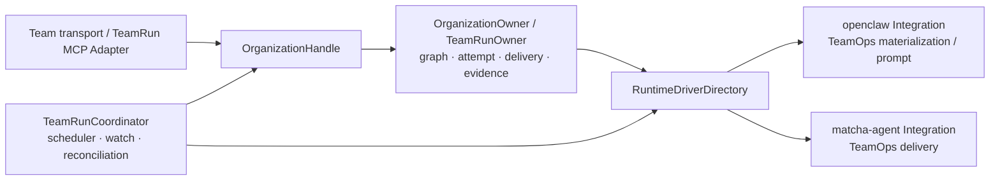

# MatchaClaw 当前分层架构

本文描述当前 **active** 的 MatchaClaw 架构：Electron Desktop Delivery 与 Rust `runtime-host` workspace 如何协作、各 crate 的事实 owner、transport seam 与编译依赖方向。

它不是 TypeScript runtime-host 的目录迁移图，不是旧 owner 审计，也不是迁移完成度账本。旧 TypeScript 路径、历史 `process-runtime` 主链和已删除的 Node runtime-host 仅可作为迁移语义证据，不能被本文表述为当前实现。

产品术语以 [CONTEXT.md](../../CONTEXT.md) 为准；迁移状态唯一以 [runtime-host-ts-rust-migration-progress.md](./runtime-host-ts-rust-migration-progress.md) 为准；Rust 终态地址空间与依赖规则以 [runtime-host-rust-target-architecture.md](./runtime-host-rust-target-architecture.md) 为准。

## 1. 当前结论

```text
Renderer
→ Electron Delivery
→ Rust runtime-host
  ├─ Root owner：lifecycle / state / safe event / shutdown
  ├─ owner modules：业务语义、operation 与 capability descriptor 的 typed boundary
  ├─ integration ports：peer runtime ops 的 typed adapter implementation
  ├─ OwnerRuntimeSystem：durable owner actor 执行
  ├─ Organization coordinator：TeamRun scheduler / watch / reconciliation
  └─ RuntimeDriverDirectory：endpoint / capability 到 peer runtime ops 的分派
→ Domain facts / Platform contracts / Runtime Integrations / Foundation mechanisms
→ Native Runtime Edge
```

- **Electron** 是桌面 Delivery：它拥有窗口、preload、OS integration、Host API proxy、受限 capability decision、Rust binary 启动及 Renderer event projection。
- **`runtime-host` binary** 是本地 runtime process，也是 Rust workspace 的唯一 concrete composition root；它不是 OpenClaw、matcha-agent 之外的第三个 peer Runtime。
- **Root owner actor** 只拥有 Host lifecycle/read-state/safe event/shutdown seam。private control 的 health/state/stop/readiness 可经 `owner::Handle`；产品行为不得再经 Root owner product command。
- **owner modules** 是业务语义、operation、loopback adapter 与 capability descriptor 的 typed boundary；业务事实仍由各自 owner 单写。新增 `modules/call-log` 只单写安全调用审计/history，不接管业务执行或 native facts，见 §5.2。
- **integration ports** 是 peer runtime ops 的 typed adapter implementation；Host 只注入 port，不保存 peer/native durable facts。
- **Foundation** 只提供 runtime-agnostic execution 与受管进程 authority/supervision mechanism。
- **Platform** 只提供跨 owner 的中性契约，例如 Endpoint、Capability、Invocation/Immediate Receipt、ModuleDescriptor/ModuleCatalog（含 effects scoped registration 校验入口）、loopback outcome、listener identity 与 pinned TLS；它不保存跨 Domain 的业务事实，也不拥有 Host listener/transport extension。[VERIFY: runtime-host/platform/src/module.rs:31-99] [VERIFY: runtime-host/platform/src/module.rs:239-304] [VERIFY: runtime-host/platform/src/loopback.rs:152-218]
- **Domain crates** 独占自己的 durable facts、状态转换、恢复与 reconciliation policy。
- **Integration crates** 独占 peer-specific lifecycle、native wire、private projection、native session/workspace semantics；它们不把 peer-private DTO 倒灌为 Domain 事实。
- **Native Runtime Edge** 是 OpenClaw Gateway、matcha-agent app-server、OpenClaw config/plugin/workspace 等真实 native owner。Rust 不复制 Native Session transcript 或 LLM execution history。

## 2. 系统结构与调用方向


```mermaid
flowchart TB
  Renderer["Renderer\npages · stores · Host API client"]
  Preload["Preload\nrestricted IPC contract"]
  Electron["Electron Delivery\nHost API · capability decision · DirectRuntimeHost"]
  Control["private framed control\nstdin / stdout"]
  PublicTransport["unified loopback server\nsigned fixed product routes"]

  Host["runtime-host composition\nHost::new · shutdown order"]
  Root["Root owner actor\nlifecycle · state · safe events · shutdown"]
  Modules["owner modules\noperation · loopback · capability descriptors"]
  Ports["integration ports\npeer runtime ops adapters"]
  OwnerRuntime["OwnerRuntimeSystem\nowner actor execution"]
  TeamCoordinator["Organization coordinator\nTeamRun scheduler · watch · reconciliation"]
  Directory["RuntimeDriverDirectory\nendpoint/capability dispatch"]

  Foundation["foundation\nexecution · process supervision"]
  Platform["platform\nendpoint · capability · exchange"]
  Products["provider · connectors · settings · security\n独立 owner modules / durable facts"]
  Fleet["fleet\nDomain facts"]
  Organization["organization\nTeam · TeamRun facts"]
  OpenClaw["openclaw Integration\nlifecycle · gateway · projections"]
  Matcha["matcha-agent Integration\nlifecycle · peer · session"]
  Native["Native Runtime Edge\nGateway · app-server · config · plugins"]

  Renderer --> Preload --> Electron
  Electron --> Control
  Electron --> PublicTransport
  Control --> Root
  Control --> Modules
  PublicTransport --> Modules
  Modules --> Ports
  PublicTransport -. compatibility health/stop .-> Root
  Host --> Root
  Host --> Facade
  Host --> Owners
  Host --> OwnerRuntime
  Host --> TeamCoordinator
  Facade --> Directory
  Owners --> OwnerRuntime
  Owners --> Directory
  TeamCoordinator --> Owners
  TeamCoordinator --> Directory
  Host --> Foundation
  Host --> Platform
  OwnerRuntime --> Foundation
  Modules --> Products
  Owners --> Fleet
  Owners --> Organization
  Directory --> OpenClaw
  Directory --> Matcha
  OpenClaw --> Foundation
  OpenClaw --> Platform
  OpenClaw --> Products
  OpenClaw --> Organization
  Matcha --> Foundation
  Matcha --> Platform
  OpenClaw --> Native
  Matcha --> Native
```

箭头表示当前调用或编译依赖允许的方向，不表示所有 crate 都互相依赖。`runtime-host` 仅在 composition 处同时看见具体 Domain 与 Integration；其他 crate 不通过反向依赖、全局 registry 或 generic runtime map 获得对 Host 的控制权。

## 3. Delivery：Renderer、Electron 与 Rust 的三个 contract

Renderer public capability、Electron transport 与 Rust internal control 是三个不同的 contract。一个 Rust command 存在，不会自动成为 Renderer 能力。

### 3.1 Renderer 到 Electron

Renderer 通过 `hostApiFetch` 和 preload 暴露的受限 IPC 调用 Electron Host API。Renderer 只消费公开 DTO 和 Renderer event projection，不读取 Rust bootstrap、peer token、native path、child stderr、private state directory 或 peer-private protocol data。

| Module | Interface | 实现位置 |
|---|---|---|
| Renderer product entry | 页面、store、view projection 与 Host API client | `src/pages/**`, `src/stores/**`, `src/lib/host-api.ts` |
| Shared desktop contract | 公开 capability/identity/ownership 类型与纯校验、版本比较；不拥有 native/runtime 状态 | `src/types/desktop/**` |
| Preload seam | retained IPC channel 与严格 IPC contract | `electron/preload/**` |
| Main Host API | route ownership、capability decision、公开错误 envelope | `electron/api/**`, `electron/main/ipc/hostapi-proxy-ipc.ts` |

### 3.2 Electron 到 Rust

Electron 使用 `DirectRuntimeHost` 启动一个 Rust binary，写入一次 bootstrap frame，并保留两个不同的调用 seam：

1. **private framed control**：Electron Main 通过 stdin/stdout 长度帧发出 private control command；control 只保留 frame/wire/ready/EOF/outcome/event loop，命令 vocabulary 来自 installed module descriptors/private-control snapshot，当前 Host system handler 只覆盖 health/runtime snapshot 等 Host-private projection。
2. **signed loopback route**：Electron 在已授权的公开产品操作上签发固定 capability decision，并调用 Rust 统一 loopback server 上的 fixed module route；业务 Adapter 不经 Root owner 或 private control 分派产品行为。


```mermaid
sequenceDiagram
  participant R as Renderer
  participant E as Electron Delivery
  participant C as DirectRuntimeHost control
  participant T as Rust loopback server route
  participant Root as Root owner handle
  participant I as typed owner/facade interface

  R->>E: Host API request
  alt private lifecycle/control projection
    E->>C: framed private command
    C->>Root: host-private health/snapshot projection
  else product capability
    E->>T: signed fixed module DTO
    T->>I: call injected typed interface
  end
  I-->>E: sealed product outcome
  Root-->>E: sealed lifecycle projection
  E-->>R: Host API response
```

`DirectRuntimeHost` 位于 `electron/main/runtime-host-delivery/direct-host.ts`。它是 Electron 的 Rust child process adapter，不是旧 TypeScript `RuntimeHostManager`、`runtime-host-client` 或 `electron/main/process-runtime/**` 的兼容替代。private control 是 Host-private framed protocol：只 decode wire envelope、通过 installed private-control snapshot 分派 Host-private handler、再 encode outcome/event；unified loopback server route 才承接 signed product DTO，并调用注入的 typed Interface。`owner::Handle` 仅覆盖 Host health/state/shutdown 等 Root lifecycle seam。

### 3.3 Rust 到 Renderer 的事件方向

Root owner 只转发 HostEvent 并更新 lifecycle 快照，受限 `SafeEvent` 由 control 投影；cron 模块的 `CronExecutionTerminalEvent` 经此链发布，公开名称仍为 `OpenClawCronExecution` / `openclaw.cron.execution`。[VERIFY: runtime-host/host/src/host_actor/actor.rs:25-50] [VERIFY: runtime-host/host/src/control/event_projection.rs:21-36] [VERIFY: runtime-host/host/src/control/wire.rs:439-444]

Session delta 不走 Root/control：Integration 转为 sessions-owned `SessionIngressEvent`，Host composition 用 sessions scope-managed pipe 接到 owner，state/delta 经 `/api/sessions/events` SSE 到 Electron `host-event-bridge`，再投影 `host:event / session.delta`。[VERIFY: runtime-host/host/src/composition/host/session_ingress.rs:18-40] [VERIFY: runtime-host/modules/sessions/src/owner/actor.rs:878-884] [VERIFY: runtime-host/modules/sessions/src/adapters/loopback/events.rs:43-70] [VERIFY: electron/main/host-event-bridge.ts:100-102] Renderer event 不反向成为 Host state 的写入通道；没有 public consumer 的 native event、raw message、tool payload、thinking、approval detail、workspace root、token 或 raw child stderr 不得跨此 seam。

## 4. Rust workspace：物理 owner 与职责

当前 workspace 位于 `runtime-host/`：

```text
runtime-host/
├── foundation/                 # foundation
├── platform/                   # platform
├── modules/
│   ├── provider/               # accounts / models / routing
│   ├── connectors/             # connector desired / applied
│   ├── settings/               # settings desired / effect
│   ├── security/               # policy desired / effect / receipts
│   ├── call-log/               # safe calls + revision history, not execution
│   ├── channels/               # native channel operations
│   ├── toolchain/              # verify / prepare
│   ├── fleet/                  # fleet
│   ├── organization/           # organization
│   └── …                       # 其他已落地业务 modules
├── external/
│   └── clawhub/                # third-party ClawHub registry/CLI
├── integrations/
│   ├── openclaw/               # openclaw
│   └── matcha-agent/           # matcha-agent / matcha_agent
└── host/                       # runtime-host / runtime_host
```

`integrations/acp/` 不是当前 workspace member：当前没有 source-backed supported Delivery consumer，因此不以空 crate、fake transport 或 unavailable production implementation 占位。

| Crate | 事实 owner 与 interface | 不负责的事 |
|---|---|---|
| `foundation` | `execution` 与 `process` mechanism；受管进程 authority、observation、termination、supervision | 产品 Domain、peer wire、route、Renderer DTO |
| `platform` | Endpoint、Capability、Invocation/Immediate Receipt、listener identity、pinned TLS 的中性语言 | Session transcript、global approval、global job store、Domain reconciliation state |
| `provider` | account/model/routing stores、cascade journal、private resolver port | 明文 credential durable store、OpenClaw native auth authority |
| `connectors` | connector catalog、revision/applied revision、secret resolver port、session MCP operations | secret bytes durable store、native session authority |
| `settings` | desired state、revision/correlation、effect settlement | OpenClaw private config authority、Electron OS login-item effect |
| `security` | policy desired/effect、operation receipts、typed native security port | signed capability issuer、已退役的聚合 grant/replay store |
| `fleet` | target/topology、lease、command/outbox、unknown/replay、audit、selector/reconcile durable facts | 未证明的 remote executor、artifact producer、public remote Delivery |
| `organization` | Team、TeamRun graph、attempt、delivery、approval、evidence、trigger 与 durable Organization facts | OpenClaw config shape、peer terminal receipt 的猜测 |
| `clawhub` | ClawHub registry HTTP catalog/search、token projection、legacy CLI install registry fallback | durable product facts、OpenClaw Gateway native skill operation、Renderer public policy |
| `openclaw` | Gateway lifecycle/wire/auth、native session/workspace、OpenClaw projections、Cron/skill/task/channel operations | Host composition、Organization command ledger、Renderer public policy、ClawHub registry catalog/search、sealed skill package owner |
| `matcha-agent` | app-server lifecycle、peer/session protocol、run/terminal receipt、approval/session translation、bounded read-only transcript history projection | Electron process lifecycle、Renderer channel、Matcha transcript writer、Matcha transcript shadow store、sealed skill package owner |
| `runtime-host` | concrete composition root、Root lifecycle/event owner、`OwnerRuntimeSystem` concrete owners、owner module handles、integration ports、control/loopback Adapter Module、module registry capability catalog、diagnostic projection、sealed skill package host-level concrete owner | 把自己变成第三个 peer Runtime；复活 Mega owner、generic `RuntimeJob`、generic job/runtime registry、Host facade drawer 或 product command enum |

### 4.1 Durable state roots

Electron bootstrap 只传递 owner-specific state root，不做跨 owner fallback：

| Root | Owner | 内容 |
|---|---|---|
| `%APPDATA%/MatchaClaw/runtime-host` | MatchaClaw Host / Rust `runtime-host` | `organization-facts.log`、Team webhook token、`fleet-facts.log`、`fleet-private/` |
| `%APPDATA%/MatchaClaw/openclaw` | OpenClaw Integration / native OpenClaw | `openclaw.json` 仅保存 `skills.<key>.enabled`、Gateway token、private OpenClaw projection；OpenClaw 源码改动通过 bundle patch 投递 |
| `%APPDATA%/MatchaClaw/runtime-local` | `runtime-host` owner-local private material | 加密 sealed skill package material |
| `%APPDATA%/MatchaClaw/matcha-agent/app-server` | matcha-agent app-server | app-server native session/run/event/snapshot state |

## 5. `runtime-host` 内部结构

`runtime-host/host` 不是传统 controller/service/repository 栈。它的 Depth 不在旧 Root/Mega owner，而在 **Host composition + owner module / integration port graph**：composition stages 把 bootstrap input 转成 concrete owner tasks、owner module handles、integration ports、runtime directory、module registry install plan 与 shutdown order；`Host::new()` 保持薄阶段串联和最终 assembly；Root owner 的 Interface 只保留 lifecycle/event/shutdown。这个形状把 Leverage 给 transport/control substrate，同时把 product policy 的 Locality 留在具体 owner module / integration / coordinator。


```mermaid
flowchart LR
  Main["main.rs\nbootstrap + exit"] --> HostNew["Host::new\ncomposition + HostHandles"]
  HostNew --> OwnerRuntime["OwnerRuntimeSystem\nconcrete owner actors"]
  HostNew --> Modules["owner modules\noperation · loopback · capability"]
  HostNew --> Integrations["integration ports\nOpenClaw / matcha-agent ops"]
  HostNew --> Coordinator["Organization coordinator\nTeamRun background implementation"]
  HostNew --> RootOwner["Root owner actor\nlifecycle · events · shutdown"]

  Control["control\nframed private protocol"] --> PrivateRegistry["private-control snapshot\ninstalled descriptor registry"]
  Transport["transport\nunified loopback server"] --> RouteRegistry["installed route registry\nModuleCatalog descriptors"]
  PrivateRegistry --> RootHandle["owner::Handle\nstate/shutdown only"]
  RouteRegistry --> ModuleHandles["typed owner module handles"]
  RootHandle --> RootOwner
  ModuleHandles --> OwnerRuntime
  ModuleHandles --> Integrations
  Modules --> Directory["runtime-directory module"]
  Coordinator --> ModuleHandles
  Coordinator --> Directory
  Directory --> Integration["Integration crates"]
  OwnerRuntime --> Domain["Domain crates"]
  RootOwner --> Shutdown["shutdown order\ncancel / join"]
```

| Host module group | Interface / role | 关键路径 |
|---|---|---|
| bootstrap | 解码 private bootstrap material，构造 typed Host input | `host/src/bootstrap/**`, `host/src/main.rs` |
| composition | 创建 concrete owner tasks、owner module handles、integration ports、runtime plan 与 shutdown order；`Host::new` 只做阶段委派和 assembly | `host/src/composition/**`, `host/src/composition/host/**` |
| owner | Root lifecycle/event/shutdown Module；`owner::Handle` 是 Host lifecycle read/shutdown Seam，不是 product request Seam | `host/src/host_actor/**` |
| owner modules | Session、Provider、Settings、Security、Channel、Connector、Fleet、Organization、Plugins、Skills、Task、Workspace、Usage 等业务 module；Interface 是各自 typed handle / port / loopback adapter | `runtime-host/modules/**` |
| integration ports | OpenClaw / matcha-agent peer-specific lifecycle、driver ops 与 owner module port implementation；不保存 Host canonical facts | `runtime-host/integrations/openclaw/src/**`, `runtime-host/integrations/matcha-agent/src/**` |
| module registry | canonical module install；校验 provides/requires/effects，生成 installed route registry、private-control snapshot 与 capability catalog projection；不手写业务 descriptor directory | `host/src/module_registry/install.rs`, `host/src/module_registry/capability_catalog.rs`, `host/src/module_registry/private_control.rs`, `platform/src/module.rs` |
| runtime surface | fixed OpenClaw/Matcha peer identity、RuntimeDriver ops surface、Runtime Endpoint Directory public projection 与 installed capability catalog projection | `runtime-host/host/src/composition/runtime_ports.rs`, `runtime-host/modules/runtime-directory/src/**`, `runtime-host/host/src/module_registry/capability_catalog.rs`, `runtime-host/integrations/openclaw/src/driver/**`, `runtime-host/integrations/matcha-agent/src/driver/**` |
| control | private framed stdin/stdout wire、ready signal、EOF shutdown、SafeEvent/outcome encode 与 service loop；dispatch 只查 installed private-control snapshot | `host/src/control/**`, `host/src/module_registry/private_control.rs` |
| http / module loopback | 统一 loopback server、route lookup 与 Response/Stream/Upgrade 写回；authorization decision 验证和业务 DTO decode 在具体 module adapter/facade | `host/src/http/**`, `runtime-host/modules/**/src/adapters/loopback/**` |

### 5.1 Root owner 与 typed Interface 的不变量

- Root owner 只能推进 Root lifecycle/shutdown/event projection；不能新增 product command enum 或 product mutable facts。
- Domain/product mutable facts 必须经对应 concrete owner Interface 推进；Session/Organization/Fleet/Provider/Settings/Security/Channel/Connector 等状态各自单写。
- owner module 只能持有自己明确拥有的 bounded operation state；例如 Cron terminal observation 可在 `cron` owner module 中收束，但不能升级成 Host-wide `RuntimeJob`。
- transport 只解析、验证其输入 contract 并投影固定 outcome；不复制 Domain 或 Integration policy。Loopback route 可声明整请求期限或仅 body 接收期限；Host 机械执行计时范围。Provider 修改由 owner 限制 native reconcile 预算并返回持久化/运行时双结果，不能被统一短 HTTP 期限提前抹掉已提交事实。[VERIFY: runtime-host/platform/src/loopback.rs:266-326] [VERIFY: runtime-host/host/src/http/server.rs:89-115] [VERIFY: runtime-host/modules/provider/src/owner/actor.rs:454-538]
- 长操作必须保留 cancellation 与 shutdown/join 语义；落点是拥有语义的 concrete owner、facade 或 coordinator，不是 Root/Mega owner。
- `Host` 可以组合 peer Integration，但不直接把 Gateway/app-server/private config/state 作为公开 DTO 返回。
- `main.rs` 只负责 bootstrap、入口和退出码，不承载业务状态机。

### 5.2 统一 Call Log：审计 owner，不是执行 owner

```text
21 business modules -> platform::call typed recorder/context
                    -> original owner queue / native ports / canonical facts
                    -> modules/call-log writer -> calls + call_changes
commit -> call.changed {callId,revision} -> Electron -> Calls consumer re-read
lag -> calls.resync -> active observers re-read (no periodic polling)
```

`platform::call` 只定义中性记录语言；`modules/call-log` 持有独占 writer lock、SQLite WAL/FULL 与 bounded 256 专用线程 writer，一套当前 calls + revision history。`CallId` 是调用记录身份，不能替代 run/session/dispatch 等 native identity；模块定义 safe typed detail，禁止通用 args/results、native raw 和 secrets。calls read 不递归记审计，重启 unfinished 结算 Unknown、不 replay。[VERIFY: runtime-host/platform/src/call.rs:74-105] [VERIFY: runtime-host/platform/src/call.rs:221-225] [VERIFY: runtime-host/modules/call-log/src/lib.rs:19-55] [VERIFY: runtime-host/modules/call-log/src/store.rs:19-95]

长操作仍入原 owner/module bounded queue，持久 accepted 后短返 strict 202 `CallReceipt`；原 Global/keyed/workflow 执行和 native facts 不转移。已批准范围在原 Provider 四项、Channel delete-config、Wiki 三项之外，扩展 Provider discover、Connector probe/status/sessionStatus、Channel disconnect/logout、Cron create/update/delete（toggle→update）、Skills 配置/启停/批量/卸载/产物、Subagents 创建/更新/删除/配置/包安装/export/exportCloud、Team materialize/manual create/runDelete/delete、Wiki rescan/applyGeneratedPages/deleteSource/source-task.retry/source-task.resume、Runtime stop。Provider Main 私有凭证快照/锁仍通过原 owner 私有 claim/settle 收束，本地 commit 与 native applied/observed 分开；既有后台操作不重建执行 owner。[VERIFY: runtime-host/modules/provider/src/api.rs] [VERIFY: runtime-host/modules/connectors/src/api.rs] [VERIFY: runtime-host/modules/skills/src/operation.rs] [VERIFY: runtime-host/modules/subagents/src/application/results.rs] [VERIFY: runtime-host/modules/organization/src/call.rs] [VERIFY: runtime-host/modules/wiki/src/api.rs] [VERIFY: runtime-host/host/src/composition/peer/handle.rs]

Main 的完整 Rust child restart 仍归 `RuntimeHostLifecycleOwner`，短返 restartId 并观察同次结果；updater download 复用原事件终态。Cloud package download/install preparation/agent upload/skill upload confirm 归 `CloudAccountService` 的具体 bounded operation，operationId 不冒充 Rust CallId，也不进入 CallLog；native install/export 保留独立 Rust receipt，原 account epoch、lease 与补偿边界保持。[VERIFY: electron/main/runtime-host-delivery/lifecycle-owner.ts] [VERIFY: electron/main/updater.ts] [VERIFY: electron/main/cloud-account/service.ts] [VERIFY: electron/main/cloud-account/package-operations.ts]

Sessions、Workspace、Browser 与 team.runCreate 不在此批；短查询、登录交互、内部完成屏障与 MCP 必要即时 payload 保留 original await。body deadline 仅收 body，不能代替后台化/执行预算；既有 Fleet long actions 仍 HTTP 200 accepted，不统一全部路由 202。变化提示 commit 后只带 id/revision，consumer wait 安全摘要后短读原 canonical facts 或同 callId 的模块自有 typed result；模型列表、partial 集合、Wiki 写入/删除结果与包字节不进入 CallLog，也不以最新 snapshot 冒充某次结果。模块结果有容量、完成 TTL 与原授权，读取非消费、pending 不过期、重启不恢复；sealed cloud 产物只经 signed 私有入口交 Main。Calls 不建立 global job/result store，Host 只组合注入、注册、转发与关停，Root/Foundation 不成为业务执行 owner。[VERIFY: runtime-host/platform/src/call.rs:269-319] [VERIFY: runtime-host/modules/provider/src/owner/discovery.rs] [VERIFY: runtime-host/modules/connectors/src/owner/observations.rs] [VERIFY: runtime-host/modules/subagents/src/application/results.rs] [VERIFY: runtime-host/modules/wiki/src/call_result.rs] [VERIFY: runtime-host/modules/skills/src/result.rs] [VERIFY: electron/api/routes/packages.ts]

具体 admit/await 分界见 [async-projection.md](../runtime-host-contract-v1/async-projection.md)，源码覆盖与接线/验证 OPEN 只维护于 [Call Log / Calls](../architecture-knowledge/modules/call-log/dev.md)；不以源码已写宣称 checks passed。

## 6. Domain、Platform 与 Integration 的关系

### 6.1 Platform 是语言，不是第二状态库

`platform` 为跨 crate 调用提供 Endpoint、Capability、scope、Invocation outcome、`call` 审计记录端口、ModuleDescriptor/ModuleCatalog、loopback Response/Stream/Upgrade outcome、listener identity 与 pinned TLS 的 typed grammar。[VERIFY: runtime-host/platform/src/module.rs:31-99] [VERIFY: runtime-host/platform/src/loopback.rs:152-218]

`ModuleDescriptor.effects` 是模块声明的 effect ownership 清单；`ModuleCatalog::validate_effects()` 用 `EffectRegistration` 校验 unknown module、未声明 effect 与缺失 scoped effect，其中可选 loopback descriptor 会自动计入该 module 的 scoped `Route` registration。当前 Host 安装路径由 `module_registry/install` 把 Foundation `ModuleScope` registrations 映射为 Platform effect registrations，并调用 `install_with_capabilities_and_effects()` 同时校验 capability dependency 与 scoped effects，随后派生 installed route registry、private-control snapshot 与 capability catalog projection。[VERIFY: runtime-host/platform/src/module.rs:141-204] [VERIFY: runtime-host/platform/src/module.rs:239-304] [VERIFY: runtime-host/host/src/module_registry/install.rs]

Foundation lifecycle `ModuleScope` 是运行期 effect 生命周期 mechanism：它注册 disposer/owned task/process/listener/runtime endpoint 并按 LIFO dispose；`EffectGuard` 当前只携带 scope/effect identity。它向 Platform catalog 提供 scoped registration 事实，但不拥有 `ModuleDescriptor.effects` 契约，也不赋予普通模块 Host transport ownership。[VERIFY: runtime-host/foundation/src/lifecycle.rs:9-74] [VERIFY: runtime-host/foundation/src/lifecycle.rs:131-214] [VERIFY: runtime-host/host/src/composition/host/owner_runtime.rs:55-107]

**Invocation outcome / Immediate Receipt** 只表达调用边界能知道的事实：明确拒绝、同步完成、取消，或 effect 可能已到达目标但终局未知。它不等同最终 execution success。需要恢复的 command、attempt、delivery 和 terminal outcome 仍由真正的 Domain 或 Native Runtime owner 保存；无法判定的 effect 使用 `Unknown`，不自动重试。

### 6.2 业务 owner modules 独占各自事实

- `modules/provider`、`modules/connectors`、`modules/settings`、`modules/security` 分别拥有 account/model/routing、connector catalog、settings desired、security policy/effect stores；Host composition 逐个 spawn，不存在 Environment 聚合状态或 `modules/environment`。[VERIFY: runtime-host/host/src/composition/host/owners/runtime.rs:244-287]
- 无消费者的旧 `domains/environment` 聚合 revision/grant/reconciliation 模型退役，不视为这些业务 owner 的新增能力或等价迁移。OpenClaw `crate::environment` 安装检查与 Fleet environment/resource 生命周期保留。
- `fleet` 只保留当前能证明的本地 durable facts；历史 RemoteFleet control plane 删除不构成新的 executor 依据。
- `organization` 负责 Team 与 TeamRun 的 graph、attempt、approval、delivery、evidence、trigger 和恢复。OpenClaw materialization 是 Integration effect，不拥有 TeamRun command ledger。

没有横切的 `session`、`approval`、`reconciliation`、`job`、`storage` 或 `facts` crate。共同字段形状不证明共同 owner。

### 6.3 Integration 独占 peer-specific private semantics

Sealed skill 的包、授权与解封仍由 Rust `sealed-resource` 持有；OpenClaw native 负责模型上下文中的引用展开，而非 Renderer 或 Host Session 投影脱敏。普通工具结果与 transcript 保存安全资源引用，正文只进入正常模型请求的临时副本；压缩保存引用而不接收正文。引用绑定包摘要，恢复时重新检查当前授权及版本；旧包已替换则拒绝，不将最新包冒充历史版本。模型上下文正文捕获在这类请求上关闭，普通诊断不变；本地包加密不保证模型绝不复述，也不追溯重写旧 transcript。[VERIFY: runtime-host/modules/sealed-resource/src/ports.rs:367] [VERIFY: runtime-host/modules/skills/src/adapters/loopback/sealed_resource.rs:426] [VERIFY: scripts/openclaw-bundle-patches.mjs:383] [VERIFY: scripts/openclaw-bundle-patches.mjs:394]

| Integration | 当前职责 | Native Runtime Edge |
|---|---|---|
| OpenClaw | Gateway auth/wire、single backend WS dispatcher、request/response/event demux、peer lifecycle、native session/window/workspace、config/channel/agent/team projection、native operation readback；session/task/team prompt 复用 `GatewayClient` control exchange，`sessions.subscribe` 不参与 Host session 主链路 | OpenClaw Gateway、OpenClaw config、plugins、Agent Workspace、native session state |
| matcha-agent | app-server lifecycle、peer/session protocol、run/terminal receipt、approval/session translation | app-server、worker、QueryEngine、native session/run state |

Integration 可以消费 Domain 的 typed port 或 intent，但不能将 OpenClaw config object graph、Gateway raw error、app-server token、native workspace root、transcript 或 raw event 变成 Platform/Domain 事实。

Provider 私密凭据链统一为 **Main encrypted vault → Host 非秘密 account → private resolver → OpenClaw SQLite auth profile**：Main 用 `safeStorage` 加密保存 API key、Token 或 OAuth material；Host 只保存 account 配置与 credential reference，由私密 resolver 解密并投影到 OpenClaw `state/openclaw.sqlite`，secret 不进入 public DTO 或通用 Host 配置。Anthropic `cliReuse` 不复制 CLI secret、不持有 credential reference，而由 native `anthropic` provider 的 `agentRuntime: { "id": "claude-cli" }` 使用 CLI 自有认证。品牌 / 套餐仍是现有 account 的 provider / endpoint，不新增 plan owner，也不改变层级。认证类型映射见 [Provider account 认证契约](../runtime-host-contract-v1/renderer-api.md#provider-account-认证契约)；实现见 `electron/main/ipc/provider-private-auth.ts`、`runtime-host/modules/provider/src/domain/account.rs` 与 `runtime-host/integrations/openclaw/src/native_config/provider_models/mod.rs`。

渠道适配按已授权的 ClawX 行为对齐，native 基线为 OpenClaw `2026.9.2`。渠道配置、绑定与登录材料属于 OpenClaw Integration / native owner，不是 Host durable facts；Host 只编排登录 finalization 与既有 Foundation supervisor。配置成功后，登录 finalization，或外部托管插件配置 `Noop` / `peer_link` 失败，需要在 supervisor 为 `Running` 时请求 restart；普通 changed 配置交给 native reload，不重复重启。渠道插件 prepare 使用实际 OpenClaw 包根，由 managed reconciliation 的 `plugin_peer_link.rs` 修复插件 host link（Windows junction / Unix symlink），经 canonical readback 返回真实 `peer_link_ok`；该修复不改安装账本、不重建 native scanner。非 running 时，status/read 读取 native config store，configure/delete 锁内原子提交；form/read 的 schema 来自本地插件原生 channel descriptor，飞书/微信读取实际 channel schema export，不使用插件级 schema 冒充渠道字段。企微原生插件未提供 channel schema，表单采用既有 ClawX/产品 descriptor，并以实际插件 account reader 核验 `botId` / `secret` 语义，不冒称 native schema；公共 read 只投影非敏感标量。是否离线以 supervisor 提供的 `runtime_running` 为准，不能因 RPC 失败盲目回退本地；running mutation 的 `MayHaveReached` 只允许只读确认，不以离线写入兜底。具体提交、删除范围及限制见[渠道契约](../runtime-host-contract-v1/routes.md#d-openclaw--provider--settings--skills--channel-reads)。

渠道配置读取在原有安全字段投影之外，单独公开可空 `agentId`，仅表达 native `bindings` 中该渠道/账号明确的简单 route binding；不解析消息级路由、不推断默认智能体、不在 Host 或 Renderer 缓存第二份绑定事实。Electron 严格校验后由配置弹窗回填，不扩展渠道 snapshot。[VERIFY: electron/main/runtime-host-delivery/transport/channels/config-read.ts:17-20] [VERIFY: electron/main/runtime-host-delivery/transport/channels/config-read.ts:87-92] [VERIFY: electron/api/routes/channel-config-read.ts:40-44]

OpenClaw `2026.9.2` 的 SQLite state 与微信插件 `openclaw-weixin/accounts.json` 账户索引、`accounts/<accountId>.json` 登录材料是不同的 native 存储，不能相互替代。渠道快照在非 running 时读取 native config store、零 RPC；微信账户取自插件索引，未登录仍保留已配置渠道项，但不虚构 `default` 账户。running 时保留 native 状态事实，RPC 失败保持失败/unknown，不伪造离线快照。实现见 `runtime-host/integrations/openclaw/src/surfaces/channels/adapter.rs`、`runtime-host/modules/channels/src/**` 与 `runtime-host/integrations/openclaw/src/surfaces/channels/gateway/status.rs`。

OpenClaw 安装记录 reconciliation 将 `plugins.installedIndex.index` 持久化为仅含完整 `installRecords` 的账本，保留第三方记录及记录扩展字段，清除派生索引；外层元数据保留，revision 复用原事务更新。OpenClaw 在启动时自行发现并在内存重建索引，Rust 不扫描重建原生索引，也不调用刷新 CLI。

飞书插件由 Matcha 维护 `packages/openclaw-lark` 并通过既有 managed builder → `build/openclaw-plugins/openclaw-lark` → after-pack → `resources/openclaw-plugins/openclaw-lark` 交付，替代官方 npm 下载与 SDK 文本补丁；Rust 读取独立 `dist/config-schema.mjs` 的 `FEISHU_CONFIG_JSON_SCHEMA`，插件/渠道身份及渠道 owner 不变。[VERIFY: scripts/lib/openclaw-local-plugin-builder.mjs:10-13] [VERIFY: scripts/lib/openclaw-local-plugin-builder.mjs:237-243] [VERIFY: scripts/after-pack.cjs:664-682] [VERIFY: runtime-host/integrations/openclaw/src/surfaces/channels/gateway/config/local_schema.rs:195-197]

## 7. Process lifecycle ownership

受管 runtime lifecycle 的职责固定如下：

```text
Foundation
→ runtime-agnostic process authority / observation / termination / supervision mechanism

Runtime Integration
→ peer-specific launch / readiness / graceful stop / recovery / logs / restart policy

Host
→ concrete composition, cross-instance start dependency, shutdown / join order

Electron Delivery
→ launch and connect Rust runtime-host; desktop shell and safe transport
```

每个受管 process instance 的 process handle、provenance、authority scope 和 lifecycle state 只由其 Foundation Supervisor 单写。Host 和 Integration 通过 typed command/request 操作；未知 port occupant 未证明是 Matcha-owned 时不得被终止。

Electron 不拥有 OpenClaw 或 matcha-agent 的 semantic lifecycle policy。Electron 启动并连接 Rust `runtime-host`；Rust Host 组合具体 peer Integration、决定 runtime dependency 与 shutdown order。

### 7.1 当前 crate 依赖 DAG

下图和表摘录 `runtime-host/Cargo.toml` 与各 crate `Cargo.toml` 的主要编译依赖，不是完整 workspace 清单或逻辑调用图；Products 节点仅合并展示四个独立 module，不代表新聚合 crate。具体边以各 crate manifest 为准。


```mermaid
flowchart BT
  Foundation[foundation]
  Platform[platform]
  Products[provider / connectors / settings / security]
  RuntimeDirectory[runtime-directory]
  Fleet[fleet]
  Organization[organization]
  ClawHub[clawhub]
  OpenClaw[openclaw]
  Matcha[matcha-agent]
  Host[runtime-host]

  Products --> Foundation
  Products --> Platform
  Products -. provider only .-> RuntimeDirectory
  RuntimeDirectory --> Foundation
  RuntimeDirectory --> Platform
  Fleet --> Platform
  Fleet --> Foundation
  OpenClaw --> Foundation
  OpenClaw --> Platform
  OpenClaw --> Products
  OpenClaw --> Organization
  Organization --> Foundation
  Organization --> Platform
  Organization --> RuntimeDirectory
  Matcha --> Foundation
  Matcha --> Platform
  Host --> Foundation
  Host --> Platform
  Host --> Products
  Host --> Fleet
  Host --> Organization
  Host --> ClawHub
  Host --> OpenClaw
  Host --> Matcha
```

| Crate | 当前可依赖的 workspace crate | 架构含义 |
|---|---|---|
| `foundation` | 无 | 最低层 mechanism，不能看见产品或 peer |
| `platform` | 无 | 中性 contract，不引入 Domain 或 Integration policy |
| `provider` | `foundation`, `platform`, `connectors`, `runtime-directory` | 非秘密 account/model/routing facts 与 owner-local effect |
| `connectors`、`settings`、`security` | `foundation`, `platform` | 各自持久化、operation 与 typed port，不依赖聚合 Environment |
| `fleet` | `foundation`, `platform` | Fleet durable facts 使用 endpoint/exchange language，不依赖 Host |
| `organization` | `foundation`, `platform`, `runtime-directory` | Team/TeamRun 领域模型与 store、owner-local execution |
| `clawhub` | 无 | 第三方 registry/CLI client；不拥有 Domain facts，也不是 peer runtime |
| `openclaw` | `foundation`, `platform`、`provider`/`connectors`/`settings`/`security`/`organization` 等业务 modules、`clawhub` | 实现具体业务 typed ports 与 OpenClaw native effects，不依赖旧聚合 Environment |
| `matcha-agent` | `foundation`, `platform` | 只翻译 app-server lifecycle/session peer semantics |
| `runtime-host` | 所有当前 workspace crate | 唯一 concrete composition 与 Delivery-facing Interface graph |

该 DAG 也解释了为什么 `organization` 不能直接 import OpenClaw：TeamRun 通过 `organization::ports` 定义的 materialization、role-session、prompt-delivery 等 typed interface 表达所需 effect，具体 OpenClaw adapter 只能在 Host composition 处注入。

## 8. 启动、transport 与 shutdown 的真实结构

### 8.1 Bootstrap 与启动

Electron `bootstrapMainApplication()` 创建 `DirectRuntimeHost`，将一次性 bootstrap bytes 写入 Rust stdin。Rust `host/src/main.rs` 只完成三件事：读取 bootstrap、拆出 typed input/runtime-host transport port/verifier、调用 `run_delivery_transports()`。

`run_delivery_transports()` 的顺序是：

```text
bootstrap typed inputs
→ Host::new(input)
  → run composition stages
  → spawn OwnerRuntimeSystem concrete owners
  → create owner module handles and integration ports
  → assemble thin Host + HostHandles
→ read settings auto-start through SettingsHandle
→ host.start_admission_only()
→ spawn Root lifecycle host actor
→ module_registry::install installs ModuleCatalog
→ derive route registry, private-control snapshot, capability catalog snapshot
→ bind one Host-owned loopback server from installed route descriptors
→ run private framed control with root handle + installed private-control snapshot
→ request peer autostart through PeerHandle
```

Host-owned loopback transport 已收敛为一个 loopback port/listener，但不会共享单一 Root owner Interface。每个业务 Adapter 仍只绑定自身需要的 typed owner module handle / port；`owner::Handle` 只保留给 Root lifecycle projection/shutdown 路径，例如 host-private health/snapshot。常规 Rust module 通过 `platform::module::ModuleDescriptor` 声明 provides/requires/effects 与可选 loopback descriptor；`module_registry/install` 收集 Foundation `ModuleScope` registrations，调用 `ModuleCatalog::install_with_capabilities_and_effects()` 校验依赖与 scoped effects，并输出 installed route registry、private-control snapshot 与 capability catalog projection。loopback router 只消费 installed route descriptors；legacy compatibility module 已删除，不在 router 中硬编码。Organization/Team、Sessions、Fleet 等业务 HTTP/SSE/WS 入口由各自 module descriptor 注册。普通模块不拥有 Host transport/listener，也不能把 route descriptor 反推为通用 Host registry。[VERIFY: runtime-host/platform/src/module.rs:141-204] [VERIFY: runtime-host/platform/src/module.rs:239-304] [VERIFY: runtime-host/host/src/module_registry/install.rs] [VERIFY: runtime-host/host/src/http/router.rs] [VERIFY: runtime-host/modules/organization/src/adapters/loopback/mod.rs:50-58] [VERIFY: runtime-host/modules/fleet/src/adapters/loopback/mod.rs:61-69] [VERIFY: runtime-host/modules/sessions/src/adapters/loopback/mod.rs:73-85] Platform loopback outcome 类型支持 `Response`、`Stream`、`Upgrade`；当前 Host server 直接写回该 outcome，Session SSE 与 Fleet terminal WS 是统一 server 的 route outcome，不是独立 Host-owned listener。统一 listener 自身作为 Host HTTP extension scope 管理，不归普通模块所有。[VERIFY: runtime-host/platform/src/loopback.rs:152-218] [VERIFY: runtime-host/host/src/http/server.rs:20-40] [VERIFY: runtime-host/host/src/http/server.rs:83-104] [VERIFY: runtime-host/modules/fleet/src/adapters/loopback/mod.rs:120-164] OpenClaw gateway、Matcha app-server、TeamRun MCP stdio 仍是 peer/native 边界。Host capability catalog 来自 installed `ModuleCatalog` 中各 owner module 的 `CapabilityDescriptorProvider`；Runtime Endpoint Directory 由 `runtime-directory` module 投影 fixed local OpenClaw/Matcha endpoints。Host `PeerHandle` 只提供 peer lifecycle source，不存在单独的 `peer_directory.rs` Host owner，public response 不暴露 PID、token、path 或 raw peer state。因此 HTTP/control 请求不能绕过自己的 typed Interface 直接访问 `Host`，也不会为每条 route 创建第二个 Host 或第二份 peer lifecycle state。对应实现为 `runtime-host/host/src/main.rs`、`runtime-host/host/src/control/**`、`runtime-host/host/src/host_actor/**`、`runtime-host/host/src/composition/host/mod.rs`、`runtime-host/host/src/composition/runtime_ports.rs`、`runtime-host/host/src/module_registry/**`、`runtime-host/modules/runtime-directory/src/**`、`runtime-host/host/src/composition/peer/handle.rs`、`runtime-host/host/src/http/**` 与 `runtime-host/modules/**/src/adapters/loopback/**`。

### 8.2 Transport family 与职责

`transport/**` 按产品语义拆分 handler/adapter，而不是按 HTTP resource 机械聚合。它们共享的 Interface 是：严格解码固定 DTO、验证 capability decision、调用注入的 typed owner module handle / integration port、投影封闭成功/拒绝/unknown outcome。统一 loopback server 只收敛 listener 和 HTTP/SSE/WS outcome 写回；`owner::Handle` 不是 transport-wide Interface。

| Transport family | Target Interface / Module | 典型路径 |
|---|---|---|
| Session | `SessionHandle` / `SessionOwner`，必要时经 RuntimeDriver `SessionOps` | `transport/sessions/**`, `transport/session_*.rs`, `host/src/sessions/**` |
| Workspace | `workspace` owner module，经 `WorkspaceOps` port 读取/写入 OpenClaw native workspace projection | `modules/workspace/src/**`, `integrations/openclaw/src/workspace/**` |
| Organization / TeamRun | `organization` owner module；TeamRun effect 经 native effects/runtime ports；session terminal settlement 经 `SessionTerminalHook` / Organization terminal hook；standalone MCP artifact 只经 Organization fixed API | `modules/organization/src/adapters/loopback/**`, `modules/organization/src/owner/**`, `host/src/composition/host/organization_ports.rs`, `host/src/bin/runtime-host-mcp.rs` |
| Provider / Settings / Security / Channel / Connector | `provider`、`settings`、`security`、`channels`、`connectors` owner modules | `modules/provider/**`, `modules/settings/**`, `modules/security/**`, `modules/channels/**`, `modules/connectors/**` |
| External ClawHub marketplace | `ClawHubRegistryClient`；search 直连 external registry，install 经 `skills` owner module / OpenClaw skills port | `external/clawhub/**`, `modules/skills/src/**`, `integrations/openclaw/src/skill.rs` |
| OpenClaw products | `cron`、`subagents`、`task-manager`、`plugins`、`skills`、`usage` owner modules；session/task/team prompt effect 经 OpenClaw Gateway / owner module ports 投递 | `modules/cron/**`, `modules/subagents/**`, `modules/task-manager/**`, `modules/plugins/**`, `modules/skills/**`, `modules/usage/**`, `integrations/openclaw/src/**` |
| diagnostics | `diagnostics` owner module constrained archive receipt | `modules/diagnostics/src/**`, `host/src/composition/host/diagnostics_archive.rs` |

这个划分不是把每个 transport 变成一个新的事实 owner：例如 Cron native job facts仍由 OpenClaw，TeamRun graph facts 仍由 Organization，security desired/effect facts 仍由其 dedicated owner。transport 只是其入站 adapter。Host health/status 读取 Host admission、peer supervisor projection、Gateway health/control readiness 时保持独立字段；`Host Ready` 只表示 admission open，不等同 Gateway connected、Matcha Running 或 OpenClaw control ready。

### 8.3 Shutdown 是显式顺序，不依赖 drop 偶然收束

Host shutdown 由 `composition/host/shutdown.rs` 定义，并由 Root owner shutdown path 串行触发 `Host::shutdown()`；本轮新增的 drain/call-log scope 是源码接线，完整关停验证仍 OPEN。[VERIFY: runtime-host/host/src/composition/host/shutdown.rs:83-115]

```text
begin Host shutdown admission
→ drain/join OwnerRuntimeTasks
  → peer/security/channel/fleet/connector/settings/provider/session owners
  → Organization coordinator before Organization owner join
  → OwnerRuntimeSystem
→ close session delta sink
→ cancel CronHandle bounded operations and settle OpenClaw session shutdown
→ close OpenClaw event sink when session slot settles
→ confirm and join OpenClaw Supervisor
→ advance Matcha source epoch, close Matcha event sink, confirm and join Matcha peer
→ dispose call-log scope after producers; drain writer / close DB / join
→ only when all slots settle, publish HostPhase::ShutDown
```

每一步都会保留 `ShutdownOutcome` 或 typed failure；未 resolved/join 的 peer 使 Host shutdown 保持失败，而不是假报成功。由此产生两个维护规则：

1. 新增长操作时，拥有该语义的 concrete owner、facade 或 coordinator 必须定义 cancellation 与 join 位置。
2. 新增 peer 时，不能仅在 `Host::new()` 构造；必须同时明确 start dependency、event sink、shutdown order 与 failure report。

## 9. 代表性业务调用链

### 9.1 Session：公开 DTO 不成为 transcript owner


```mermaid
sequenceDiagram
  participant UI as Renderer session UI
  participant Main as Electron session transport
  participant Route as Rust localhost route handler
  participant Session as SessionHandle / SessionOwner
  participant Directory as RuntimeDriverDirectory
  participant Peer as RuntimeDriver SessionOps
  participant Native as Native Runtime Edge

  UI->>Main: signed session capability request
  Main->>Route: fixed localhost route DTO
  Route->>Session: typed session command/query
  Session->>Directory: endpoint lookup
  Directory-->>Session: OpenClaw or matcha-agent driver
  Session->>Peer: SessionOps request
  Peer->>Native: native typed request
  Native-->>Peer: native receipt or uncertainty
  Peer-->>Session: bounded runtime outcome
  Session-->>Server: sealed product outcome
  Server-->>UI: public DTO
```

Session identity is an endpoint-bound address; it is not a transcript identifier, local filesystem path or permanent product identity. The peer Runtime remains the Native Session history owner. Rust may project a bounded catalog/window/receipt but does not create a second session store or rehydrate private transcript state into the Host. `sessions` owns `SessionIngressEvent` / `SessionCommand::Ingest` / state / delta；OpenClaw `driver/projection::openclaw_canonical_changes` 与 Matcha `driver/events::matcha_event_changes` 在 Integration 内转换，Host composition 只在 sessions scope 内管理中性 pipe，不解释 private session DTO；Root actor 不处理 session。[VERIFY: runtime-host/modules/sessions/src/application/commands.rs:50-96] [VERIFY: runtime-host/integrations/openclaw/src/driver/projection.rs:20-65] [VERIFY: runtime-host/integrations/matcha-agent/src/driver/events.rs:17-46] [VERIFY: runtime-host/host/src/composition/host/mod.rs:244-259] [VERIFY: runtime-host/host/src/composition/host/session_ingress.rs:18-40] [VERIFY: runtime-host/host/src/host_actor/actor.rs:25-50]

Matcha session catalog 的 authority 是 native `session.list` 合并的 SessionIndex、registry 与 history，包括未发送空会话；Rust adapter 经既有 `list_history` 链投影，不以 transcript 文件集合当目录，unavailable 不 fallback 扫描。native RFC3339 `updatedAt` 转毫秒，identity 与 `model_state: None` 不变；window/content 仍为 local bounded read，不新增 Host session store。[VERIFY: runtime-host/integrations/matcha-agent/src/session/adapters/runtime.rs:397-441] [VERIFY: runtime-host/integrations/matcha-agent/src/peer/lifecycle.rs:1597-1624] [VERIFY: matcha-agent/src/app-server/main.ts:779-794] [VERIFY: runtime-host/integrations/matcha-agent/src/session/adapters/timeline.rs:18-26] [VERIFY: runtime-host/integrations/matcha-agent/src/session/adapters/timeline.rs:111-127]

Session list/catalog 与 create/load/window 的 `ownership` 是只读归属投影：`null` 表示未知，`ordinary` 表示成功查无 Team binding，`team` 必须带完整 `teamId/teamRunId/roleId/sessionRef`。Sessions 经批量 `SessionOwnershipReader` 读取 Organization，不使用内存默认 `source_binding` 判归属；Electron strict decode 后进入 Renderer meta/graph，普通 history/Agent open 只接受 ordinary，不依赖 Teams store hydrate 或旧前缀。Team 记录保留，仍由显式 `openSessionIdentity` 打开。[VERIFY: runtime-host/modules/sessions/src/owner/session_ownership.rs:10-114] [VERIFY: runtime-host/modules/sessions/src/ports.rs:27-41] [VERIFY: src/types/desktop/session-ownership.ts:1-21] [VERIFY: electron/main/runtime-host-delivery/transport/sessions/list.ts:118-143] [VERIFY: electron/main/runtime-host-delivery/transport/sessions/session-contract.ts:190-214] [VERIFY: src/stores/chat/session-runtime-graph.ts:149-159] [VERIFY: src/stores/chat/types.ts:77-81] [VERIFY: src/components/layout/AgentSessionsPane.tsx:972-985] [VERIFY: src/pages/Teams/TeamChat.tsx:152-159]

普通 Session 取消保持公开 DTO/签名不变：Renderer 固定点击时的 session/run，无审批时省略 `approvalIds`，`stopping` 只是本地请求中投影；unknown/rejected/timeout 可见，成功回执也只等原生终态，单次 deadline 不重发。Rust `SessionHandle::abort_session` 经 `SessionQuery::Abort` / `QueryRoute::Direct` → `SessionShared::handle_abort`（`owner/abort.rs`）直接调用 native，绕开 Send keyed FIFO，旧 command Abort 已删除；仍复用既有 scope-managed owner runtime、CallRecorder 与 native ingress，不新增 registry/state store。OpenClaw 有 run 只用 `chat.abort(sessionKey, runId)`，无 run 只用 `sessions.abort(key)`，无 fallback；不改变 TeamRun 或引入 embedded 恢复场景设计。[VERIFY: src/stores/chat/abort-handlers.ts:38-71] [VERIFY: src/stores/chat/abort-handlers.ts:99-128] [VERIFY: runtime-host/modules/sessions/src/api.rs:171-177] [VERIFY: runtime-host/modules/sessions/src/application/queries.rs:105-108] [VERIFY: runtime-host/modules/sessions/src/owner/actor.rs:1583-1585] [VERIFY: runtime-host/modules/sessions/src/owner/abort.rs:83-98] [VERIFY: runtime-host/modules/sessions/src/call.rs:266-274] [VERIFY: runtime-host/host/src/composition/host/owners/runtime.rs:382] [VERIFY: runtime-host/host/src/composition/host/owners/runtime.rs:526] [VERIFY: runtime-host/host/src/composition/host/session_ingress.rs:5-27] [VERIFY: runtime-host/integrations/openclaw/src/session/adapters/runtime.rs:104-158]

新建会话的默认模型仍由 peer runtime 提供事实，Renderer picker 只读 `modelState.selectionId ?? selected.ref`。OpenClaw Integration 创建时显式发送 agent 默认模型，并将 native create 顶层 `resolved.modelProvider/model` 与原生 `entry.modelOverrideSource` 投影到成功 view；缺 `resolved` 保持 null，不新增 RPC、前端 fallback 或公有 modelState 默认策略。Matcha 普通 create 尚无默认模型 producer，worker QueryEngine 在 send 才解析默认；catalog 修复不改变其创建显示或 native server 合同；live 均未验收，检查结果与验收方式见 [Session / Chat Dev Notes](../architecture-knowledge/modules/session-chat/dev.md#验证方式)。[VERIFY: src/pages/Chat/index.tsx:1089-1095] [VERIFY: runtime-host/integrations/openclaw/src/session/adapters/runtime.rs:910-932] [VERIFY: runtime-host/integrations/openclaw/src/session/protocol.rs:1842-1883] [VERIFY: runtime-host/integrations/openclaw/src/session/adapters/runtime.rs:453-467] [VERIFY: runtime-host/modules/sessions/src/domain/model.rs:1431-1437] [VERIFY: matcha-agent/src/app-server/sessions/sessionRegistry.ts:125-146] [VERIFY: matcha-agent/src/QueryEngine.ts:286-289]

Renderer 流式 cache 以 `Omit<SessionView, 'modelState'>` 保存 timeline projection；被接受的 full view 单独回填 meta，null 保留既有值，delta 不携带模型副本、不覆盖手选/catalog 更新。既有 full view 接受判定不变，本轮不改 runtime/public DTO；live 验收仍 OPEN。[VERIFY: src/stores/chat/store-state-helpers.ts:1247-1250] [VERIFY: src/stores/chat/store-state-helpers.ts:1706] [VERIFY: src/stores/chat/store-state-helpers.ts:1748-1768] [VERIFY: src/stores/chat/store-state-helpers.ts:1990-1999]

### 9.2 TeamRun：Organization 事实与 OpenClaw effect 分离

Team materialization 中，Organization 只持有 role tools 意图、lifecycle 与 typed receipt；OpenClaw Integration 为 Managed/External 写入 agent 级 `tools.profile=full`、可选 `alsoAllow`、固定禁止 `sessions_spawn/sessions_yield/subagents` 及 `sandbox.mode=off`，不修改全局 tools。External 其余字段保留，删除恢复创建前整个 agent 条目；Managed 删除 native agent。native raw config undo 在写 config 前由 Integration 私有持久化，重启时重新加载核验，不进入 Organization/public receipt；config request Debug 脱敏。[VERIFY: runtime-host/modules/organization/src/ports/materialization.rs:20-67] [VERIFY: runtime-host/modules/organization/src/team/lifecycle.rs:7-42] [VERIFY: runtime-host/integrations/openclaw/src/gateway/wire/team/config.rs:170-215] [VERIFY: runtime-host/integrations/openclaw/src/surfaces/team/provider.rs:464-520] [VERIFY: runtime-host/integrations/openclaw/src/surfaces/team/provider.rs:663-701] [VERIFY: runtime-host/integrations/openclaw/src/surfaces/team/provider.rs:101-173] [VERIFY: runtime-host/integrations/openclaw/src/gateway/wire/team.rs:183-190]


```mermaid
flowchart LR
  Delivery["Team transport / TeamRun MCP Adapter"]
  OrgHandle["OrganizationHandle"]
  OrgOwner["OrganizationOwner / TeamRunOwner\ngraph · attempt · delivery · evidence"]
  Coordinator["TeamRunCoordinator\nscheduler · watch · reconciliation"]
  Directory["RuntimeDriverDirectory"]
  OpenClaw["openclaw Integration\nTeamOps materialization / prompt"]
  Matcha["matcha-agent Integration\nTeamOps delivery"]

  Delivery --> OrgHandle --> OrgOwner
  Coordinator --> OrgHandle
  Coordinator --> Directory
  OrgOwner --> Directory
  Directory --> OpenClaw
  Directory --> Matcha
```

`organization` 拥有 graph、attempt fence、delivery、approval、evidence 与 trigger facts。普通 `Activate/Gate/Finish` DAG 不变；返工控制边在目标到 review 的激活路径并集及已消费 fence 的失效闭包上追加 attempt，不引入全局 round 或第二调度器。`TeamRunCoordinator` 直接等待 Foundation operation join 并回流 receipt，订阅 Organization 成功提交后的 schedule watch 继续 ready 调度；30 秒 maintenance 仅承担 cron/recovery/deferred retry。Role activity 通过注入的 `TeamActivityExecutor` 复用 Session send；Session terminal hook 携带可选 final text 与内部 delivery context，Organization 验证关联后结算，包括仅排空历史在途 attempt 的迟到终态。Root actor 不拥有这些策略。`PeerOwner` 只通过 `TeamRunCoordinatorHandle` 通知 materialization receipt recovery；不得把 TeamRun scheduler/reconciliation 或终端结算写回 Root actor，也不引入 `PeerMaintenance` Module。`runtime-host-mcp` 是独立 Delivery shell；它打开 Organization store 并验证请求 contract，但不引入第二个 TeamRun owner。[VERIFY: runtime-host/modules/organization/src/run/graph/rework.rs:36-158] [VERIFY: runtime-host/modules/organization/src/owner/supervisor.rs:55-140] [VERIFY: runtime-host/modules/organization/src/owner/handle.rs:930-958] [VERIFY: runtime-host/host/src/composition/host/ports/organization.rs:260-347] [VERIFY: runtime-host/modules/organization/src/run/delivery/transition.rs:257-314]

Team session 归属由 Organization 的 durable `RoleSessionReceipt` 单写；`role_session_receipts()` 走 Global 批查，一次 refresh 后返回所有 `runtime.bindings()`，completed/cancelled/tombstone 不消除归属，purge 须验证 native 删除 proof 后才移除；Matcha 当前 native close 不删除 transcript，Team delete 返回 `OutcomeUnknown`，不伪造删除 proof。[VERIFY: runtime-host/integrations/matcha-agent/src/team/native_effects.rs:142-157] Host adapter 以 endpoint + native session id 关联，OpenClaw 另匹配 agent；Matcha native id 在 runtime 内全局定位，catalog 默认 agent 不是归属依据。O(N+M) 仅指批量关联，Organization refresh 仍读取并恢复日志；不另建持久化库、归属 cache 或逐条 RPC。[VERIFY: runtime-host/modules/organization/src/owner/handle.rs:383-391] [VERIFY: runtime-host/modules/organization/src/owner/actor.rs:1080-1109] [VERIFY: runtime-host/modules/organization/src/owner/actor.rs:1976-1987] [VERIFY: runtime-host/modules/organization/src/store/facts.rs:2323-2362] [VERIFY: runtime-host/host/src/composition/host/ports/organization.rs:30-70] [VERIFY: runtime-host/modules/organization/src/store/durable.rs:119-125]

### 9.3 Cron：immediate admission 与 native terminal fact 不混同

Cron CRUD/read-model uses the fixed Electron Cron transport and Rust OpenClaw integration. A manual trigger has two distinct facts:

```text
Electron capability request
→ Cron transport/control Adapter
→ CronHandle facade admission
→ OpenClaw RuntimeDriver CronOps immediate receipt (accepted / skipped / outcome unknown)
→ CronHandle bounded OperationHandle only when terminal observation is required
→ OpenClaw native cron event or readback terminal fact
→ cron::CronExecutionTerminalEvent → HostEvents → Root forwarding
→ control SafeEvent::OpenClawCronExecution (wire: openclaw.cron.execution)
```

terminal event 契约和有界 observation state 属于 cron 模块；Host/control 只转发并验证投影，不借用 OpenClaw session event DTO 承载 Cron 终态。[VERIFY: runtime-host/modules/cron/src/domain/model.rs:284-298] [VERIFY: runtime-host/modules/cron/src/owner/actor.rs:274-300] [VERIFY: runtime-host/host/src/composition/events.rs:9-20] [VERIFY: runtime-host/host/src/control/event_projection.rs:59-84]

An accepted immediate receipt does not mean agent execution succeeded. Only `CronHandle` may retain bounded `foundation::execution::OperationHandle<T>` state for the concrete terminal observation it owns, and Host shutdown must call `CronHandle::cancel_operations()` before closing the OpenClaw session. This does not create a Root owner Cron ledger, generic Host-wide job queue, or native Cron history shadow store. OpenClaw remains the native Cron fact owner.

### 9.4 Security：Delivery decision 与 desired/effect owner 分离

Security policy and emergency routes verify an Electron-issued decision, then call a dedicated Rust desired/effect owner. Electron bearer access, Rust private control, Gateway scope and a public capability decision are not interchangeable authority. Public results stay sealed; native config, token, raw evidence, peer error and filesystem detail do not leave the private implementation.

## 10. 当前 active path 与迁移状态的分离

本文记录的是稳定 architecture fact，不以“有 crate”“有 private seam”或“某个局部测试通过”宣称迁移完成。

- 具体 owner 是否已结算，必须同时满足 Rust active path、旧 owner 删除/不可达、定向 oracle 与 residual scan，并以 [runtime-host-ts-rust-migration-progress.md](./runtime-host-ts-rust-migration-progress.md) 为准。
- 固定 profile E2E、支持 target、unpacked/signed package、真实账号或 release evidence 只在对应 owner 的账本记录中结算；它们不能由源码存在、unit test 或单一 Windows smoke 替代。
- 未结算的 Provider/Connector/Settings/Security、Organization/TeamRun、部分 Session/Integration、Foundation 跨平台及 package proof 继续保持各自真实状态；本文不把它们降级成 historical no-go，也不伪称已经完成。
- 已删除的 TS runtime-host 和无 consumer 的 candidate 不作为 active module 重新列入本文。未来只有与真实 consumer、final owner、Delivery、oracle 和精确删除范围同一 atomic group 的实现，才能扩展本文。

## 11. 依赖与修改规则

1. Renderer 只能经 Host API/preload seam 进入 Electron，不直连 Rust loopback、Gateway 或 app-server。
2. Electron public transport、Rust private control、Rust loopback product transport 是独立 contract；不得以 private control 充当公开产品 interface。
3. `runtime-host` 是唯一 concrete composition root。仅 Host 依赖具体 Domain 与 Integration；其他 workspace crate 不反向依赖 Host。
4. Root owner 只承载 lifecycle/state/safe event/shutdown；不得恢复 `owner/command.rs`、Root product command enum、`RuntimeJob`、`projection/job_compatibility.rs` 或 Host-wide generic job/runtime registry。
5. 新增产品行为必须经已有 typed owner/facade Interface，或先形成有两个真实 Adapter/consumer 证明的 deep Module；不得把 `owner::Handle` 当 product request Seam。
6. Foundation 不依赖 Platform、Domain、Integration 或 Delivery。
7. Platform 不拥有业务 store、peer private state、generic runtime map 或跨 Domain execution database。
8. Domain 只保存自己的 facts、policy、recovery 与 receipt；它通过 typed port 请求 external effect。
9. Integration 封装 peer-specific protocol、private material 和 native projection；不得复活 TypeScript fallback、bridge、dual write 或 shadow state。
10. `transport/**` 与 `control/**` 是 adapter：它们不承载 Domain/Integration policy，也不回显 private error/detail。
11. `composition/**` 只组装真实 owner、依赖和 shutdown order；不成为新的 generic registry 或业务事实 source。
12. 需要异步/long operation 时，必须把 state 放在拥有语义的 concrete owner module 或 coordinator，并把 cancel/join 写入 shutdown order。
13. 任何新 public interface 必须有当前真实 consumer、明确 owner 与可执行 oracle；一个 hypothetical adapter 不足以证明需要新 seam。

## 12. 历史资料的角色

旧 TypeScript 实现、旧 audit、历史 artifact、过时目录与 Git history 是语义、失败模式和删除范围的证据，不是当前 active architecture。它们用于恢复 `caller → workflow → adapter → effect → persistence → recovery → receipt → consumer`，但不得被恢复为 runtime fallback 或本文件中的当前 module map。

当当前 active code、迁移账本与历史说明冲突时：当前 active code 说明现状；实时账本说明 owner 结算状态；历史记录只说明过去的语义证据。
