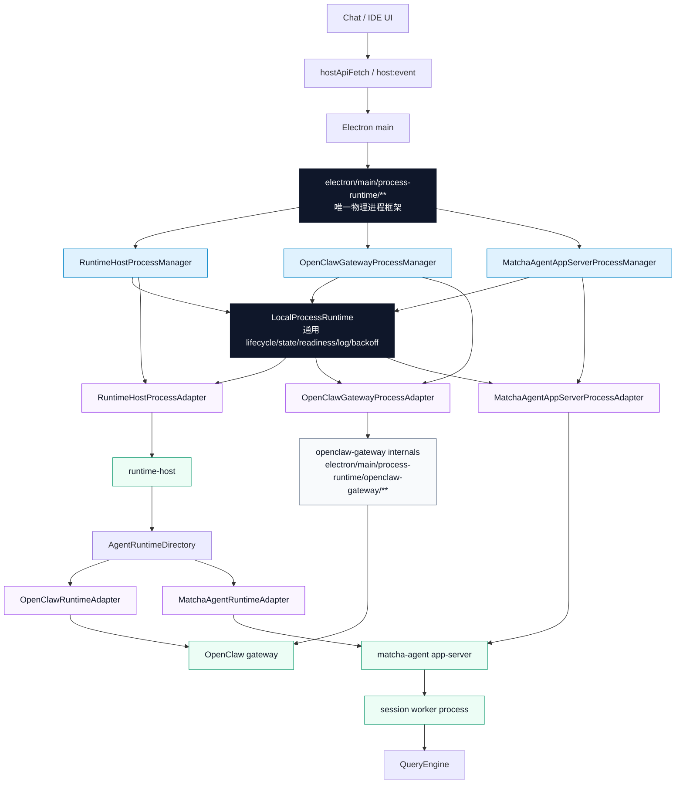
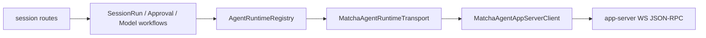
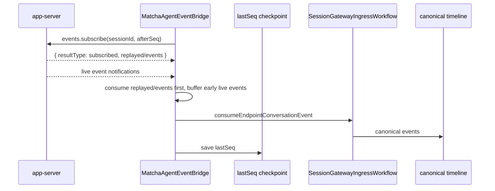
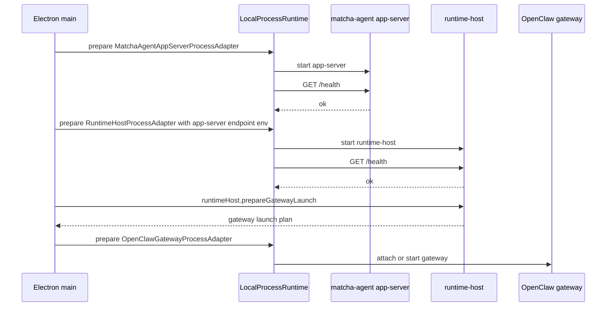

# Local Process Runtime + matcha-agent app-server 当前实现事实

状态：当前实现事实。

一句话：**一个本地进程 runtime 是唯一物理进程 owner；process manager 做产品门面，adapter 只放各进程自己的启动、探活、恢复和日志分类知识。**

## 1. 最终形态



不是三套物理进程框架：

```text
唯一物理进程框架：electron/main/process-runtime/**
三个 process manager：RuntimeHostProcessManager / OpenClawGatewayProcessManager / MatchaAgentAppServerProcessManager
三个真实进程 adapter：runtime-host / OpenClaw gateway / matcha-agent app-server
一套路由/语义适配：AgentRuntimeDirectory + RuntimeAdapter
一套 app-server 内部执行器：WorkerSupervisor
```

三个 process manager 都在 `electron/main/process-runtime/**` 语义边界内工作：manager 负责产品侧门面和状态查询，`LocalProcessRuntime` 是唯一物理进程 owner，负责 spawn/kill/restart/crash/readiness/log/auto-restart。adapter 只负责每类进程自己的启动准备、探活、恢复和日志分类。OpenClaw gateway 的 config-sync/public-status/config-sync-env/manager/supervisor/process-launcher 等都归 `electron/main/process-runtime/openclaw-gateway/**`；`electron/gateway/**` 不再是合法目录。

## 2. 分层边界

| 层 | 管什么 | 不管什么 |
|---|---|---|
| Electron `electron/main/process-runtime/**` | 唯一物理进程框架；容纳 `LocalProcessRuntime`、三个 process manager、三个 process adapter、OpenClaw gateway 专属实现 | session、prompt、approval、Claude Code worker IPC、renderer API |
| Electron `LocalProcessRuntime` | 唯一 runtime child process owner；负责 `node-child` / `spawn` / `utility` / `external` launch、kill、restart、crash、readiness、log、auto-restart、backoff、pid | 每类进程自己的启动准备、OpenClaw gateway supervisor 端口占用 / attach 判定、OpenClaw 专属恢复策略、session 语义 |
| Process manager | 产品侧门面与组合：runtime-host / OpenClaw gateway / matcha-agent app-server 三个 manager 都在 process-runtime 边界内；各自创建对应 `ProcessAdapter` 并组合 `LocalProcessRuntime`；`GatewayManager` 是 domain/status facade | 物理进程 ownership、独立生命周期状态机、session 语义、renderer 直连通道 |
| ProcessAdapter | 每类进程自己的 prepare launch、readiness probe、recovery hook、log classify | spawn/kill/restart/crash/readiness/log/auto-restart 的通用状态机 |
| `electron/main/process-runtime/openclaw-gateway/**` | OpenClaw gateway 专属实现：`config-sync`、`public-status`、`config-sync-env`、manager、supervisor、process-launcher、state、policy、readiness、recovery、stderr classify | 通用进程 owner、renderer API |
| `electron/gateway/**` | 非法旧目录；不再承载 OpenClaw gateway 职责 | 新代码或文档事实 |
| runtime-host `MatchaAgentRuntimeAdapter` | session / event / approval / model 语义适配；唯一产品语义入口；只通过内部 endpoint/token 通道访问 app-server | Bun、dist、worker args、进程重启、renderer 直连 app-server |
| matcha-agent app-server | WS JSON-RPC、EventLog、Snapshot、ApprovalBroker、WorkerSupervisor；app-server token 只服务内部 RPC | MatchaClaw host API、Electron process policy、renderer 或其他产品入口可用的公开 API |
| app-server WorkerSupervisor | Claude Code session worker / QueryEngine executor | MatchaClaw 产品级进程管理 |

## 3. Electron 侧：LocalProcessRuntime

当前目录：

```text
electron/main/process-runtime/
  contracts.ts
  local-process-runtime.ts
  process-registry.ts
  readiness.ts
  restart-policy.ts
  log-tail.ts
  runtime-host-process-manager.ts
  openclaw-gateway-process-manager.ts
  matcha-agent-app-server-process-manager.ts
  adapters/
    runtime-host-process-adapter.ts
    openclaw-gateway-process-adapter.ts
    matcha-agent-app-server-process-adapter.ts
  openclaw-gateway/
    config-sync.ts
    config-sync-env.ts
    manager.ts
    port-readiness.ts
    process-launcher.ts
    process-policy.ts
    public-status.ts
    restart-controller.ts
    state.ts
    startup-recovery.ts
    startup-stderr.ts
    supervisor.ts
```

三个 process manager 都位于 `electron/main/process-runtime/**`，各自创建对应 adapter，并通过 `createLocalProcessRuntime({ adapter })` 组合进同一 lifecycle。`LocalProcessRuntime` 依赖 adapter contract 调用 prepare/probe/recovery/log hook；adapter 不反向拥有 lifecycle。`GatewayManager` 是 OpenClaw gateway 的 domain/status facade，不拥有 runtime child process；config-sync/public-status/config-sync-env/manager/supervisor/process-launcher/restart-controller/startup-recovery/startup-stderr 等都位于 `electron/main/process-runtime/openclaw-gateway/**`。`electron/gateway/**` 不再是合法目录。

核心接口：

```ts
interface LocalProcessAdapter {
  readonly id: string
  readonly displayName: string
  prepareLaunch(context: LocalProcessStartContext): Promise<LocalProcessLaunchPlan>
  probeReadiness(plan: LocalProcessLaunchPlan): Promise<LocalProcessReadiness>
  recoverStartFailure?(context: LocalProcessStartFailureContext): Promise<{ action: 'retry' | 'fail' }>
  onLaunched?(state: LocalProcessState): Promise<void>
  onStarted?(state: LocalProcessState): Promise<void>
  onStopped?(state: LocalProcessState): Promise<void>
  onCrashed?(event: LocalProcessCrashEvent): Promise<void>
  classifyLog?(line: string, stream: 'stdout' | 'stderr'): LocalProcessLogEvent
}
```

`LocalProcessRuntime` 统一提供：

- start lock / restart lock
- `idle | starting | running | stopping | stopped | restarting | error`
- `node-child` / `spawn` / `utility` / `external` launch plan
- readiness pipeline：HTTP、control RPC 等都由 adapter probe
- SIGTERM -> timeout -> force kill
- crash backoff / crash window
- stdout/stderr tail
- state event
- runtime child process ownership 判断；OpenClaw gateway 的端口占用 / attach 判定仍归 gateway supervisor 专属实现

## 4. 三个 ProcessAdapter

### 4.1 RuntimeHostProcessAdapter

已落地。`RuntimeHostProcessManager` 在 `electron/main/process-runtime/runtime-host-process-manager.ts`，`RuntimeHostProcessAdapter` 在 `electron/main/process-runtime/adapters/runtime-host-process-adapter.ts`；manager 只做产品侧门面和 runtime 组合，adapter 保留 runtime-host 独有启动知识：

- `host-process.cjs` 路径解析
- dev stale build 检查与 `build:runtime-host-process`
- `MATCHACLAW_RUNTIME_HOST_PARENT_API_BASE_URL`
- `MATCHACLAW_RUNTIME_HOST_PARENT_DISPATCH_TOKEN`
- app version / userData / packaged env
- `/health` probe

通用逻辑归 `LocalProcessRuntime`：

- fork
- stop/restart
- health wait loop
- auto-restart timer
- crash timestamps
- stdout/stderr logging

### 4.2 OpenClawGatewayProcessAdapter

已落地。`OpenClawGatewayProcessManager` 在 `electron/main/process-runtime/openclaw-gateway-process-manager.ts`，`OpenClawGatewayProcessAdapter` 在 `electron/main/process-runtime/adapters/openclaw-gateway-process-adapter.ts`，OpenClaw gateway 专属实现都在 `electron/main/process-runtime/openclaw-gateway/**`。

`OpenClawGatewayProcessAdapter` 不拥有通用 runtime child process lifecycle，只保留 OpenClaw 专属 prepare launch、readiness、recovery、log classify 知识；其中端口占用、既有 gateway 探测与 attach 判定属于 gateway supervisor 专属实现，不等同于 `LocalProcessRuntime` 的 child-process ownership：

- runtime-host prelaunch job
- precomputed gateway launch context
- gateway token
- provider env
- proxy / uv env
- OpenClaw dir / entry
- attach existing gateway
- control ready retry
- doctor repair
- Python warmup
- legacy launchctl cleanup

`electron/main/process-runtime/openclaw-gateway/**` 承担 OpenClaw gateway 专属实现：

- `config-sync` / `public-status` / `config-sync-env`
- `GatewayManager` domain/status facade
- supervisor / process launcher
- state / process policy
- restart controller
- port readiness
- startup stderr / recovery

通用 runtime child process ownership 归 `LocalProcessRuntime`：

- spawn / kill
- restart / backoff / auto-restart
- crash 与 exit/error 监听
- state event
- stdout/stderr log tail
- readiness wait

### 4.3 MatchaAgentAppServerProcessAdapter

已落地。`MatchaAgentAppServerProcessManager` 在 `electron/main/process-runtime/matcha-agent-app-server-process-manager.ts`，`MatchaAgentAppServerProcessAdapter` 在 `electron/main/process-runtime/adapters/matcha-agent-app-server-process-adapter.ts`。职责只限拉起 app-server：

- resolve bundled Bun / dev Bun
- resolve `matcha-agent/dist/cli-bun.js` 或 dev `scripts/dev.ts`
- allocate fixed port / token / storage root
- start app-server
- 通过 `MATCHA_AGENT_APP_SERVER_AUTH_TOKEN` env 注入 app-server token，不走 argv `--auth-token`
- probe `/health`
- expose endpoint snapshot 给 runtime-host env；endpoint/token 只进入内部进程 env，不进入 renderer，也不形成公开 app-server API

开发启动：

```text
MATCHA_AGENT_APP_SERVER_AUTH_TOKEN=<token> \
bun run matcha-agent/scripts/dev.ts app-server \
  --host 127.0.0.1 \
  --port <port> \
  --storage-root <userData>/matcha-agent/app-server
```

生产启动：

```text
MATCHA_AGENT_APP_SERVER_AUTH_TOKEN=<token> \
<bundled-bun> <resources>/matcha-agent/dist/cli-bun.js app-server \
  --host 127.0.0.1 \
  --port <port> \
  --storage-root <userData>/matcha-agent/app-server
```

不传 session worker 细节。worker 仍由 [WorkerSupervisor](../../matcha-agent/src/app-server/workers/workerSupervisor.ts) 管。

## 5. runtime-host 侧：MatchaAgentRuntimeAdapter

当前目录：

```text
runtime-host/application/adapters/matcha-agent/runtime/
  matcha-agent-runtime-identity.ts
  matcha-agent-profile.ts
  matcha-agent-app-server-client.ts
  matcha-agent-runtime-adapter.ts
  matcha-agent-transport.ts
  matcha-agent-protocol-adapter.ts
  matcha-agent-event-bridge.ts
  matcha-agent-session-checkpoint-store.ts
```

注册方式：和 [OpenClawRuntimeAdapter](../../runtime-host/application/adapters/openclaw/runtime/openclaw-runtime-adapter.ts) 平级，贡献到 `runtime.adapterRegistrationFactories`。



命令映射：

| runtime-host transport | app-server JSON-RPC |
|---|---|
| `ensureSession` | `session.create`；已存在或重复时 `session.load` |
| `startSessionEvents` | `events.subscribe`；返回体里的 `replayed`/`events` 先消费，再接 live event notification |
| `sendPrompt` | `session.prompt` |
| `abortSession` | `session.cancel` |
| `resolveApproval` | `approval.respond` |
| `patchSessionModel` | `session.setModel` |
| `inspectReadiness` | `/health` + `initialize` |

`MatchaAgentRuntimeAdapter` 是 app-server 的唯一产品语义入口：负责 `session.create/load`、`events.subscribe`、`session.prompt` 等 RPC；renderer 不直连 app-server，Electron 也不把 app-server endpoint/token 暴露成 renderer 可用通道。runtime-host 只能在 `MatchaAgentRuntimeAdapter` 内通过内部注入的 endpoint/token 与 app-server 通信；不允许 renderer 或其他产品入口直连 app-server，也不由 Electron/renderer 直接发 prompt。`session.prompt` 会把 runtime-host `runId` 透传给 app-server；app-server `RunCoordinator` 以 runId 去重，重复 runId 直接返回既有 runId，不重复入队。

会话映射：

```text
runtime-host sessionKey = MatchaClaw 本地 session key
endpointSessionId = app-server sessionId
```

事件桥：



当前实现事实：

1. `MatchaAgentEventBridge` 读取 lastSeq 后调用 `events.subscribe(sessionId, afterSeq)`；app-server subscribe handler 会把订阅与 replay 合在一次响应里，返回 `replayed`。
2. bridge 同时监听 live JSON-RPC `event` notification；subscribe 响应消费完成前到达的 live events 会先 buffer，再按序消费。
3. bridge 对每个 envelope 用 checkpoint 去重：`seq <= lastSeq` 的事件丢弃，成功消费后写入 lastSeq。
4. `session.snapshot` 当前不是 `MatchaAgentRuntimeTransport.startSessionEvents` 的事件恢复路径。
5. `sdk.message` 由 app-server worker 作为事件 envelope 发出；runtime-host `MatchaAgentProtocolAdapter` 把 `sdk.message` 投影成 canonical assistant message parts。
6. 不为 approval 再造 side channel；`approval.requested/resolved` 走同一事件流。

## 6. 启动顺序



Electron 启动 app-server 后，从 `MatchaAgentAppServerProcessAdapter` 的 endpoint snapshot 读取 endpoint/token，再只注入 runtime-host 内部 env：

```text
MATCHACLAW_MATCHA_AGENT_APP_SERVER_ENABLED=1
MATCHACLAW_MATCHA_AGENT_APP_SERVER_URL=http://127.0.0.1:<port>
MATCHACLAW_MATCHA_AGENT_APP_SERVER_TOKEN=<token>
```

## 7. UI 链路不变

```text
Chat 页面
  -> hostApiFetch / host:event
  -> Electron Host API
  -> runtime-host session routes
  -> MatchaAgentRuntimeAdapter
  -> matcha-agent app-server
  -> QueryEngine
```

Renderer 不直连 app-server。Electron 只负责进程生命周期和 endpoint/token 内部注入，不把 app-server token 投影到 renderer，不发 `session.prompt`；prompt 统一经 runtime-host 的 `MatchaAgentRuntimeAdapter` 转成 app-server `session.prompt`。

## 8. 打包约定

已有构建链：

- [build-matcha-agent.mjs](../../scripts/build-matcha-agent.mjs) 构建 `matcha-agent/dist`
- [after-pack.cjs](../../scripts/after-pack.cjs) 复制到 `resources/matcha-agent/dist`

当前约定：

- adapter 使用 packaged resources 路径解析 `matcha-agent/dist/cli-bun.js`
- adapter 使用 bundled Bun，不走 PowerShell shim
- storage root 固定到 `app.getPath('userData')`
- app-server port 固定，不用 `0` 随机端口
- app-server token 通过 `MATCHA_AGENT_APP_SERVER_AUTH_TOKEN` 传给 app-server，不走 argv `--auth-token`
- app-server endpoint/token 只注入 runtime-host 内部 env，不进 renderer，不作为 renderer 或其他产品入口的直连通道

## 9. 当前实现清单

1. `electron/main/process-runtime/**` 是唯一物理进程框架，`LocalProcessRuntime` 是唯一 runtime child process owner，已提供 `node-child` / `spawn` / `utility` / `external` launch、spawn/kill/restart/crash/readiness/log/auto-restart、state、restart policy。
2. 三个 process manager 都在 process-runtime 边界内：`RuntimeHostProcessManager`、`OpenClawGatewayProcessManager`、`MatchaAgentAppServerProcessManager`；manager 各自创建 adapter，再组合 `createLocalProcessRuntime({ adapter })`。
3. 三个真实 `ProcessAdapter` 已存在：`RuntimeHostProcessAdapter`、`OpenClawGatewayProcessAdapter`、`MatchaAgentAppServerProcessAdapter`；runtime-host / gateway / app-server 不是“自身就是 adapter”。
4. `RuntimeHostProcessAdapter` 只保留 runtime-host 专属启动、探活、日志知识；runtime-host runtime child process lifecycle 由 `LocalProcessRuntime` 统一拥有。
5. `MatchaAgentAppServerProcessAdapter` 只保留 app-server 专属启动、探活、endpoint snapshot 知识；app-server runtime child process lifecycle 由 `LocalProcessRuntime` 统一拥有。Electron 先启 app-server，再把 endpoint/token 只注入 runtime-host 内部 env。
6. `OpenClawGatewayProcessAdapter` 只负责 OpenClaw 专属 prepare launch、readiness、recovery、log classify；OpenClaw gateway runtime child process ownership 仍归 `LocalProcessRuntime`，但 supervisor 的端口占用、既有进程探测与 attach 判定属于 gateway 专属实现。
7. OpenClaw gateway 的 `config-sync`、`public-status`、`config-sync-env`、manager、supervisor、process-launcher 等都位于 `electron/main/process-runtime/openclaw-gateway/**`；`GatewayManager` 是 domain/status facade，不拥有 runtime child process；`electron/gateway/**` 不再是合法目录。
8. runtime-host 已注册 `MatchaAgentRuntimeAdapter`，负责 app-server `session.create/load`、`events.subscribe`、`session.prompt` 等命令面。
9. `MatchaAgentEventBridge` 已负责 `events.subscribe` 返回体 replay 消费、live event notification、lastSeq checkpoint 和 `seq <= lastSeq` 去重。
10. `MatchaAgentProtocolAdapter` 已把 app-server `sdk.message` 投影为 canonical assistant message parts。
11. app-server `session.prompt` 保留 runtime-host 传入的 runId，并在重复 runId 时返回既有 runId，避免重复入队。
12. UI 继续走现有 session routes，不新增直连通道；renderer 不直连 app-server，app-server token 不进入 renderer。

## 10. 验收标准

- Electron 只有一套本地进程生命周期状态机，物理进程框架唯一归 `electron/main/process-runtime/**`。
- `LocalProcessRuntime` 是唯一 runtime child process owner，负责 `node-child` / `spawn` / `utility` / `external` launch、spawn/kill/restart/crash/readiness/log/auto-restart。
- 三个 process manager 都在 process-runtime 边界内；runtime-host / gateway / app-server 都通过各自 `ProcessAdapter` 接入 `LocalProcessRuntime`，不是“自身就是 `LocalProcessAdapter`”。
- OpenClaw gateway 的 config-sync/public-status/config-sync-env/manager/supervisor/process-launcher 等都位于 `electron/main/process-runtime/openclaw-gateway/**`。
- `GatewayManager` 只是 domain/status facade，不拥有进程。
- `electron/gateway/**` 不再是合法目录。
- OpenClaw 专属逻辑没有进入通用 runtime。
- runtime-host 不 spawn Bun、不知道 worker args。
- app-server worker IPC 不暴露给 runtime-host/UI。
- renderer 不直连 app-server；app-server endpoint/token 只作为 Electron main 注入 runtime-host 的内部通道。
- runtime-host 按 lastSeq 启动订阅，并对 subscribe 返回的 replayed/events 与 live events 做 checkpoint 去重。
- approval 通过同一事件流入账，并受 checkpoint 去重保护。
- `sessionKey` 与 `endpointSessionId` 语义清楚。
- dev/prod 都能启动 app-server 并跑通 `session.prompt`。
- `bun run precheck` / Electron 相关测试通过。

## 11. 已读事实源

- [layered-architecture.md](layered-architecture.md)
- [matcha-agent-app-server-architecture.md](../../matcha-agent/docs/matcha-agent-app-server-architecture.md)
- [process-runtime/local-process-runtime.ts](../../electron/main/process-runtime/local-process-runtime.ts)
- [process-runtime/runtime-host-process-manager.ts](../../electron/main/process-runtime/runtime-host-process-manager.ts)
- [process-runtime/openclaw-gateway-process-manager.ts](../../electron/main/process-runtime/openclaw-gateway-process-manager.ts)
- [process-runtime/matcha-agent-app-server-process-manager.ts](../../electron/main/process-runtime/matcha-agent-app-server-process-manager.ts)
- [process-runtime/adapters/runtime-host-process-adapter.ts](../../electron/main/process-runtime/adapters/runtime-host-process-adapter.ts)
- [process-runtime/adapters/openclaw-gateway-process-adapter.ts](../../electron/main/process-runtime/adapters/openclaw-gateway-process-adapter.ts)
- [process-runtime/adapters/matcha-agent-app-server-process-adapter.ts](../../electron/main/process-runtime/adapters/matcha-agent-app-server-process-adapter.ts)
- [process-runtime/openclaw-gateway/**](../../electron/main/process-runtime/openclaw-gateway/)
- [process-runtime/openclaw-gateway/config-sync.ts](../../electron/main/process-runtime/openclaw-gateway/config-sync.ts)
- [process-runtime/openclaw-gateway/public-status.ts](../../electron/main/process-runtime/openclaw-gateway/public-status.ts)
- [process-runtime/openclaw-gateway/config-sync-env.ts](../../electron/main/process-runtime/openclaw-gateway/config-sync-env.ts)
- [agent-runtime-registry.ts](../../runtime-host/application/agent-runtime/contracts/agent-runtime-registry.ts)
- [runtime-endpoint-types.ts](../../runtime-host/application/agent-runtime/contracts/runtime-endpoint-types.ts)
- [openclaw-runtime-adapter.ts](../../runtime-host/application/adapters/openclaw/runtime/openclaw-runtime-adapter.ts)
- [matcha-agent app-server main.ts](../../matcha-agent/src/app-server/main.ts)
- [matcha-agent app-server config.ts](../../matcha-agent/src/app-server/config.ts)
- [workerSupervisor.ts](../../matcha-agent/src/app-server/workers/workerSupervisor.ts)
- [workerEntry.ts](../../matcha-agent/src/app-server/workers/workerEntry.ts)
