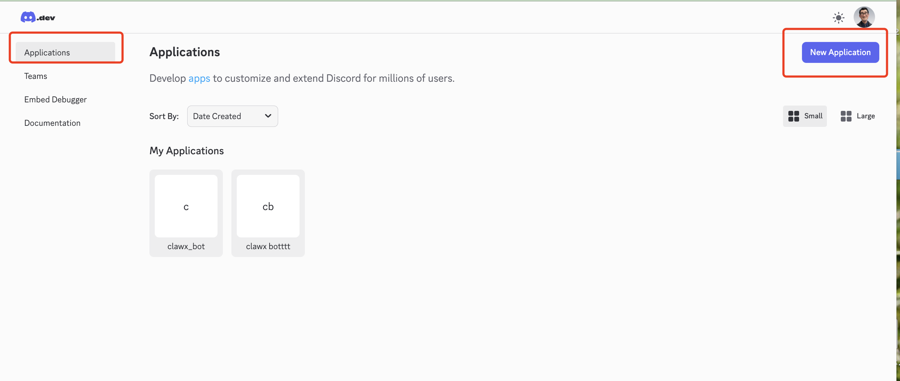
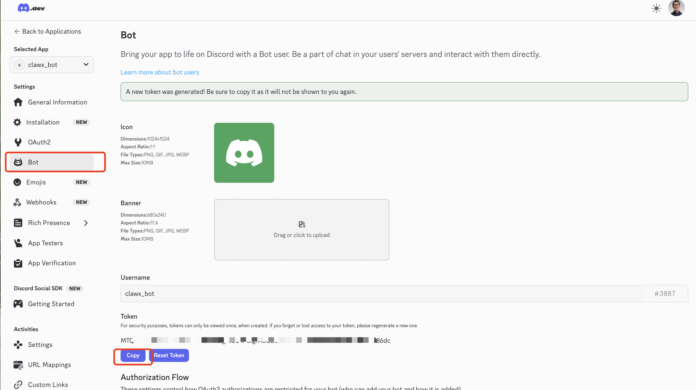
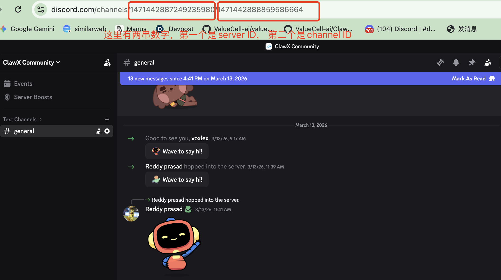
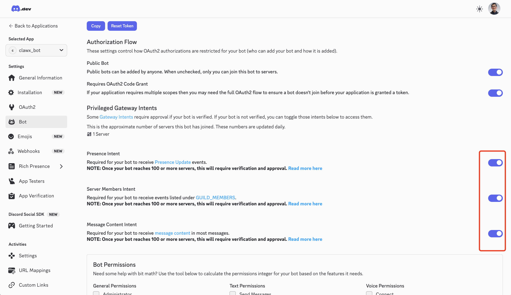
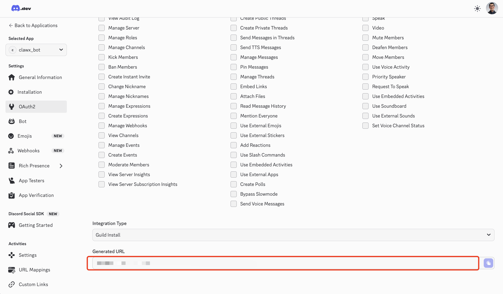
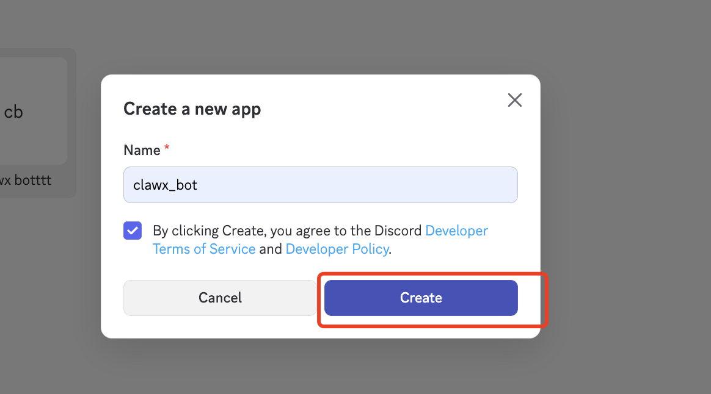
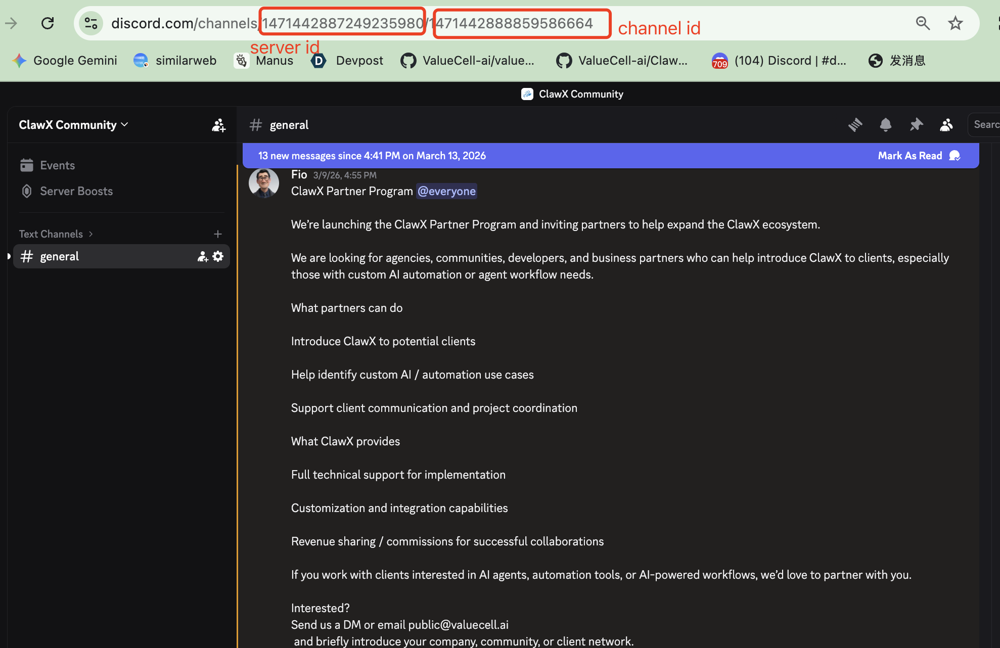
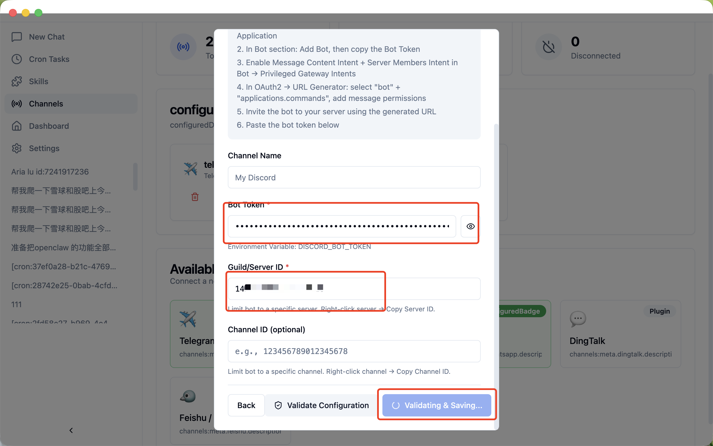
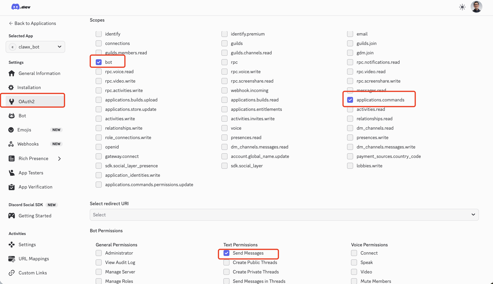

# Discord Operation Guide

## 中文教程

1. 前往 [Discord 开发者门户](https://discord.com/developers/home) → 应用 → 新建应用

在“机器人”部分：添加机器人，然后复制机器人令牌,添加到产品页面并填写要目标server id和channel id 

Bot token的获取方式

Server id 与Channel id 的获取方式

在“机器人”→“特权网关意图”中启用“消息内容意图”和“服务器成员意图”

在 OAuth2 → URL 生成器中：选择“bot” \+ “applications.commands”，添加消息权限

使用生成的 URL 用浏览器打开将机器人邀请到您的服务器

## English Guide

1. Go to Discord Developer Portal → Applications → New Application

1. In Bot section: Add Bot, then copy the Bot Token to the product page and fill in the target server ID.

Bot token

Server id & channel id

1. Enable Message Content Intent \+ Server Members Intent in Bot → Privileged Gateway Intents

1. In OAuth2 → URL Generator: select "bot" \+ "applications.commands", add message permissions

1. Invite the bot to your server using the generated URL

