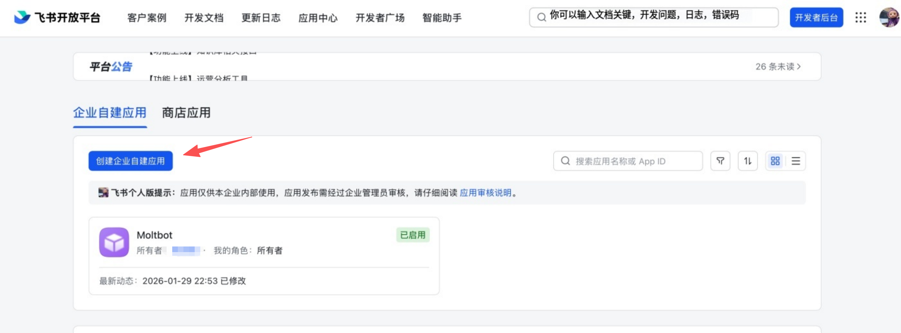
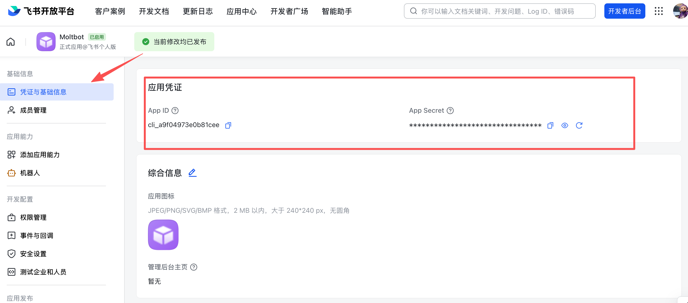
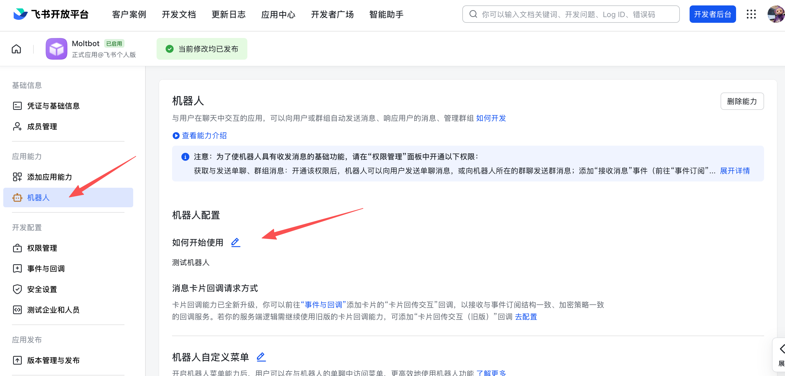
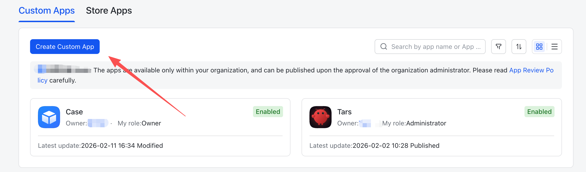
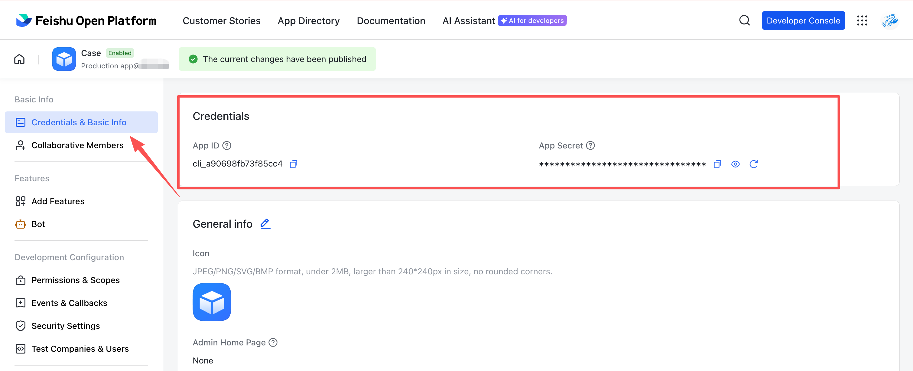
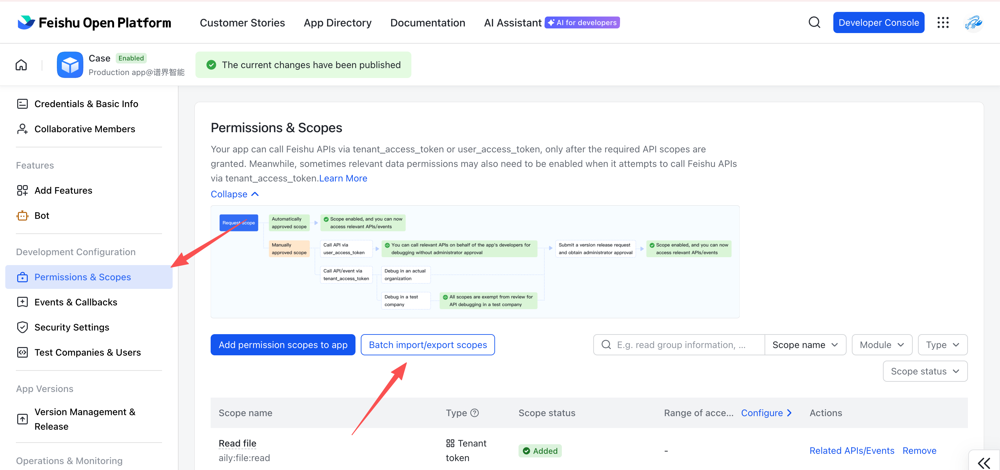
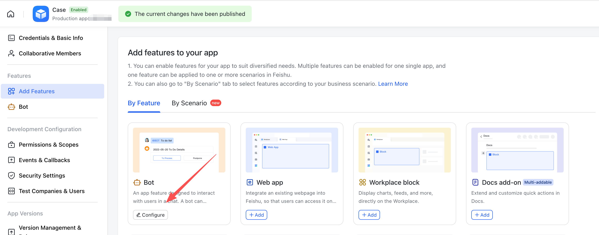
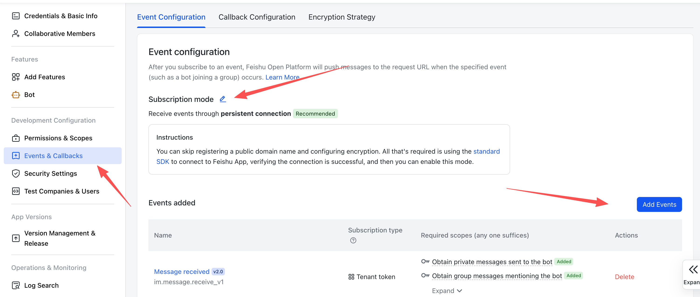

# Feishu Operation Guide

## 中文教程

## 飞书官方全新功能

打开下方链接，即可一键创建机器人，复制id、secret到MatchaClaw即可完成配置。

https://open.feishu.cn/page/openclaw?form=multiAgent

修改机器人配置可以在开发者控制台，做更加精细化的权限管理。

__飞书官方插件使用说明：__[OpenClaw飞书官方插件使用指南（公开版）](https://bytedance.larkoffice.com/docx/MFK7dDFLFoVlOGxWCv5cTXKmnMh)

## 老版本自定义配置

1. __打开飞书开放平台__

访问 [飞书开放平台](https://open.feishu.cn/app)，使用飞书账号登录。

2. __创建应用__

1. 点击 创建企业自建应用
2. 填写应用名称和描述
3. 选择应用图标

3. __获取应用凭证__

在应用的 凭证与基础信息 页面，复制：

- App ID（格式如 cli\_xxx）
- App Secret

❗ 重要：请妥善保管 App Secret，不要分享给他人。

4. __配置应用权限__

在 权限管理 页面，点击 批量导入 按钮，粘贴以下 JSON 配置一键导入所需权限：

JSON  
\{  
  "scopes": \{  
    "tenant": \[  
      "contact:contact.base:readonly",  
      "docx:document:readonly",  
      "im:chat:read",  
      "im:chat:update",  
      "im:message.group\_at\_msg:readonly",  
      "im:message.p2p\_msg:readonly",  
      "im:message.pins:read",  
      "im:message.pins:write\_only",  
      "im:message.reactions:read",  
      "im:message.reactions:write\_only",  
      "im:message:readonly",  
      "im:message:recall",  
      "im:message:send\_as\_bot",  
      "im:message:send\_multi\_users",  
      "im:message:send\_sys\_msg",  
      "im:message:update",  
      "im:resource",  
      "application:application:self\_manage",  
      "cardkit:card:write",  
      "cardkit:card:read"  
    \],  
    "user": \[  
      "contact:user.employee\_id:readonly",  
      "offline\_access","base:app:copy",  
      "base:field:create",  
      "base:field:delete",  
      "base:field:read",  
      "base:field:update",  
      "base:record:create",  
      "base:record:delete",  
      "base:record:retrieve",  
      "base:record:update",  
      "base:table:create",  
      "base:table:delete",  
      "base:table:read",  
      "base:table:update",  
      "base:view:read",  
      "base:view:write\_only",  
      "base:app:create",  
      "base:app:update",  
      "base:app:read",  
      "sheets:spreadsheet.meta:read",  
      "sheets:spreadsheet:read",  
      "sheets:spreadsheet:create",  
      "sheets:spreadsheet:write\_only",  
      "docs:document:export",  
      "docs:document.media:upload",  
      "board:whiteboard:node:create",  
      "board:whiteboard:node:read",  
      "calendar:calendar:read",  
      "calendar:calendar.event:create",  
      "calendar:calendar.event:delete",  
      "calendar:calendar.event:read",  
      "calendar:calendar.event:reply",  
      "calendar:calendar.event:update",  
      "calendar:calendar.free\_busy:read",  
      "contact:contact.base:readonly",  
      "contact:user.base:readonly",  
      "contact:user:search",  
      "docs:document.comment:create",  
      "docs:document.comment:read",  
      "docs:document.comment:update",  
      "docs:document.media:download",  
      "docs:document:copy",  
      "docx:document:create",  
      "docx:document:readonly",  
      "docx:document:write\_only",  
      "drive:drive.metadata:readonly",  
      "drive:file:download",  
      "drive:file:upload",  
      "im:chat.members:read",  
      "im:chat:read",  
      "im:message",  
      "im:message.group\_msg:get\_as\_user",  
      "im:message.p2p\_msg:get\_as\_user",  
      "im:message:readonly",  
      "search:docs:read",  
      "search:message",  
      "space:document:delete",  
      "space:document:move",  
      "space:document:retrieve",  
      "task:comment:read",  
      "task:comment:write",  
      "task:task:read",  
      "task:task:write",  
      "task:task:writeonly",  
      "task:tasklist:read",  
      "task:tasklist:write",  
      "wiki:node:copy",  
      "wiki:node:create",  
      "wiki:node:move",  
      "wiki:node:read",  
      "wiki:node:retrieve",  
      "wiki:space:read",  
      "wiki:space:retrieve",  
      "wiki:space:write\_only"  
    \]  
  \}  
\}

5. __启用机器人能力__

在 应用能力 > 机器人 页面：

1. 开启机器人能力
2. 配置机器人名称

6. __发布应用__

1. 在 __版本管理与发布__ 页面创建版本
2. 提交审核并发布
3. 等待管理员审批（企业自建应用通常自动通过）

7. __配置事件订阅__

在 事件订阅 页面：  
⚠️ 注意：应用版本是否发布成功，不成功无法选择 使用长连接接收事件

1. 选择 使用长连接接收事件（WebSocket 模式）
2. 添加事件：im.message.receive\_v1（接收消息）

⚠️ 注意：如果网关未启动或渠道未添加，长连接设置将保存失败。

7. __再次发布应用__

1. 在 __版本管理与发布__ 页面创建版本
2. 提交审核并发布
3. 等待管理员审批（企业自建应用通常自动通过）

8. __开始使用__

1. 通讯录页面飞书搜索；群聊天页面添加群成员，搜索Bot名称即可

## English Guide

## New Official Feature from Feishu

Open the link below to create a bot with one click. Then copy the __ID__ and __Secret__ into __MatchaClaw__ to complete the configuration.

https://open.feishu.cn/page/openclaw?form=multiAgent

If you need to modify the bot configuration, you can go to the __Developer Console__ to perform more fine-grained permission management.

__Feishu Official Plugin Usage Guide : __[OpenClaw飞书官方插件使用指南（公开版）](https://bytedance.larkoffice.com/docx/MFK7dDFLFoVlOGxWCv5cTXKmnMh)

## Legacy Custom Configuration

1. __Open Feishu Open Platform__

Visit [Feishu Open Platform](https://open.feishu.cn/app) and sign in.

2. __Create an app__

1. Click Create enterprise app
2. Fill in the app name \+ description
3. Choose an app icon

3. __Copy credentials__

From Credentials & Basic Info, copy:

- App ID \(format: cli\_xxx\)
- App Secret

❗ Important: keep the App Secret private.

4. __Configure permissions__

On Permissions, click Batch import and paste:

JSON  
\{  
  "scopes": \{  
    "tenant": \[  
      "contact:contact.base:readonly",  
      "docx:document:readonly",  
      "im:chat:read",  
      "im:chat:update",  
      "im:message.group\_at\_msg:readonly",  
      "im:message.p2p\_msg:readonly",  
      "im:message.pins:read",  
      "im:message.pins:write\_only",  
      "im:message.reactions:read",  
      "im:message.reactions:write\_only",  
      "im:message:readonly",  
      "im:message:recall",  
      "im:message:send\_as\_bot",  
      "im:message:send\_multi\_users",  
      "im:message:send\_sys\_msg",  
      "im:message:update",  
      "im:resource",  
      "application:application:self\_manage",  
      "cardkit:card:write",  
      "cardkit:card:read"  
    \],  
    "user": \[  
      "contact:user.employee\_id:readonly",  
      "offline\_access","base:app:copy",  
      "base:field:create",  
      "base:field:delete",  
      "base:field:read",  
      "base:field:update",  
      "base:record:create",  
      "base:record:delete",  
      "base:record:retrieve",  
      "base:record:update",  
      "base:table:create",  
      "base:table:delete",  
      "base:table:read",  
      "base:table:update",  
      "base:view:read",  
      "base:view:write\_only",  
      "base:app:create",  
      "base:app:update",  
      "base:app:read",  
      "sheets:spreadsheet.meta:read",  
      "sheets:spreadsheet:read",  
      "sheets:spreadsheet:create",  
      "sheets:spreadsheet:write\_only",  
      "docs:document:export",  
      "docs:document.media:upload",  
      "board:whiteboard:node:create",  
      "board:whiteboard:node:read",  
      "calendar:calendar:read",  
      "calendar:calendar.event:create",  
      "calendar:calendar.event:delete",  
      "calendar:calendar.event:read",  
      "calendar:calendar.event:reply",  
      "calendar:calendar.event:update",  
      "calendar:calendar.free\_busy:read",  
      "contact:contact.base:readonly",  
      "contact:user.base:readonly",  
      "contact:user:search",  
      "docs:document.comment:create",  
      "docs:document.comment:read",  
      "docs:document.comment:update",  
      "docs:document.media:download",  
      "docs:document:copy",  
      "docx:document:create",  
      "docx:document:readonly",  
      "docx:document:write\_only",  
      "drive:drive.metadata:readonly",  
      "drive:file:download",  
      "drive:file:upload",  
      "im:chat.members:read",  
      "im:chat:read",  
      "im:message",  
      "im:message.group\_msg:get\_as\_user",  
      "im:message.p2p\_msg:get\_as\_user",  
      "im:message:readonly",  
      "search:docs:read",  
      "search:message",  
      "space:document:delete",  
      "space:document:move",  
      "space:document:retrieve",  
      "task:comment:read",  
      "task:comment:write",  
      "task:task:read",  
      "task:task:write",  
      "task:task:writeonly",  
      "task:tasklist:read",  
      "task:tasklist:write",  
      "wiki:node:copy",  
      "wiki:node:create",  
      "wiki:node:move",  
      "wiki:node:read",  
      "wiki:node:retrieve",  
      "wiki:space:read",  
      "wiki:space:retrieve",  
      "wiki:space:write\_only"  
    \]  
  \}  
\}

5. __Enable bot capability__

In App Capability > Bot:

1. Enable bot capability
2. Set the bot name

6. __Publish the app__

1. Create a version in Version Management & Release
2. Submit for review and publish
3. Wait for admin approval \(enterprise apps usually auto-approve\)

7. __Configure event subscription__

In Event Subscription:

⚠️Verify whether the application version has been __successfully published__. If the publication fails, you will be unable to select the __"Receive events through persistent connection"__ option.

1. Choose Receive events through persistent connection \(WebSocket\)
2. Add the event: im.message.receive\_v1

⚠️ If the gateway is not running, the __persistent-connection__ setup may fail to save.  

8. __Publish the app again__

1. Create a version in Version Management & Release
2. Submit for review and publish
3. Wait for admin approval \(enterprise apps usually auto-approve\)

9. __Start using__

1. Address book page Feishu search; add group members on the group chat page, just search for the Bot name.
