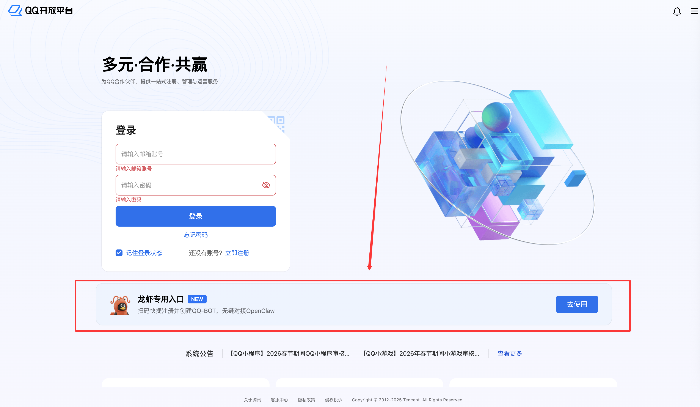
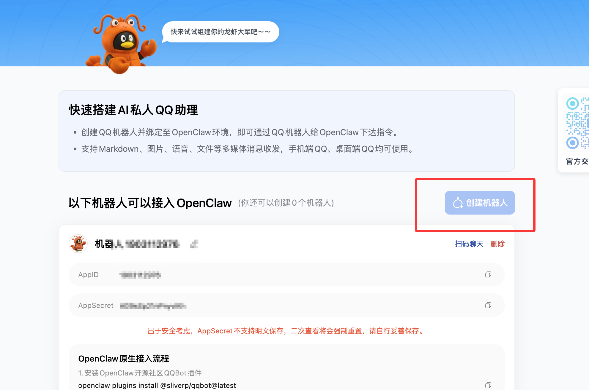
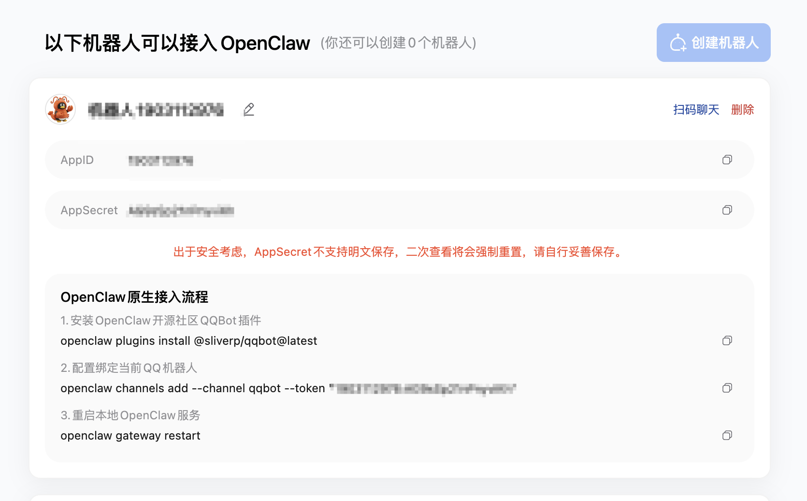
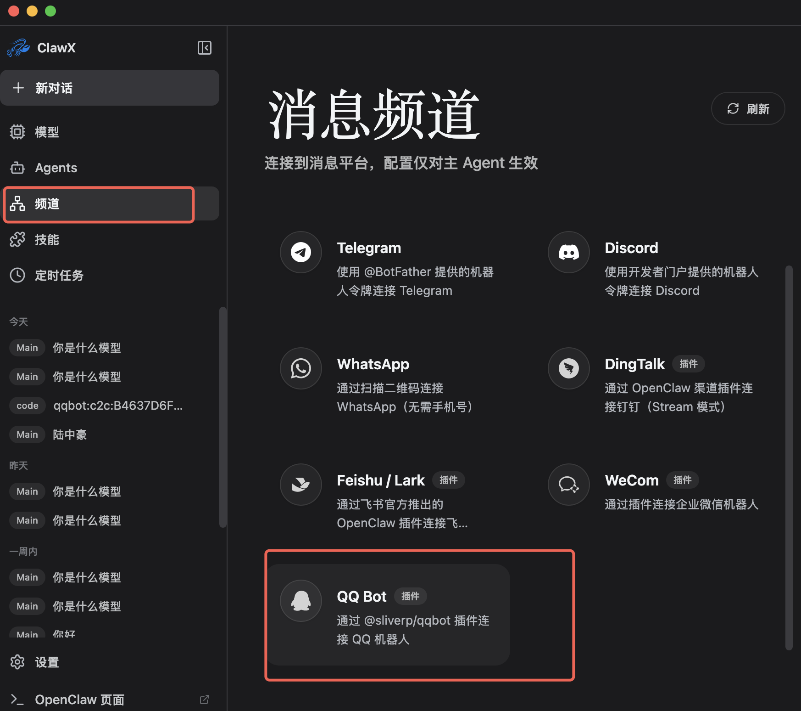
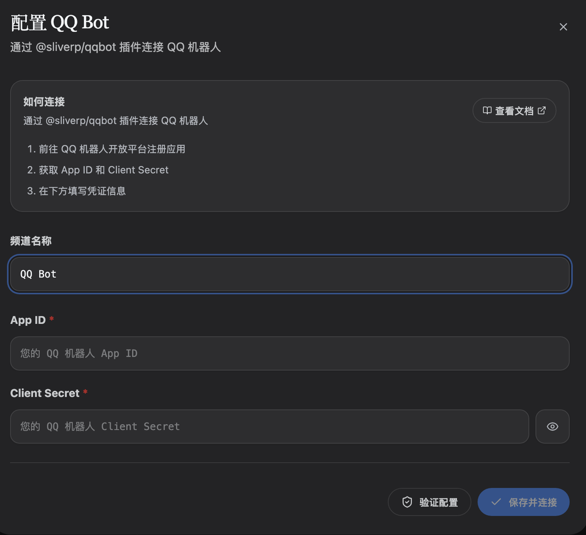

# QQ Bot Operation Guide

## 第一步：创建机器人

- 进入[QQ开放平台](https://cloud.tencent.com/developer/tools/blog-entry?target=https%3A%2F%2Fq.qq.com%2Fqqbot%2Fopenclaw%2Flogin.html&objectId=2626045&objectType=1&contentType=rich)

- 点击创建机器人

- 在机器人页面中找到 AppID 和 AppSecret，分别点击右侧复制按钮，保存到记事本或备忘录中。AppSecret 不支持明文保存，离开页面后再查看会强制重置，请务必妥善保存。

## 第二步：在matchaclaw中添加QQ bot

