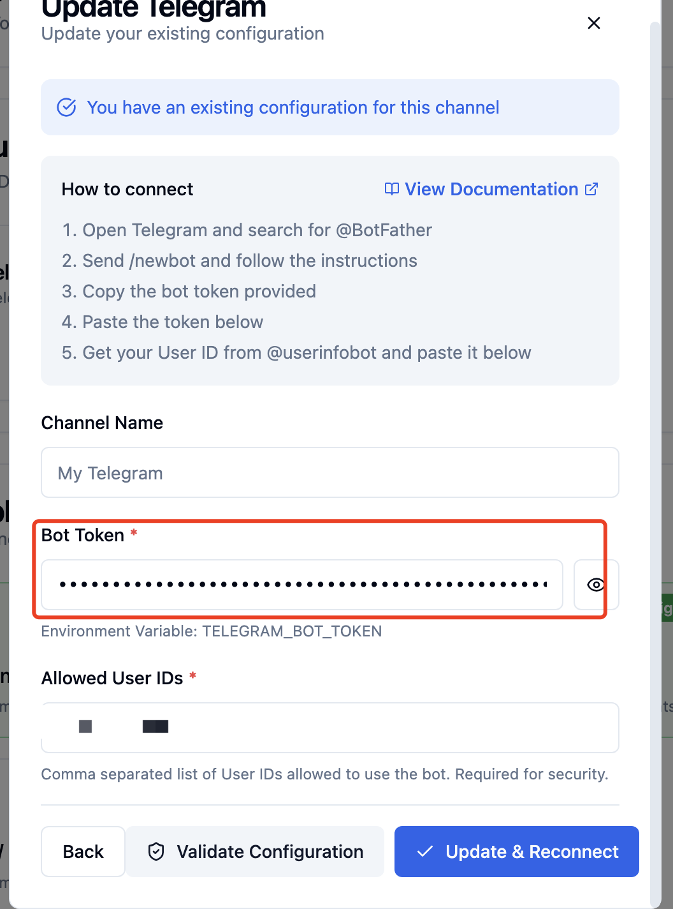
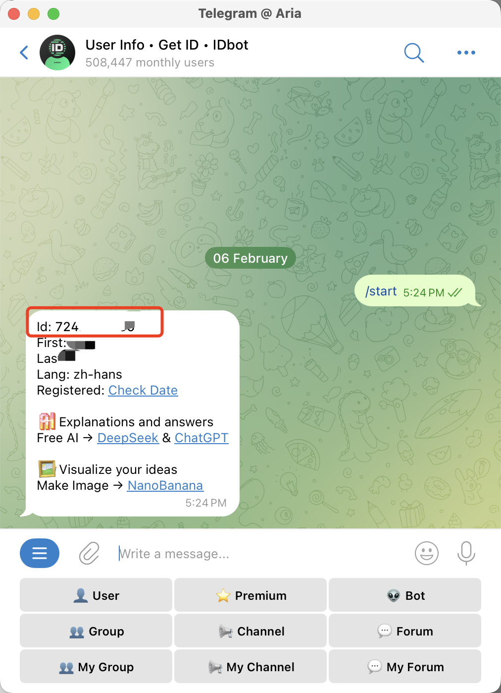
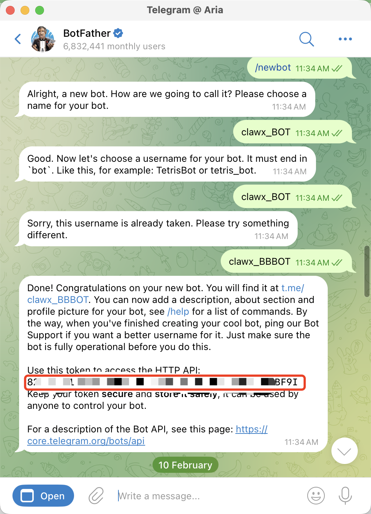
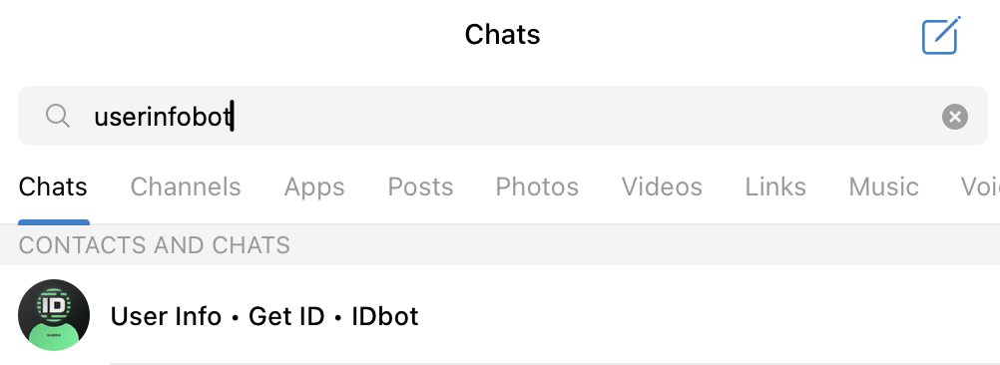
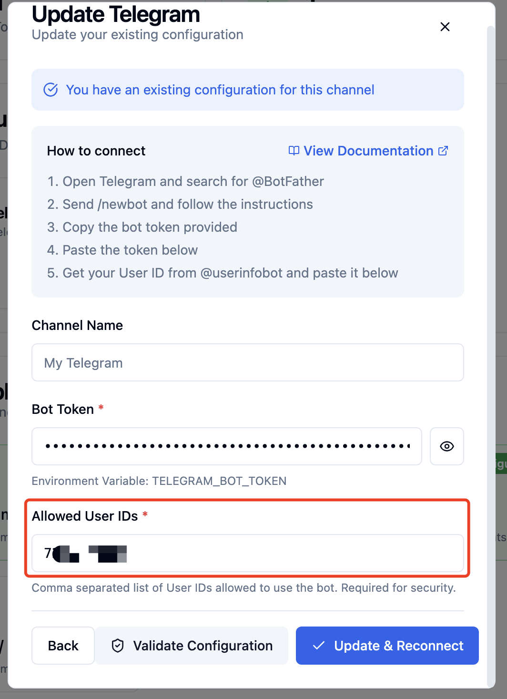
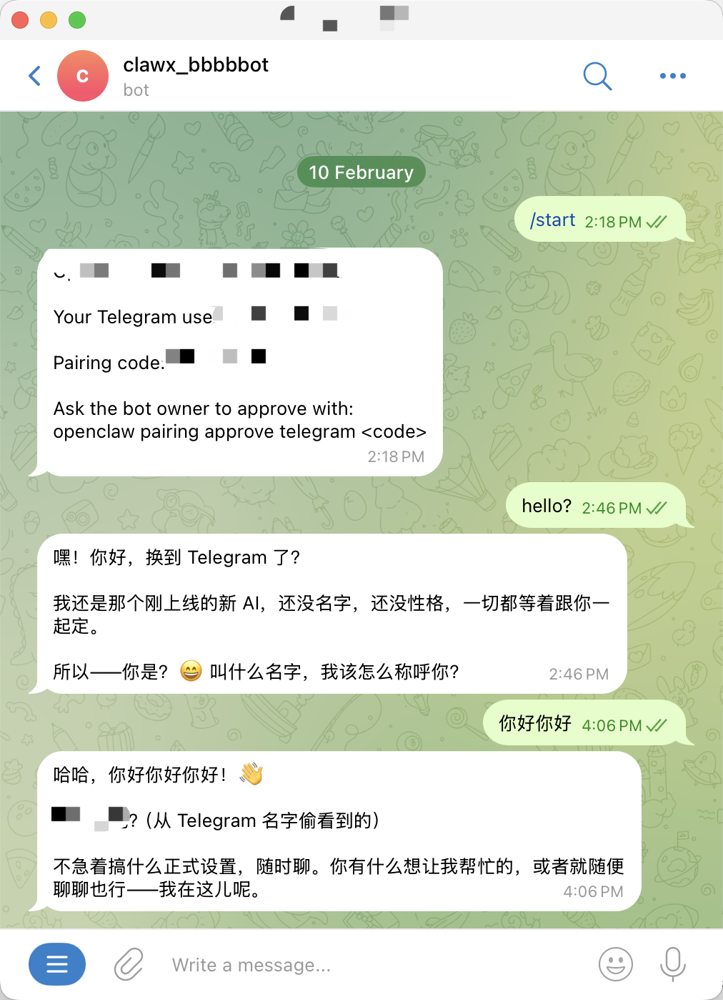

# Telegram Operation Guide

## 中文教程

1. 在 BotFather 中创建机器人令牌：打开 Telegram 并与 @BotFather 聊天（确认用户名是否为 @BotFather）。运行 /newbot 命令，按照提示操作，复制提供的机器人令牌，将令牌粘贴到下方

1. 从 @userinfobot 获取您的用户 ID 并粘贴到下方

1. 在telegram 搜索到你的bot然后就可以进行对话

## English Guide

1. Create a bot token in BotFather：Open Telegram and chat with @BotFather \(confirm the username is @BotFather\).Run the /newbot command, follow the prompts, and copy the provided bot token and paste it below.

1. Get your user ID from @userinfobot and paste it below.

1. Search for your bot on Telegram and you can then start a conversation.

