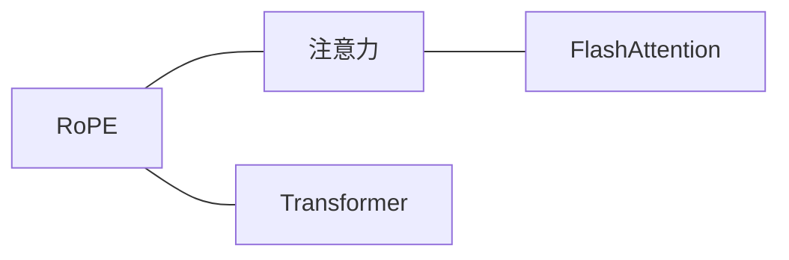

# 对话请求 → MCP 调用模式

这些是可组合的**调用范例**，不是脚本。统一使用共用服务器 `matcha` 的模型侧工具名 `matcha__wiki_*` 与 JSON 参数。路径、库名与正文均为示意，实际调用使用真实返回。

每次调用自动使用用户在 **Wiki 页或 Chat 输入框**选择的**全局当前库**，不绑定会话。状态与列表仅供查看，不是检索前置步骤。默认只读；任何扫描、导入、刷新、写入、删除或嵌入都需用户明确要求。

---

## 跨平台说明（Windows / macOS / Linux）

MCP 调用与操作系统、终端无关，无需转换命令。库内页面路径统一使用相对路径和正斜杠，例如 `wiki/concepts/rope.md`，直接作为 JSON 字符串传入。

导入时使用用户明确提供的本地文件或文件夹路径，不把文件路径当作选库方式，不猜测文件位置。

---

## “我的知识库怎么解释 X？”

最常见的流程：

1. 搜索，检查 `hits` 的排序、`mode` 与 `snippets`。
2. 若排名靠前的结果明显领先，优先读取这些页面；否则读取前 3–5 个候选页面并综合核对。读取使用实际 `relativePath`。
3. 引用每个使用的页面路径，保留实际读到的来源链接；引用片段时使用原文，不把改写当作直接引语。
4. 无结果或证据不足时明确说明，不编造。

```text
matcha__wiki_search {"query":"rope rotary position embedding","limit":5}
matcha__wiki_read_file {"relativePath":"wiki/concepts/rope.md","limit":0}
```

也可直接取正文上下文：

```text
matcha__wiki_retrieve_context {"query":"rope rotary position embedding"}
```

`search` 默认 20 条，`content` 为 null；`retrieve_context` 使用**同一检索算法**，默认 8 条并附带正文，两者都返回 `hits` 和 `snippets` 数组。

### 如何看分数

`keyword`、`vector`、`hybrid` 的尺度不同，不能跨模式设固定阈值。只参考同一响应内的相对排序与差距，最终看正文是否支持结论。`vectorScore` 可为空，向量相似不等于证据充分；图谱扩展线索也需核实。

回答示例（仅当正文实际支持时）：

> 根据 `wiki/concepts/rope.md`（本次为混合检索，`vectorScore` 为 0.94），RoPE 通过按位置旋转 Q 和 K 引入位置信息。页面还提到……（附正文中已有的来源链接）。

---

## “读一下 X 页面”

1. 只给标题或文件名时先搜索，避免读错同名页面；结果不唯一时确认。
2. 使用返回的路径读取，`limit: 0` 获取全文。
3. 用户要全文而非综合回答时，按 Markdown 格式展示正文，不将截短读取称为全文。

```text
matcha__wiki_search {"query":"rotary position embedding","limit":5}
matcha__wiki_read_file {"relativePath":"wiki/concepts/rope.md","limit":0}
```

若只需要预览：

```text
matcha__wiki_read_file {"relativePath":"wiki/concepts/rope.md","limit":1200}
```

`limit` 是字符数，不是行数；返回仍包含 `relativePath`、`content`、完整文件的 `revision`。

---

## “哪些页面链接到 X？” / “看看 X 周围的节点”

```text
matcha__wiki_graph {}
```

1. 在 `nodes` 中按 `id`、`label` 或 `relativePath` 找目标。
2. 筛选 `edges` 的 `from` / `to`，另一端为相邻节点。
3. 需要具体内容时，读取邻居节点的实际 `relativePath`。
4. 标注页面路径与实际连接，不把邻接关系编造成父子、因果或引用关系。

工具返回 `nodes`、`edges`、`communities`，没有过滤或数量参数；在返回数据里筛选，不给调用添加这些参数。

用户希望直观看到关联时，可用一个小型 Mermaid 图展示真实返回的连接。以下仅示意原文中的三条边，不代表用户库实际存在这些关系：



---

## “我的知识库里有什么？” / “给我一个概览”

**结构概览**：先看库根目录，再按返回目录向下查看。每次只列直接子项。

```text
matcha__wiki_files {}
matcha__wiki_files {"directory":"wiki"}
matcha__wiki_files {"directory":"wiki/concepts"}
```

结果为 `{root, entries}`，子项包含 `relativePath` 和 `isDirectory`。概括实际目录分类，如 `concepts/`、`entities/`、`sources/`，并在列出相应页面后估算各类页数；不把一次目录列表称为全库统计。

**主题概览**：先确认页面存在，再读取索引、概览或用途说明。

```text
matcha__wiki_read_file {"relativePath":"wiki/index.md"}
matcha__wiki_read_file {"relativePath":"wiki/overview.md"}
matcha__wiki_read_file {"relativePath":"purpose.md"}
```

`purpose.md` 说明知识库的用途，`wiki/index.md` 汇总页面，`wiki/overview.md` 提供主题概览。引用与问题相关的段落；只引用实际读取到的内容，不假定每个库都有这些页面。

---

## “我改了源文件，扫描一下变化”

用户明确要求扫描后：

```text
matcha__wiki_rescan_sources {}
```

返回状态 DTO，按真实 `pendingChangeCount` 说明变化队列条目数。若用户还想查看导入或生成任务：

```text
matcha__wiki_source_tasks {}
```

扫描更新快照与变化队列，**不等于导入处理，也不等于全量重建索引**。不要报告不存在的 `changedTasks`，也不要把扫描成功说成页面生成、向量索引完成。

用户只说“重新索引”且意图不清时，先确认是扫描变化、刷新源文件还是重建索引，不擅自替换成扫描。

---

## “找出所有提到 Y 的页面”（广泛查找）

```text
matcha__wiki_search {"query":"Y","limit":50}
```

搜索是排序检索，数量限制在 1–50。若第 50 条相对靠前结果仍值得核查，可改用更具体的查询继续查找；单次不会返回超过 50 条，也没有分页参数，不能把这批结果称为穷尽结果。

**精确字符串核对**：分词可能无法保留原字符串的完整边界，例如中文、日文、韩文中的标点，或带下划线的代码标识符（如 `foo_bar`）。遇到这类情况，用 `matcha__wiki_files` 按目录逐层列出 `wiki/` 下的 Markdown 页面，再用 `matcha__wiki_read_file` 读取全文，在返回内容中逐页匹配原字符串。这样较慢，但能避免只依赖分词检索；说明实际覆盖范围，未完整读完时不宣称“全库没有”。

**按语义广泛查找**：使用 `limit: 50`，结合每条命中的 `vectorScore` 查看向量匹配信号，不以固定阈值截断。若 `vectorScore` 为 null，该条没有向量命中信号；可结合 `graphRelatedTo` 区分图谱扩展线索，不把关键词或图谱命中误称为语义命中。仍需读取正文核实，这种排序检索不保证找到所有语义相关页面。

---

## “查我的 Reading 库，不是当前库”

请用户在 **Wiki 页或 Chat 输入框**切换全局当前库到 Reading，切换后继续原查询：

```text
matcha__wiki_search {"query":"narrative voice","limit":5}
```

不要先解析库标识或自行换库。`matcha__wiki_projects {}` 只能在用户想查看有哪些库时使用，不是取目标再指定调用的步骤。

---

## “比较 Research 和 Reading 两个库对 X 的说法”

1. 用户在 Wiki 页或 Chat 输入框切到 Research，再调用：

   ```text
   matcha__wiki_retrieve_context {"query":"narrative voice","limit":3}
   ```

2. 保留这次已读证据及库名；请用户切到 Reading 后，用相同参数再检索。
3. 比较两次真实内容，引用**库名 + 页面路径**，说明其中的差异与不足。

不能并行指定两个目标库，也不能把某次旧结果当作当前库内容；全局切换会影响后续调用，不建立会话级库绑定。

---

## “现在切到 X 库”（对话中途）

说明：“请在 Wiki 页或 Chat 输入框切到 X，后续查询会自动使用新的当前库。”

用户完成切换后，继续原问题。不由助手执行切库，不保存替代性的会话选库状态。只有需要查看当前状态时才调用 `matcha__wiki_status {}`，不强制刷新列表。

---

## 反模式

- **不要自动维护知识库**：问答、搜索或读取不授权任何状态变更。
- **不要给工具加未列出的参数**：参数以 [api-reference.md](api-reference.md) 为准，额外字段严格拒绝。
- **不要直接读写文件来绕过工具**：使用已有 MCP 能力；没有对应工具时如实说明。
- **不要把扫描当成生成或重建**：扫描、刷新、单页嵌入是不同操作。
- **不要把错误当成结果**：`Invalid params` 可能涉及未选库或路径问题；`Internal error` 不表示库为空。不要盲目重复调用。
- **不要凭分数或图谱编结论**：正文证据不足时直接说明。
- **不要把列表查看变成选库流程**：切换由用户在界面完成，工具自动使用全局当前库。

用户明确要求写操作时，使用实际定义的参数：

| 请求 | 工具与参数 |
|---|---|
| 导入某个文件 | `matcha__wiki_import_source {sourcePath}` |
| 导入某个文件夹 | `matcha__wiki_import_folder {folderPath}` |
| 刷新源文件 | `matcha__wiki_refresh_sources {}` |
| 应用生成页面 | `matcha__wiki_apply_generated_pages {sourcePath, files: [{path, content}]}` |
| 删除源文件及相关页面 | `matcha__wiki_delete_source {sourcePath, fileAlreadyDeleted?}`（默认 false） |
| 为一个页面写入向量索引 | `matcha__wiki_embed_page {relativePath}` |

路径与范围必须来自用户明确要求或真实返回；先确认删除、写入范围，按实际 DTO 报告成功与跳过，不承诺未执行的生成或重建。

---

## 完整对话示例

用户：“我的知识库怎么解释 FlashAttention？也看看相关概念。”

助手调用（假设搜索确实返回下列页面）：

```text
matcha__wiki_search {"query":"flash attention","limit":5}
matcha__wiki_read_file {"relativePath":"wiki/concepts/flash-attention.md","limit":0}
matcha__wiki_graph {}
```

从图谱找真实邻居，再按需要读取它们的正文。假设本次检索返回 `mode: "hybrid"`、`tokenHits: 12`、`vectorHits: 8`，且正文与图谱确实支持下列内容，回答可以是：

> 我查的是当前知识库。检索结合了关键词与向量信号；首条结果是 `wiki/concepts/flash-attention.md`，其 `vectorScore` 为 0.91。
>
> 这篇页面把 FlashAttention 描述为一种节省内存的精确注意力实现：对 Q、K、V 矩阵分块计算，避免保存完整的 N×N 注意力矩阵。页面给出的性能说法是：A100 上的长上下文场景可加速 2–4 倍。这是该页面的说法，引用时需同时保留原文中的适用条件与来源链接。
>
> 图谱中关联到的页面有：
> - `wiki/concepts/attention.md`
> - `wiki/concepts/long-context.md`
> - `wiki/entities/tri-dao.md`
>
> 要不要继续读其中某一页？

若没有找到足够支持材料，则说：“当前检索没有足够证据回答这个问题。”不套用示例结论。

## 来源

原始对话模式来源：<https://github.com/nashsu/llm_wiki_skill>；本地调用契约见 [api-reference.md](api-reference.md)。
